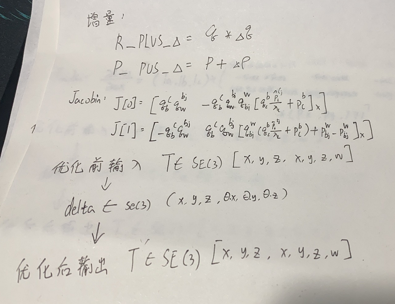
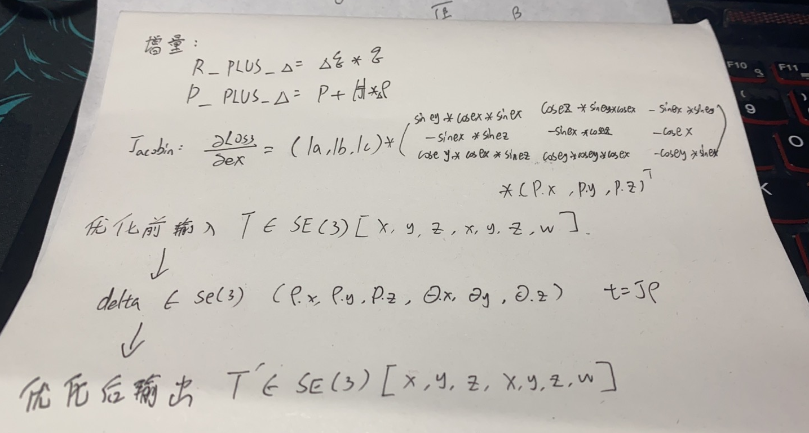

Ceres是一个高效的通用非线性求解库，十分适合用来做SLAM中的非线性优化，我们都知道非线性优化的一个通用方法是梯度下降法，但是SLAM中的位姿一般用李代数表示，这就需要我们在ceres中实现位姿的过参数化。

<!-- more -->

## Ceres中对于过参数化的需求定义

[**ceres官网**]( https://http://ceres-solver.org/)

首先来看Ceres官网对于过参数化加法(**LocalParameterization**&**plus**)的需求定义: 

> In many optimization problems, especially sensor fusion problems, one has to model quantities that live in spaces known as [Manifolds](https://en.wikipedia.org/wiki/Manifold) , for example the rotation/orientation of a sensor that is represented by a [Quaternion](https://en.wikipedia.org/wiki/Quaternions_and_spatial_rotation).
>
> Manifolds are spaces, which locally look like Euclidean spaces. More precisely, at each point on the manifold there is a linear space that is tangent to the manifold. It has dimension equal to the intrinsic dimension of the manifold itself, which is less than or equal to the ambient space in which the manifold is embedded.
>
> For example, the tangent space to a point on a sphere in three dimensions is the two dimensional plane that is tangent to the sphere at that point
>
> > A basic operation one can perform on a manifold is the $\oplus $(plus operation),that computes the result of moving along delta in the tangent space at x, and then projecting back onto the manifold that x belongs to. Also known as a *Retraction*,$\oplus$ is a generalization of vector addition in Euclidean spaces. Formally,$\oplus$ is a smooth map from a manifold $M$ and its tangent space $T_M$ to the manifold $M$ that obeys the identity $\oplus(x,0)=x,\forall x$
> >

这一段话主要讲的就是欧式空间投影到流型空间，维数对不上，不能直接欧式空间加法（梯度更新需要增量加法），所以就需要进行一个增量加法定义。

说的比较简单，但是实际上看完这个还是一头雾水，所以我们来深入的看看各个SLAM算法/库对于这个实现（本文主要分析了VINS,FLOAM,Sophus,OKVIS,SE(3) of CERES）


## VINS中对于过参数化增量加法的实现

[VINS代码地址](https://github.com/HKUST-Aerial-Robotics/VINS-Mono)

直接切入正题，我们来看VINS关于过参数化加法实现的代码：
```c++
bool PoseLocalParameterization::Plus(const double *x, const double *delta, double *x_plus_delta) const
{
    Eigen::Map<const Eigen::Vector3d> _p(x);
    Eigen::Map<const Eigen::Quaterniond> _q(x + 3);

    Eigen::Map<const Eigen::Vector3d> dp(delta);

    Eigen::Quaterniond dq = Utility::deltaQ(Eigen::Map<const Eigen::Vector3d>(delta + 3));

    Eigen::Map<Eigen::Vector3d> p(x_plus_delta);
    Eigen::Map<Eigen::Quaterniond> q(x_plus_delta + 3);

    p = _p + dp;
    q = (_q * dq).normalized();

    return true;
}


template <typename Derived>
    static Eigen::Quaternion<typename Derived::Scalar> deltaQ(const Eigen::MatrixBase<Derived> &theta)
    {
        typedef typename Derived::Scalar Scalar_t;

        Eigen::Quaternion<Scalar_t> dq;
        Eigen::Matrix<Scalar_t, 3, 1> half_theta = theta;
        half_theta /= static_cast<Scalar_t>(2.0);
        dq.w() = static_cast<Scalar_t>(1.0);
        dq.x() = half_theta.x();
        dq.y() = half_theta.y();
        dq.z() = half_theta.z();
        return dq;
    }
```
值得注意的一点是，VINS的deltaQ函数是把李代数上的旋转向量转成了四元数，但是不是标准的转换，是一种近似。
下面给出我对于VINS的视觉残差雅克比和增量加法的推导:



## FLOAM中对于过参数化增量加法的实现

[FLOAM代码地址](https://github.com/wh200720041/floam)

直接切入正题，我们来看VINS关于过参数化加法实现的代码：
```c++
bool PoseSE3Parameterization::Plus(const double *x, const double *delta, double *x_plus_delta) const
{
    Eigen::Map<const Eigen::Vector3d> trans(x + 4);

    Eigen::Quaterniond delta_q;
    Eigen::Vector3d delta_t;
    getTransformFromSe3(Eigen::Map<const Eigen::Matrix<double,6,1>>(delta), delta_q, delta_t);
    Eigen::Map<const Eigen::Quaterniond> quater(x);
    Eigen::Map<Eigen::Quaterniond> quater_plus(x_plus_delta);
    Eigen::Map<Eigen::Vector3d> trans_plus(x_plus_delta + 4);

    quater_plus = delta_q * quater;
    trans_plus = delta_q * trans + delta_t;

    return true;
}

void getTransformFromSe3(const Eigen::Matrix<double,6,1>& se3, Eigen::Quaterniond& q, Eigen::Vector3d& t){
    Eigen::Vector3d omega(se3.data());
    Eigen::Vector3d upsilon(se3.data()+3);
    Eigen::Matrix3d Omega = skew(omega);

    double theta = omega.norm();
    double half_theta = 0.5*theta;

    double imag_factor;
    double real_factor = cos(half_theta);
    if(theta<1e-10)
    {
        double theta_sq = theta*theta;
        double theta_po4 = theta_sq*theta_sq;
        imag_factor = 0.5-0.0208333*theta_sq+0.000260417*theta_po4;
    }
    else
    {
        double sin_half_theta = sin(half_theta);
        imag_factor = sin_half_theta/theta;
    }

    q = Eigen::Quaterniond(real_factor, imag_factor*omega.x(), imag_factor*omega.y(), imag_factor*omega.z());


    Eigen::Matrix3d J;
    if (theta<1e-10)
    {
        J = q.matrix();
    }
    else
    {
        Eigen::Matrix3d Omega2 = Omega*Omega;
        J = (Eigen::Matrix3d::Identity() + (1-cos(theta))/(theta*theta)*Omega + (theta-sin(theta))/(pow(theta,3))*Omega2);
    }

    t = J*upsilon;
}
```
下面那个getTransformFromSe3函数看起来很长很吓人，但其实也就是se(3)到SE(3)的转换，高博《视觉SLAM14讲》有详细的推导，下面给出我关于FLOAM增量加法的定义和相关的误差雅克比：



## Sophus对于过参数化增量加法的实现


