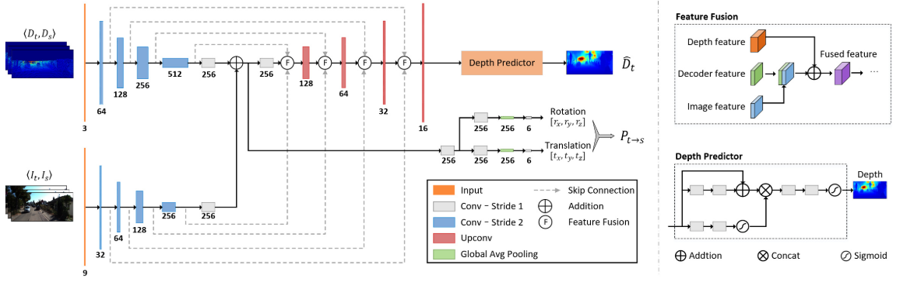
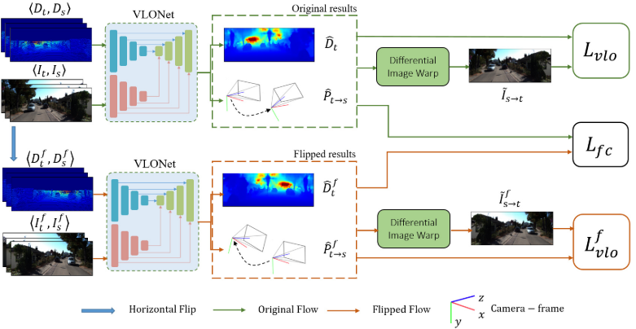
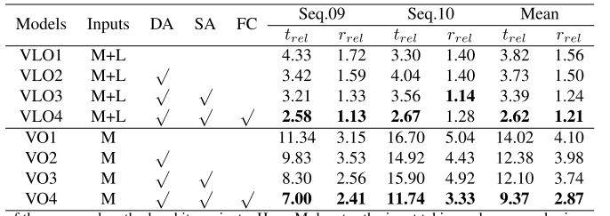
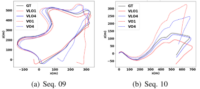
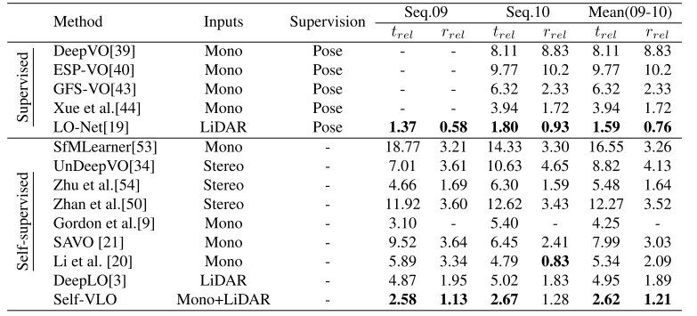

   传感器融合是SLAM中比较热门的方向，传统的融合方式是基于优化滤波或者激光辅助视觉获取深度，视觉辅助激光初始化或者频率之类的。但是随着深度学习的大热，很多人也将深度学习应用到SLAM中，最典型的应用就是端到端直接输出位姿或者输入图像+激光输出单目深度图之类的。

   目前刚入门SLAM一年多（主要做的基于优化/滤波的激光视觉融合），对于基于深度学习的融合认识尚未到位，正好今天看到了一篇浙大的这方面的工作(WACV2021)，做一下论文的记录。

<!-- more -->

[**《Self-supervised Visual-LiDAR Odometry with Flip Consistency Bin》(WACV2021)**](https://arxiv.org/pdf/2101.01322.pdf)

## Motivation

​        因为目前绝大多数基于学习的方法都是基于相机的，相机会受限于光照纹理等问题。所以作者想到将激光数据投影成深度图和相机图像一起输入接着进行一个端到端的训练。考虑到获取真值标签的困难性，采用自监督的方法进行训练，并且设计了一个翻转一致性的损失函数方便训练。实验效果表明这个模型优于全监督的VO，证明了模型的有效性。

## Contribution

1. 这是第一个基于学习方法的端到端的视觉雷达里程计，输入单目图像和稀疏深度图，输出深度图和位姿估计。
2. 采用了孪生网络结构并且设计了一个翻转一致性损失函数，没有使用任何的真值或者深度标签。
3. 在KITTI数据集上的测评结果证明，这个方法优于所有的自监督的视觉/雷达里程计，并且优于所有全监督的视觉里程计。

## Content

1. **网络结构**

   a. **VLO-Net**
   
   
   

融合的网络结构如上图，被命名为VLO-Net，它有一个双通道的编码器，一个以图像序列为输入，还有另一个以深度图序列为输入。每个路径中提取的特征通过逐点加法进行融合，用于预测两个连续帧之间的相对姿态。此外，深度和视觉特征还通过特征融合模块在每个尺度上与解码器特征融合在一起来形成一个密集深度图。

   b. **Self-VLO**

   

采取一个孪生网络结构来执行自监督的视觉雷达里程计，具体点的说，就是融合两个孪生的刚刚提到的VLO-Net结构。第一个网络采取原始图像和深度图序列作为输入，第二个网络采取水平翻转图像和对应的深度图作为输入，这两个网络的结构和参数设置相同。在具体的实现中，采用一致正则化来加快学习，并且孪生网络结构只用来训练，测试的时候只使用一个VLO-Net。

   

2. **深度和位姿损失函数**   

   网络的整体损失函数如下:

   
   $$L_{vlo} = \lambda_{vs}L_{vs}+\lambda_{df}L_{df}+\lambda_{ds}L_{ds}$$

   ($L_{vs},L_{df},L_{ds}$分别代表着视觉综合损失函数，深度保真损失函数，深度平滑损失函数, $\lambda_{vs},\lambda_{df},\lambda_{ds}$分别代表着对应的尺度因子)

   a. **视觉综合损失函数**

   $$L_{vs}=\sum_{s}(1-\alpha_{s})\|I_{t}-\tilde{I}_{s\rightarrow t}\|_{1}+\alpha_{s}(1-SSIM(I_{t},\tilde{I}_{s\rightarrow t}))$$

   $\alpha_s$是尺度因子,  $I\_{t}$代表着目标图像,  $\tilde{I}\_{s\rightarrow t}=I_{s}(<p\_{s}>)$代表着将原始图像变换到目标图像，SSIM是结构相似性指标

   b. **深度保真损失函数**

这个损失函数的主要目的是确保预测的密集深度图和输入的洗漱深度图在相同的像素具有相同的深度，根据这个目的，损失函数定义为

   $$L_{ds}=\|M(D_{t})\bigodot(D_{t}-\hat{D}_{t})\|_{1}$$

  ($D\_{t}$是输入的深度图,$\hat{D}\_{t}$是预测的密集深度图,$M(D\_{t})$代表输入的稀疏深度图中有效的像素.)

   c. **深度平滑损失函数**

   这个损失函数的目的是为了提升输出的密集深度图的质量，考虑到深度图和相机图像之间的关系，引进一个图像为导向的损失函数来平滑深度并且保持物体边缘的锐利度，损失函数定义如下:

   $$L_{sm}=\sum_{p}exp(-|\delta_{x}I_{t}(p)|)|\delta_{x}\hat{D}_{t}(p)|+exp(-|\delta_{y}I_{t}(p)|)|\delta_{y}\hat{D}_{t}(p)|$$

3. **翻转一致性损失函数**

   基于的假设：仿射变换和翻转变换的叠加等变性:

   $$G(A(I,D))=A(G(I,D))$$

   (G代表着VLONet的将输入变成输出的映射函数，并且为了方便起见，只考虑水平翻转)
   
   水平翻转操作:
   
   $$\hat{D}^f_{t}=flip(\hat{D}_{t})$$
   
   $$\hat{P}^f_{t\rightarrow s}=[\hat{t}^f_{x},\hat{t}^f_{y},\hat{t}^f_{z},\hat{r}^f_{x},\hat{r}^f_{y},\hat{r}^f_{z}]$$

   $$=[-\hat{t}_{x},\hat{t}_{y},\hat{t}_{z},\hat{r}_{x},-\hat{r}_{y},-\hat{r}_{z}]$$
   
   并且随着水平翻转，内参也会发生翻转:
   
   $$K^f=\begin{bmatrix} f_{x}&0  &W-c_{x} \\  0&  f_{y}&c_{y} \\  0& 0 & 1
   \end{bmatrix}$$
   
   (W是图像的宽度)
   
   基于上述提到的翻转关系，深度和位姿一致性约束如下:
   
   $$L_{fc}=L_{dfc}+L_{pfc}$$

   $$L_{dfc}=\|flip(\hat{D}_{t}-\hat{D}^f_{t})\|_{1}$$
   
   $$L_{pfc}=\|\hat{t}_{x}+\hat{t}^f_{x}+\hat{t}_{y}-\hat{t}^f_{y}+\hat{t}_{z}-\hat{t}^f_{z}\|_{1}+\alpha_{r}\|\hat{r}_{x}-\hat{r}^f_{x}+\hat{r}_{y}+\hat{r}^f_{y}+\hat{r}_{z}+\hat{r}^f_{z}\|_{1}$$

($\alpha\_{r}$是平移误差和翻转误差的尺度平衡因子)

4. **整体损失函数**
   
   ​		总的来说，在训练孪生网络结构的时候，有两个深度和位姿估计的损失函数$L_{vlo}$和$L^f_{vlo}$，并且对于每个翻转，都有一个翻转一致性损失函数进行约束输出，因此，总的损失函数是:
   
   $$L=L_{vlo}+L^f_{vlo}+\phi L_{fc}$$

   $$\phi=\lambda_{fc}*exp(-\frac{L_{vs}}{\sigma})$$
   
5. **论文实验结果**

   ​		a.  **对于论文提出的方法和它的变体的比较**

   

   ​				(M代表输入只有图像，M+L代表输入图像+深度图，DA代表采取了数据增强策略，SA代表孪生网络结构，FC代表了翻转损失函数)

   ​		b. **可视化的方法和变体的比较**

   ​																					

   ​				(VLO1代表了只使用一个VLONet并且没有数据增强，VLO4代表论文提出的完整的模型，VO1和VO4与之对应)

   ​		c. **和目前领先的端到端训练的里程计的比较**

   ​				

   

## Conclusion

​        深度学习真是灌水利器，这篇论文整体看下来创新点不多，只是基于之前已经有的端到端学习的工作，加入了一个孪生网络模型和一致性约束，视觉和激光分别独立的损失函数实际上是已有的，所以不被视为创新点。实验总体的实验效果是比较好的，一个自监督的学习结果超过了所有全监督的视觉里程计和自监督的激光里程计，这一点很厉害，但是因为作者的代码没有开源，所以它的实验效果是因为这个模型还是因为代码的trick，有待质疑。

​		不过，我总感觉将端到端的通过DL训练得出里程计是一个错误的方向，因为场景的特征是不同的，训练出的参数放到其他的场景，必然结果很差，不过，这并不代表我反对将深度学习应用到SLAM，事实上，SLAM很多的环节都可以应用深度学习，比如特征提取，回环检测等，单目深度的补全也是一个很好的思路，期待未来有一篇论文，将SLAM所有的适合改成深度学习训练的模块改成深度学习，但是其他的位姿计算之类的采用传统优化，效果可以预见是必然不错的，个人能力有限，这种工作只能期待大佬们做了。

>1. Li, Bin, et al. "Self-supervised Visual-LiDAR Odometry with Flip Consistency." *Proceedings of the IEEE/CVF Winter Conference on Applications of Computer Vision*. 2021.
