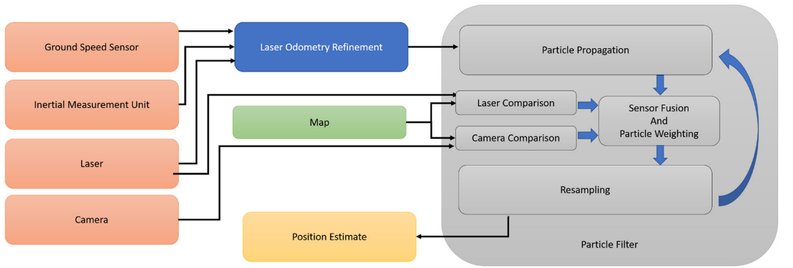
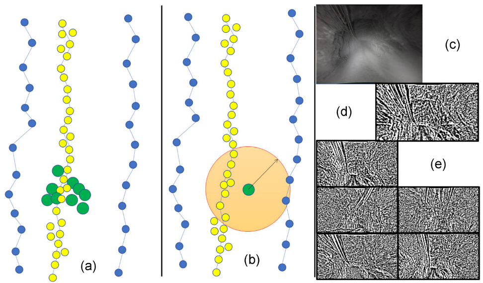

   JFR这个期刊可以说是SLAM领域的顶刊了，并且他这个期刊里的论文大多数都偏向于应用领域的效果，这周我刷到了一篇JFR关于地下采矿车结合多传感器进行定位的论文，论文实验结果很好，做一个记录。

<!-- more -->

[**《What localizes beneath:A metric multisensor localization and mapping system for autonomous underground mining vehicles》(JFR2021)**](https://sci-hub.se/10.1002/rob.21978#)

## Motivation

在地下矿井里进行定位是一个非常困难的事，因为无法使用GPS，并且地下的光照不稳定和矿井里的灰尘与水经常会有干扰。所以作者想到结合基于视觉的位置识别方法和基于雷达的定位方法，并且用粒子滤波进行融合里程计。

## Contribution

1. 提出了一个新方法来结合相机、激光、里程计信息来生成在多层矿井中的精确的3D定位。
2. 提出了一种适用于多级地下矿山定位的多传感器度量地图生成方法。
3. 在两个采集于真实矿井的数据集上进行了大量的实验评估，实验效果表明优于目前所有的里程计方法。

## Content

主要介绍如何构建离线地图和如何用这个离线地图进行在线定位。

1. **半监督的地图构建**
   
   如下图，可以分为里程计，回环，地图存储等环节。
   
     

   a. **里程计**
   
   
   
   使用IMU和地面速度信息获得位姿的一个初步估计，然后通过雷达扫描匹配进行细化位姿。每0.5 m向位姿图中添加一个节点，每个节点由来自前向和面向车顶摄像头的图像数据以及执行环路闭合的相应激光扫描组成。
   
     

   b. **回环**

   

   使用一个面向屋顶的摄像头和一个激光雷达来执行闭环。两帧图像之间的比较函数(SAD)如下:
   
   $$
   d(i,j)=\frac{1}{R_{x}R_{y}}sum_{u,v}|I_{i}(u,v)-I_{j}(u,v)|
   $$

   c.**外部地图**

   鉴于地下结构的复杂性和环境的非循环拓扑结构，引入了人工接地点来帮助消除地图表示中的里程误差: 首先使用自定义软件工具，将激光扫描样本与测量的地图手动对齐，激光扫描可在6自由度内手动操作，使激光扫描接近地图内的正确位置；然后使用点云对齐方法(ICP或者NDT)对激光扫描样本的姿态进行微调，以在世界范围内准确定位激光扫描，并生成手动地图接地点。
   
     

   d.**地图存储**

   这个主要是简单的讲了位姿图的压缩表示:

   前向摄影机数据存储为一组图像，这些图像在世界帧中具有相关的姿势;

   激光数据被压缩成一个直线表示，节点存储在0.5米的增量处；这种表示非常紧凑，能够在定位任务中进行快速搜索。  

2. **定位**   

   如下图所示，使用粒子滤波器使相机和激光信息的组合基于上述离线生成的地图执行定位：
   
   
   
   每个粒子包含一个6自由度的姿势假设和一个权重，该权重对应于当前假设与当前假设的一致程度(当前传感器数据和存储的地图)。
   
   粒子滤波有三个主要步骤:粒子传播、粒子更新和粒子重采样阶段。  

   a. **粒子传播**

   通过结合随机高斯噪声的里程计估计来进行传播:
   
   $$
   P^n_i = P^n_{i-1} + (\delta_i+\phi)
   $$
   
   ($p^n\_{i}$是粒子n在时间i的位姿，$\delta\_i$是里程计在时间i的结果,$\phi~N(\mu,\rho)$是随机高斯噪声)  
   
   
   b.**粒子更新**
   
   独立的计算相机和激光传感器的权重，并且进行融合来生成每个粒子的权重。  
   
   I.**相机权重**  
   
   相机传感器权重是通过将当前粒子的假设大小位置周围半径rc内的所有地图图像与当前查询帧进行比较而生成的(如下图),对查询图像和地图图像进行降采样和分片标准化，以增强光照和姿态不变性,将要比较的地图图像集（满足半径约束）定义为粒子n的$M\_n$,然后使用滑动SAD将查询图片与所有地图图片进行比较:
   
   $$
   d_n=min_{k\in M_{n}}\frac{1}{R_{x}R_{y}}\sum_{u,v}|I(u,v)-I_{k}(u,v)|
   $$
   
   当最小的d计算出来后，相机权重$y^c\_n$定义如下:
   
   $$
   y^c_n=\frac{d_{max}-d_n}{d_{max}-d_min}
   $$
   
   
   
   II. **激光权重**  
   
   通过使用粒子位置假设将当前激光扫描投影到世界帧中，计算每个粒子位置假设的激光权重$y^l\_n$:  
   
   $$
   y^l_n=\sum_{k\in l_n}N(f(L^k_n,M_1,M_2)|\mu,\theta)
   $$
   
   ($L^k\_n$是当前激光帧的第k个激光点使用第n个粒子位姿投影到世界坐标系的结果,$M\_1,M\_2$是$L^k\_n$最近的两个点并且可以构成一条直线,f(A,B,C)是loam的点线距离公式:$$
   f(X,A,B)=\frac{AX x AB}{AB}
   $$ )  
   
   
   
   III. **融合的传感器权重**

   $$
   y_n=\frac{\hat{y^c_n}}{\sum_{k\in P}\hat{y^c_k}}\times\frac{\hat{y^l_n}}{\sum_{k\in P}\hat{y^l_k}}\\ \\
   \hat{y^c_n}=\left\{\begin{matrix}
 y^c_n,\ if\ y^c_n>t\\t,\ else
\end{matrix}\right.\\ \\
    \hat{y^l_n}=\left\{\begin{matrix}
 y^l_n,\ if\ y^l_n>t\\t,\ else
\end{matrix}\right.
   $$
   
   c. **粒子重采样和位姿估计输出**
   
   粒子重采样的目标是移除差权重的位姿假设，并且复制具有强权重的粒子，选取新粒子的公式:
   
   $$
   \hat{P_n}=P_In\\
   I_n = D^{inv}(U_n)
   $$
   
   ($D^{inv}$是与正则化粒子权重相关的累积分布函数的逆)

3. **论文实验结果**
   
   a. 采集数据集1(皇后岛矿井)的实验
   
   
   
   b.采集数据集2(新南威尔矿井)的实验
   
   

## Conclusion

​        这篇论文的实验效果确实很好，不过很奇怪的一点是，粒子滤波融合居然能有这么好的效果？看来是时候回头看下粒子滤波了，文章主要的创新点就是基于离线地图进行视觉和激光雷达和里程计的粒子滤波融合，实验结果也很丰富，对比了很多参数和情况，确实应该中JFR

>1. Jacobson, Adam, et al. "What localizes beneath: A metric multisensor localization and mapping system for autonomous underground mining vehicles." Journal of Field Robotics 38.1 (2021): 5-27.
