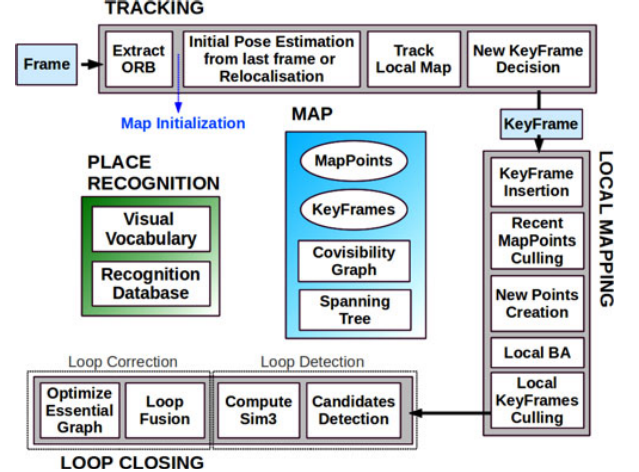
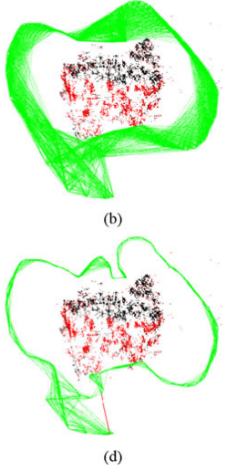
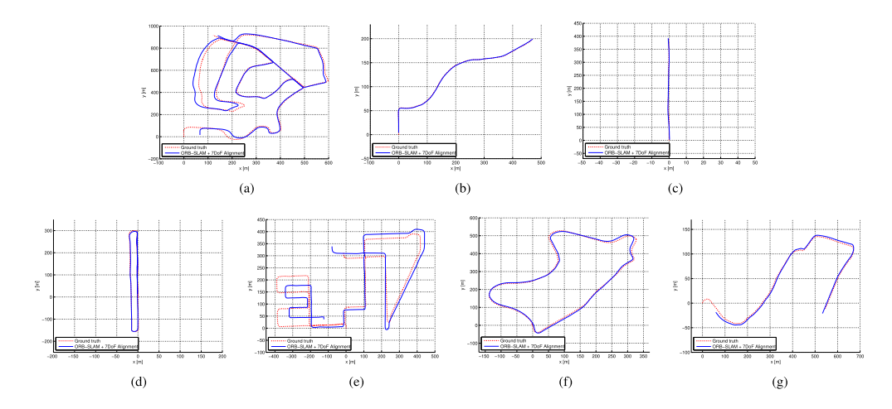
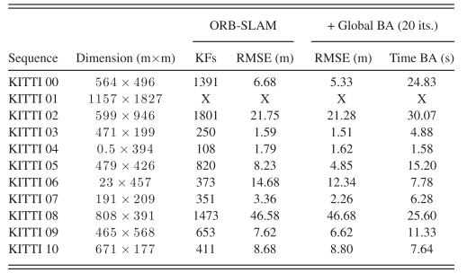

​        虽然做的一直是传感器融合这方面的工作，但是对于视觉SLAM的理解确实有欠缺，因为入门直接是从loam开始然后VLOAM，对于视觉SLAM的理解一直停留在特征法和直接法的框架层面，具体的细节没有深究过，正好最近有时间，回顾下ORB三件套。本篇分析的是ORB的开山之作。

<!-- more -->

[**《ORB-SLAM: A Versatile and Accurate Monocular SLAM System》(TOR2015)**](https://arxiv.org/pdf/1502.00956.pdf)

## Motivation

  相机传感器很便宜，很适合做SLAM，基于相机传感器的BA虽然能够提供十分精确的定位，但是时间成本太高，没法实现实时。PTAM虽然部分解决了这个问题，但是它存在比较多的问题，比如缺少回环和对遮挡的处理，重定位对于视点的要求高，并且需要人工操作。因此作者在PTAM的基础上提出了ORBSLAM来解决这些问题。

## Contribution

1. 对所有任务使用相同的特征点：跟踪、建图、重定位和回环。使得系统更加高效、简单和可靠。使用的特征点是ORB，不需要GPU，并且对视点和照明的变化提供良好的不变性。
2. 提供在大型环境中的实时操作。因为使用了共视图，跟踪和建图集中在局部共视区域，与全局地图大小无关。
3. 基于位姿图的实时闭环优化(文章里命名为本质图)。它由系统维护的生成树、闭环连接和共视图的强边构成。
4. 对视点和光照具有显著不变性的实时相机重定位。允许从跟踪失败中恢复，增强了地图重用。
5. 一个新的基于模型选择的自动和健壮的初始化过程，允许创建平面和非平面场景的初始地图。
6. 提出了一种选择关键帧的新的策略，关键帧进入很容易，剔除很严格，提升了稳定性和地图寿命。

## content

1. **系统概览**

     如下图，可以分成跟踪，建图，回环，局部建图，位置识别这几个模块

   A. **特征点的选择**

   选择ORB特征点，它们的计算和匹配速度非常快，同时对视点具有很好的不变性。这使得可以用宽基线来匹配它们，从而提高BA的准确性

   B. **三个线程:跟踪，局部建图，局部回环**

   跟踪线程负责定位每一帧的相机，并决定何时插入一个新的关键帧。首先与前一帧的初始特征匹配，并用仅运动的BA优化位姿。如果跟踪丢失（例如，由于遮挡或突然移动），就使用位置识别模块执行全局重新定位。一旦有了摄像机姿态和特征匹配的初始估计，就可以使用系统维护的关键帧共视图来检索局部可见地图。最终跟踪线程可以决定是否一个新的关键帧被插入。

   局部建图处理新的关键帧并执行局部BA从而在相机位姿的周围实现最佳重建。在共视图的连通关键帧中搜索新关键帧中不匹配ORB的新的对应点，从而三角化新点。在创建后的一段时间内，基于跟踪过程中收集到的信息，应用了一种紧急点剔除策略，以便只保留高质量的点。局部建图还负责剔除冗余的关键帧。

   闭环搜索每个新关键帧的闭环。如果检测到一个闭环，将计算一个相似性变换来计算闭环中累积的漂移。然后，将闭环的两侧对齐并融合重复的点。最后，在相似性约束上进行位姿图优化，以实现全局一致性。创新点在于是对对本质图，即共视图的一个稀疏子图进行优化。

   C. **地图点和关键帧的选择**

   地图点和关键帧是用一个松的策略创建的，而后一种非常紧的剔除机制负责检测冗余关键帧和错误匹配或不可跟踪的地图点。这允许在勘探期间进行灵活的地图扩展，从而提高在困难条件下（例如旋转、快速移动）的跟踪鲁棒性，同时大小在对相同环境的连续重访中受到限制，可以长时间操作。此外，与PTAM相比，ORB的建图包含很少的异常值，代价是包含较少的点。

   D. **共视图和本质图**

   本质图相对于共视图具有更少的边更易于计算，该系统从初始关键帧增量生成一棵生成树，该生成树提供了具有最少边数的共视图的连通子图。插入新的关键帧时，它将包含在链接到共享大多数点观测值的关键帧的树中，并且当通过消隐策略删除关键帧时，系统将更新受该关键帧影响的链接。本质图包含了这个生成树。具体示意图如下:

2. **自动地图初始化**

   地图初始化的目标是计算两帧之间的相对姿态来三角化一组初始的地图点。独立与场景模型并且不需要人工干预。并行计算两个几何模型：假设平面场景的单应矩阵和假设非平面场景的基本矩阵。然后，使用启发式方法来选择一个模型，并尝试用特定的方法来恢复所选模型的相对姿态。仅在确定双视图配置是安全的情况下进行初始化，检测低视差情况和双平面模糊，避免坏的地图。具体步骤如下:
   
   A. **寻找初始化对应点**
   
   B. **两个模型的平行计算**
   
   模型主要指的是单应矩阵$H\_{cr}$和本质矩阵$F\_{cr}$
   
$$
x_c=H_{cr}x_r,\ x^T_cF_{cr}x_r=0
$$

   在每一次迭代中，对于每一个模型计算一个分数:

$$
S_M=\sum_i(\rho_M(d^2_{cr}(x^i_c,x^i_r,M)))+\rho_M(d^2_{rc}(x^i_c,x^i_r,M))\\
   \rho_M(d^2)=\begin{cases}
\tau - d^2,\ if\ \ d^2<T_M\\0,\ if\ \ d^2\ge T_M

\end{cases}
$$

   C. **模型选择**

   使用一个启发式算法进行选择: $R\_H >0.45$选择单应矩阵，否则选择本质矩阵

$$
R_H=\frac{S_H}{S_H+S_F}
$$

   D.**SFM**

   使用cheriality tests来选择有效解，并对8个可能的解执行三角剖分并且检查是否有一个解在两个摄像机前面并且具有视差，如果有则选择它，如果没有就重新开始初始化。

   E. **BA**

3. **跟踪**

   A. **ORB提取**
   
   B. **从先前帧获得的初始位姿估计**
   
   用匀速运动模型或者使用对应点的优化。
   
   C. **通过全局重定位的初始位姿估计**
   
   在跟丢的情况下采用词袋法执行全局重定位，并且使用PnP算法找到相机的位姿。
   
   D. **跟踪局部地图**
   
   主要是进行地图点的跟踪, 步骤如下:
   
   1). 计算地图点在当前帧的重投影误差
   2). 计算视线和地图点的视线的角度差
   3). 计算地图点到相机中心的距离
   4). 计算尺度
   5). 用描述子进行比较并且寻找最佳的匹配.
   6). 用所有找到的地图点进行优化来获得相机的位姿.

   E. **插入新的关键帧**
   
   需要满足以下几个条件:
   
   1). 距离上一次全局重定位已经过去了20帧.
   2). 局部建图没有被执行，或者距离上一次关键帧的插入已经过去了20帧.
   3). 当前帧至少跟踪了50个特征点.
   4). 当前帧和参考帧的差距大于90%.

4. **局部建图**

   A. **插入关键帧**
   
   B. **地图点的排除**
   
   一个地图点保持在地图中需要满足这两个条件:
   
   1). 跟踪过程必须能够确定这个点在1/4以上的帧中是可见的。
   2). 至少要被4个关键帧看见。

   C. **新的地图点的创建**
   
   通过三角化共视图中的相邻的关键帧的ORB点来创建新的地图点。
   
   D. **局部BA**
   
   E. **局部关键帧排除**
   
5. **回环**

   词袋法检测+本质图的优化
   
6. **实验**

## Conclusion

ORBSLAM确实很厉害，在PTAM的基础上添加了回环，处理遮挡，重定位和关键帧的管理策略，显著的提高了精度，并且能够保持实时性，但是因为是单目，仍然存在诸如尺度之类的问题，所以后面作者又发了ORB2，一脉相承。
