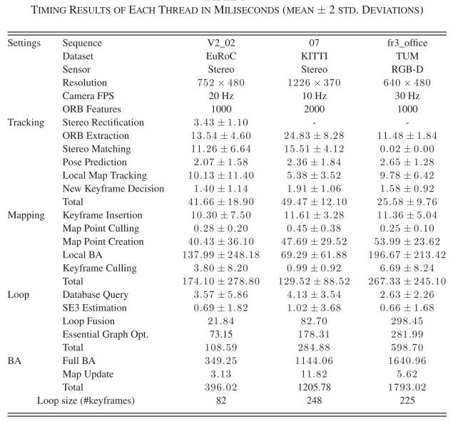

上一篇写了ORB1的论文阅读分析，今天就继续写ORB2，众所周知，ORB2是ORB1的改进版，最大的特点就是单目变成了双目

<!-- more -->

[**《ORB-SLAM2: an Open-Source SLAM System for Monocular, Stereo and RGB-D Cameras》(TOR2017)**](https://arxiv.org/pdf/1610.06475.pdf)

## Motivation

  单目的ORB存在尺度的问题，所以作者想到将ORB提升到双目的层次，来解决单目尺度估计的问题。

## Contribution

1. 第一个用于单目、双目和RGB-D相机的开源SLAM系统，包括闭环、重定位和地图重用。
2. ORB的RGB-D结果表明，通过使用BA，比基于ICP或光度和深度误差最小化的方法获得了更高的精度。
3. 通过使用近、远双目点和单目观测，结果比最先进的直接双目SLAM更精确。
4. 提出了一个轻量的定位模式，可以在地图被禁用的时候，使用地图。

## Content

1. 系统框架

   如下图，主要分成三个部分，跟踪，建图，回环，跟踪部分会对传感器进行统一，使得无论输入的是RGB-D还是双目图像，最后都转成双目点集和单目点集进行处理。因为ORB2和ORB1的主要部分是在于加入了双目，所以接下来重点分析ORB2如何利用双目深度信息的过程。

2. 单目关键点，近双目关键点，远双目关键点

   ORB2中同时存在单目和双目关键点，并且又细分为近点和远点。
   
   双目关键点的坐标表示: $X\_s = (u\_L,v\_L,u\_R)$, $u\_L,v\_L$是左图像的坐标，$u\_R$是右图像的水平坐标，对于RGB-D图像，可以将深度值转换成虚右图像坐标:
$$
u_R=u_L-\frac{f_xb}{d}
$$

3. 有单目和双目约束的BA

   A. 仅运动的BA优化
   
   $$
   {R,t}=argmin_{R,t}\sum_{i\in X}\rho(\|x^i_{(.)}-\pi_{(.)}(RX^i+t)\|^2_\sum)
   $$
   
   $\pi$是重投影公式，单目和双目的重投影公式如下:
   
$$
\pi_m\begin{pmatrix}
 X\\y
 \\Z

\end{pmatrix}=\begin{bmatrix}
 f_x\frac{X}{Z}+c_x\\f_y\frac{Y}{Z}+c_y

\end{bmatrix}\\

\pi_s \pi_m\begin{pmatrix}
 X\\y
 \\Z

\end{pmatrix}=
\begin{bmatrix}
 f_x\frac{X}{Z}+c_x\\f_y\frac{Y}{Z}+c_y\\
f_x\frac{X-b}{Z}+c_x

\end{bmatrix}
$$

   B. 包含局部地图的BA

$$
\{X^i,R_l,t_l|i\in P_L,l\in K_L\}=argmin_{X^i,R_l,t_l}\sum_{k\in K_L,k\in K_F}\sum_{j\in X_k}\rho(E(k,j))\\
   E(k,j)=\|x^j_{(.)}-\pi_{(.)}(R_kX^j+t_k)\|^2_{\sum}
$$

4. 回环和关键帧插入策略
   
   这两个部分和ORB1基本一致，不再重复。
   
5. 实验

   1). KITTI

   
   
   2). EUROC

   
   
   3). TUM

   
   
   4). 时间分析

   

## Conlusion

   实事求是的讲，ORB1和ORB2从算法层面上看，差别不大，主要就是添加了对于双目/RGBD的支持，但是程序上看有几点比较大的变动:

   1).摆脱了对ROS的依赖，显示模块采用了pangolin,使得编译更加轻便。

   2).对于双目和RGBD的支持十分简单，提供了接口。

   3).把回环的词典文件换成了二进制文件，根据issue的作者回复，这可以极大提升读取速度。

   4).将特征点存储在四叉树结构中，加速匹配以及均匀化分布。
