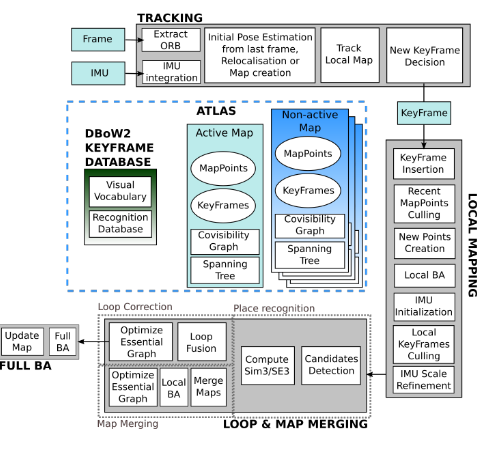
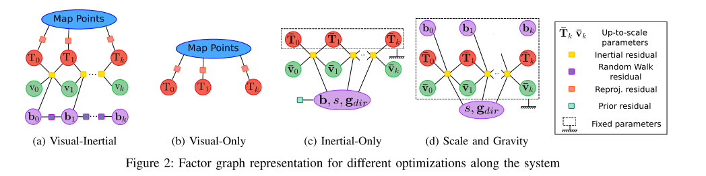
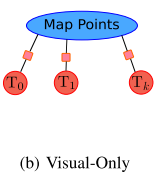
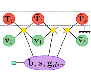
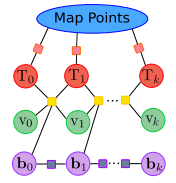
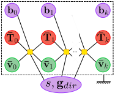
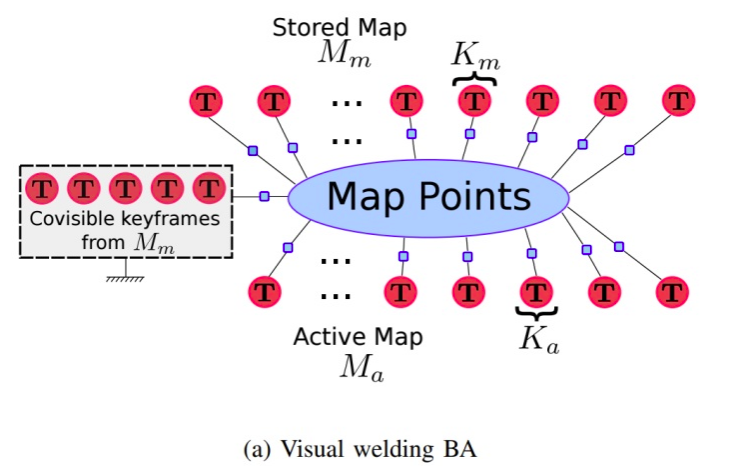
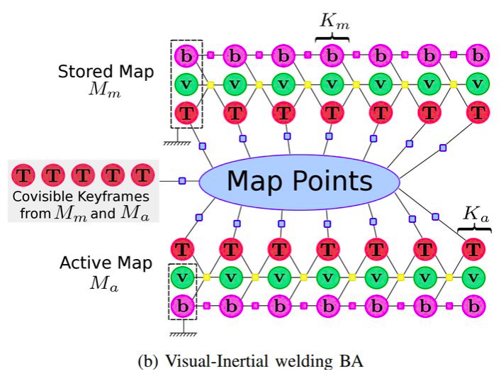
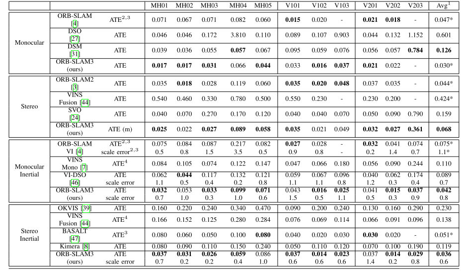
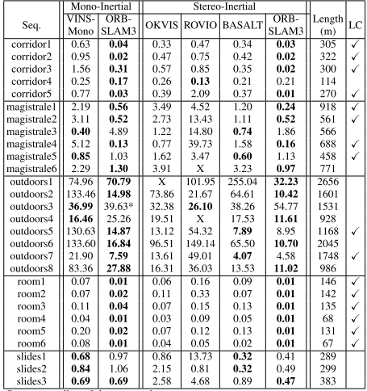

ORB这个组是真的有毅力，看了它的[**视频**](https://www.youtube.com/watch%3Fv%3DE-7fsq7en2g), 户外场景4分钟，几百米，闭环漂移基本看不见，提升是非常明显的。

<!-- more -->

[**《ORB-SLAM3: An Accurate Open-Source Libraryfor Visual, Visual-Inertial and Multi-Map SLAM》**](https://arxiv.org/pdf/2007.11898.pdf)

## Motivation

  之前的两个版本的ORB都是纯视觉传感器，这次加入了IMU，根据他们组的实验，相机+IMU的MAP 初始化可以极大的提升精度，所以想到要在ORB2的基础上加入IMU。

## Contribution

1. 提出了一种基于特征点法的视觉惯导紧耦合的SLAM系统，使用MAP对于状态量求解，包括在初始化阶段也是这么做的，相比较于ORB2，精度有2-5倍的提升。
2. 提出了多地图复用系统，使用了一种高召回率的场景识别算法，所以能够有效应对长时间弱纹理的环境，如果跟踪丢失，可以重新建图并且与之前的地图无缝融合，
3. 本文提出的SLAM算法在学术领域已有的系统中，表现最优。

## Content

1. 系统框架

   如下图，框架大体上与ORB2保持一致，添加了IMU的相关处理部分和地图集功能。

2. 地图集(Atlas)模块

   Atlas模块就是创新点所提到的多地图复用系统，它是一种多地图的表现形式，多地图由不相连的地图组成，从系统框图里可以看出，它由active map和non-active map组成，active map被跟踪线程定位。non-active map会被用来构建数据库并且重定位和闭环。
   
3. 跟踪线程

   类似与ORB2，计算重投影误差并且决定关键帧的插入策略。当系统追踪丢失后，会触发重定位模式，即当前帧在所有的Altas进行重定位；若重定位成功，当前帧恢复追踪状态；否则，经过一段时间（超过5秒），当前的active map会被存储为non-active map，同时开启新的建图过程。
   
4. 局部建图线程

   向active map中新增/删减/优化关键帧以及地图点，通过维护一个靠近当前帧的局部窗口的关键帧进行实现。与此同时，IMU的参数被初始化然后被该线程通过本文提出的最大后验估计技术进行求解。
   
5. 闭环和地图融合线程

   检测active map与整个Atlas是否有共同的区域，若共同的区域同属于active map，此时进行闭环矫正；若共同的区域属于不同的map，那么这些map就会被融合（融合为1个）,并变为active map, 最后独立执行BA来修正地图。
   
6. 相机重投影误差

   与ORB2一样，不再重复。
   
7. VIO

   1). IMU因子图优化

   如下图

   

   公式描述如下：
   
   状态向量:
   
$$
S_i=\{T_i,v_i,b^g_i,b^a_i\}
$$

   IMU残差:

$$
r_{I_{i,i+1}}=[r_\delta{R_{i,i+1}},r_\delta{v_{i,i+1}},r_\delta{p_{i,i+1}}]\\

r_{\delta{R_{i,i+1}}}=log(\delta R^T_{i,i+1}R^T_iR_{i+1})\\

r_\delta{v_{i,i+1}}= R^T_i(v_{i+1}-v_i,g\delta t_{i,i+1})-\delta v_{i,i+1}\\

r_\delta{p_{i,i+1}}=R^T_i(p_j-p_i-v_i\delta t-\frac{1}{2}g\delta t^2)-\delta p_{i,i+1}
$$

   考虑到IMU运动的帧i与3D点x之间的重投影误差:

$$
r_{i,j}=u_{i,j}-\pi(T_{CB}T^{-1}_i\oplus x_j)
$$

   最后整体的误差表示如下:

$$
min_{s_k,X}(\sum^k_{i=1}\|r_{I_{i-1,i}}\|_{\sum^2_{I_{i,i+1}}}+\sum^{l-1}_{j=0}\sum_{i\in{K^j}}\rho Hub(\|r_{i,j}\|_{\sum_{i,j}}))
$$

   2). IMU初始化

   目的是为了获取更好的IMU初始化参数值，论文里设计了一种快速准确的初始化方法，主要步骤分为3段,第一段是通过纯单目SLAM可以提供非常准确的初始地图，问题是尺度未知，首先求解vision-only问题可以提升IMU初始化的性能；第二段是如果将尺度scale显式表示为优化变量，而不是使用BA的隐式表示，则scale收敛得更快；第三段考虑的问题是若在IMU初始化过程中忽略传感器不确定性会产生大量不可预测的错误。下面一一进行分析

   A. 仅运动的初始化MAP估计

   进行单目SLAM，按照关键帧速率4Hz持续运行2s，得到按比例缩放的地图，包括关键帧以及上百个地图点，然后通过Visual-Only BA进行优化，因子图如下图所示:

   B. 仅惯性的MAP估计

   这一步的目的是获得IMU参数最优估计，MAP问题设置为:

$$
y^*_k=argmax_{y_k}(p(y_k)\prod^k_{i=1}p(I_{i-1,i}|s,g_{dir},b,v_{i-1},v_{i}))
$$

   对这个MAP取负对数，并且假设IMU预积分和先验分布符合高斯分布，那么可以简化为:

$$
y^*_k=argmin_{y_k}(\|r_p\|^2_{\sum_p}+\sum^k_{i=1}\|r_{I_{i-1,i}}\|^2_{\sum_{I_{i-1,i}}})
$$

   因子图表示如下:

   C. VI　MAP 估计

   一旦视觉以及IMU有了较好的估计后，进行一个VI联合优化进一步对这些参数进行精化，优化因子图如下:

8. 跟踪和建图

   只优化最后两帧位姿，同时保持地图点固定。采用了一种尺度精化技术：所有插入的关键帧都参与优化，但优化量只有重力向以及尺度因子，优化因子图见下图，在这种情况下bias为常数的假设就不再成立。
   

9. 地图融合与闭环

   ORB-SLAM采用的基于视觉词袋场景识别的重定位，若候选关键帧只有1个，召回率为50~80%。为了应对假阳性的出现，算法使用了时域校验以及几何校验，这两种手段能够使精确率达到100%的同时召回率为30~40%。至关重要的是，时域连续性检测将使场景识别滞后至少3个关键帧，同时召回率较低，这都是目前存在的问题。
   
   为了应对这个问题，本文提出一种新的场景识别（召回率得到改善）以及多地图数据关联算法。一旦Local Mapping线程创建了关键帧，场景识别算法就会被激活并且寻找该帧在Atlas中的数据关联。若匹配的关键帧在active map中，则进行闭环；否则，则进行多地图间的数据关联，即将active map与匹配的map进行融合。一旦这个新的关键帧与匹配地图间的相对位姿被计算出，就定义一个在局部窗口，这个局部窗口包括匹配的关键帧以及这个关键帧的共视关键帧。在这个局部窗口中，寻找中期数据关联，以提高闭环以及地图融合的精度。这个改进使得ORB-SLAM3比ORB-SLAM2具有更高的精度。
   
   1). 场景识别

   基本和ＯＲＢ２类似，添加了重力检验的步骤，检验pitch和roll是否小于一定的阈值来对场景识别结果校验。
   
   2). 地图融合

   当场景识别成功后，位于active map中的当前关键帧K与位于active map中的当前关键帧 [公式] 产生了多地图的数据关联，此时会进行地图融合(welding window + welding BA)
   

   或者

10. 论文实验结果

