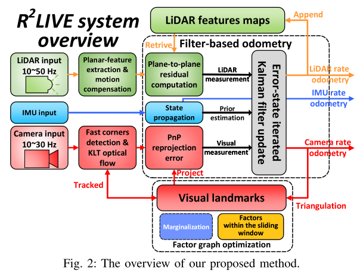
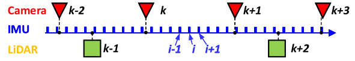
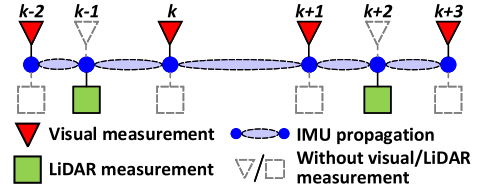
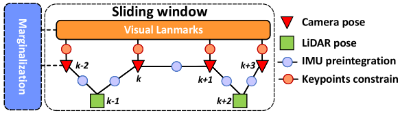
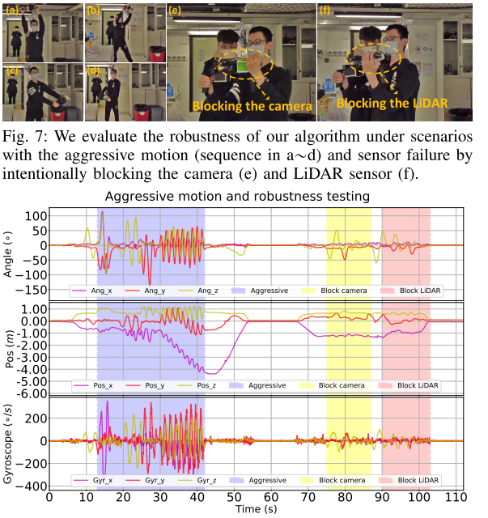
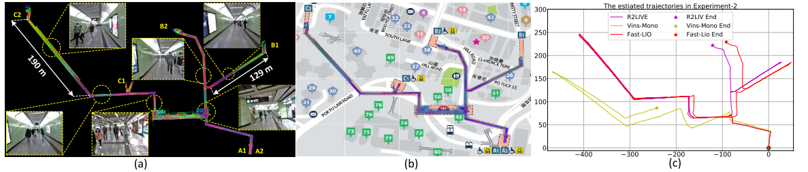
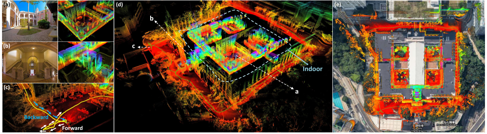
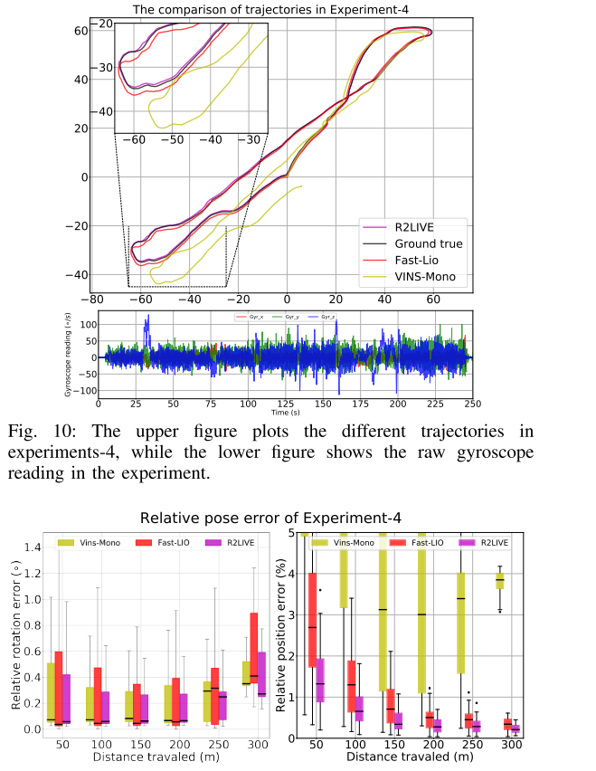
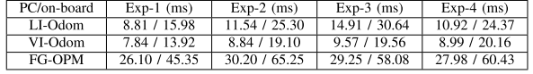

因为本人的目前研究方向是多传感器融合的，所以会有选择的挑选最新的关于多传感器融合的论文进行阅读(包括arxiv的未发表论文)。最近看到了港大的Mars实验室(他们之前的成果有loam_liovx,BALM,Fast-Lio)新上传了一篇关于多传感器融合的论文,代码已[**开源**](https://github.com/hku-mars/r2live)，所以做一下阅读笔记。

<!-- more -->

[**《R2LIVE: A Robust, Real-time, LiDAR-Inertial-Visual tightly-coupled state Estimator and mapping》（arxiv.2021.2.24）**](https://arxiv.org/pdf/2102.12400.pdf)

## Motivation

  目前由于雷达生产技术的提高，低成本激光雷达能够很便宜的量产，所以在工业上尤其自动驾驶上，得到了很大的关注，虽然诸如loam之类的算法的精确度已经比较高了，但是在低纹理环境下的性能仍然很差，这点在低成本的激光雷达上体现的更明显，所以这篇文章主要是为了基于雷达的里程计的退化问题。

## Contribution

1. 以紧耦合的方式融合相机，雷达，IMU数据，实验证明该方法在具有攻击性运动、传感器故障等各种挑战性场景下，甚至在具有大量运动目标和小视场的狭窄隧道环境中都具有足够的鲁棒性。
2. 提出了一个基于高速率滤波器的里程计和低速率因子图优化的框架。基于滤波器的里程计融合了激光雷达，惯性测量和相机传感器的误差状态迭代卡尔曼滤波，以实现实时性能。因子图优化关键帧位姿和局部图。
3. 通过对不同类型传感器的紧密融合，实现了高精度的状态估计。实验结果表明，该系统具有足够的精度，可用于重建大比例尺、室内外密集的建筑结构三维地图。

## Content

1. 系统框图

   主要就是两个部分，前段是基于误差状态卡尔曼滤波的里程计，后端是基于滑窗的因子图优化

   

2. 基于误差状态滤波的里程计

   A. 离散IMU状态向量
   
   
   
   如上图,IMU的频率最高，所以把状态建模为IMU频率:
   
   $$
   x_i=[^GR^T_{I_i}\ \ ^GP^T_{I_i}\ \ ^IR^T_{C_i}\ \ ^IP^T_{C_{i}}\ \ ^Gv^T_{i}\ \ b^T_{g_i}\ \ b^T_{a_i}]^T
   $$
   
   B. 状态传播
   
   
   
   $$
   \delta\hat{X}_i=X_i\boxminus\hat{X}_i\\
   =[^G\hat{R}^T_{I_i}\ \ ^G\hat{P}^T_{I_i}\ \ ^I\hat{R}^T_{C_i}\ \ ^I\hat{P}^T_{C_{i}}\ \ ^G\hat{v}^T_{i}\ \ \hat{b}^T_{g_i}\ \ \hat{b}^T_{a_i}]^T\\
   =(X_i\boxplus(\Delta t*f(X_i,u_i,w_i)))\boxminus(\hat{x}_i\boxplus(\Delta t*f(\hat{x}_i,u_i,0)))\\
   $$
   
   C. 雷达测量的信息处理
   
   主要是继承了Fast-Lio的面元特征思想，u为面法向量，q/p为代表面的特征点，残差如下:
   
   $$
   r_l(\check{X}_{k+1},^Lp_j)=u^T_j(^Gp_j-q_j)
   $$
   
   D. 视觉测量信息的处理
   
   如果第k+1帧是相机帧，那么误差就为重投影误差:
   $$
   ^CP_s=(^G\check{R}_{I_{k+1}}\ ^I\check{R}_{C_{k+1}})^T\ ^GP_s-(^I\check{R}_{C_{k+1}})^T\ ^G\check{p}_{I_{k+1}}-^I\check{p}_{C_{k+1}}
   $$
   
3. 因子图优化

   总体来说和VINS-MONO一样，不过就是多了一个雷达位姿节点，用IMU预积分将雷达位姿节点和相机位姿节点进行关联.
   
   
   
4. 论文实验

   A.　室内环境的对剧烈运动测试的实验
   
   
   
   B. 地铁环境下的长廊实验
   
   
   
   C. 室外和室内环境下的高精度建图实验
   
   
   
   D.　定量分析实验
   
   
   
   E. 时间对比
   
   
   
## Conclusion

   这篇文章的主要创新点体现在前段的基于误差卡尔曼滤波的里程计和后端的位姿图优化，但是论文的实验存在比较大的问题，一没有公开数据集，二也并不能体现出这种融合方式的卓越性能，看后续作者有没有补充实验再下定义。

   
