对于激光点云的优化的方法而言，尽量多的使用不同的特征从而提高鲁棒性和精确度算是一种共识，今天要介绍的这篇文章就是在激光雷达优化中同时使用了点和线，下面进行仔细分析。

<!-- more -->

[**《Efficient Velodyne SLAM with point and plane features》（Autonomous Robots 2019 ）**](https://link.springer.com/content/pdf/10.1007/s10514-018-9794-6.pdf)

## Motivation

  目前大多数的SLAM算法是基于室内环境的，这些算法虽然在室内的环境效果很好，但是如果移到室外，效果会很差，所以如果想要大规模的应用室外机器人，一个可靠的室外SLAM算法是必要的，本文基于这个需求提出了基于雷达点云的平面检测器，并且取得了不错的实验效果。

## Contribution

1. 开发了一个快速的在线SLAM算法(经过实验验证)，能够在室内和室外进行可靠的距离测量。
2. 提出了一个快速平面检测器来检测平面特征，并且保持了在低层级环境中检测底层特征(点)的能力。
3. 该算法能够在非光滑的运动轨迹上运行，适用于仿人机器人和空中机器人，不需要里程计模块.。
4. 开发了一种约束跟踪算法，使帧到帧匹配的计算量最小化。

## Content

1. 系统框架

   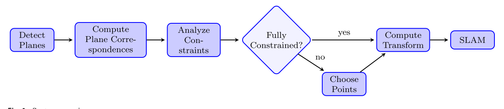
   
2. 平面特征

   这篇文章主要依据的是激光扫描到平面接收到的返回信号可能是圆锥曲线的数学原理(示意图如下)，然后根据返回的曲线的曲率，施加不同的权重，对平面进行建模，如果两个平面符合下面的约束，则视为匹配的:
   
   $$
   \hat{n}_a*\hat{n}_b\ge t_{dot}\\
   \frac{|\rho_a-\rho_b|}{\rho_a+\rho_b}<t_{dist}\\
   (\rho是坐标系原点到平面的距离，n是法向量,t为阈值)
   $$
   
   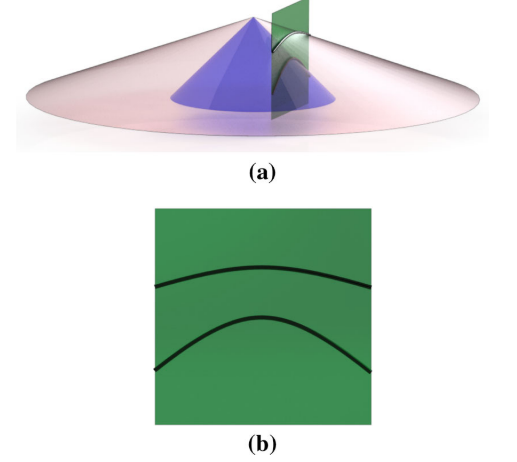
   
3. 约束分析

   如果要维持6-DOF的约束，则至少要保证每帧3对不共面的平面约束，事实上，在实验中，作者发现这个是比较难做到的，所以，加入额外的点的约束是必要的。
   
   作者在文中采取的方法是约束球法(如下图),球的三个轴分别表示三个方向的约束，轴长度就代表这个约束方向上强度的大小,约束球通过如下的步骤建立:
   
   a.计算约束矩阵C:
   $$
   C=\sum^N_{i=0}y_in_in^T_i\\
   (y_i是这个平面约束用到的点的数量，n_i是平面法向量)
   $$
   
   b.奇异值分解参数化为球形
   
   $$
   C=U\begin{bmatrix}
    r^2_{c0}&0  &0 \\
    0& r^2_{c1} &0 \\
    0&  0&r^2_{c2}
\end{bmatrix}R_c\\
(r_{c}分别是三个轴的半径长度,R_c是旋转矩阵)
   $$
   
   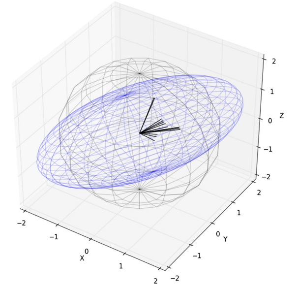
   
   在建立了约束球后，在补充点约束的时候，就可以在这个基础上减少计算的时间(只在约束少的方向上增加点的约束),步骤如下:
   
   $$
   \hat{n}=R^T_cn\\
   $$
   
   转换成极坐标:
   
   $$
   <\theta,\phi>=<arctan(\hat{n}_1,\hat{n}_0),arccos(\hat{n}_2)>\\
   $$
   
   之所以要用到极坐标，是为了方便找到原点到椭球边缘的距离
   
   $$
   d_q=\sqrt{\frac{cos(\theta)^2sin(\phi)^2}{r^2_{c0}}+\frac{sin(\theta)^2sin(\phi)^2}{r^2_{c1}}+\frac{cos(\phi)^2}{r^2_{c2}}}\\
   $$
  
   随后权重计算如下:
   $$
   s_q=1-min(\frac{d_q}{\hat{t}},1)
   $$

4. 选择点约束

   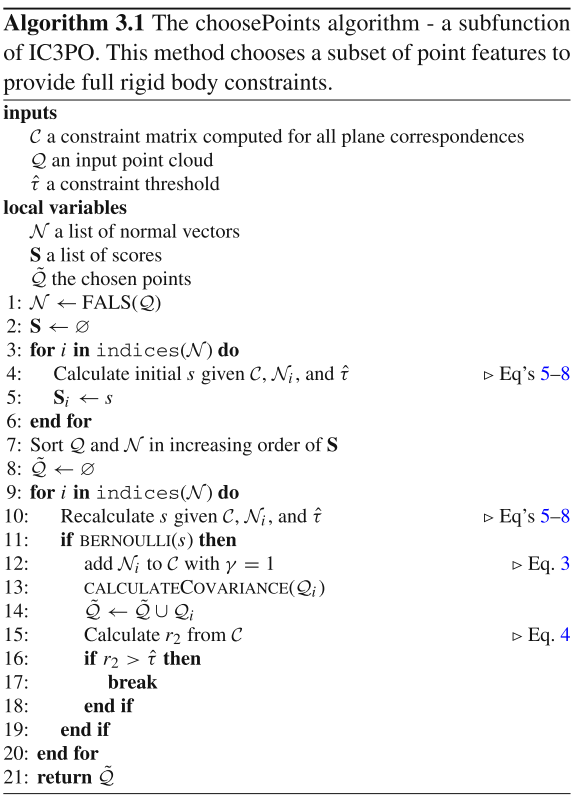
   
   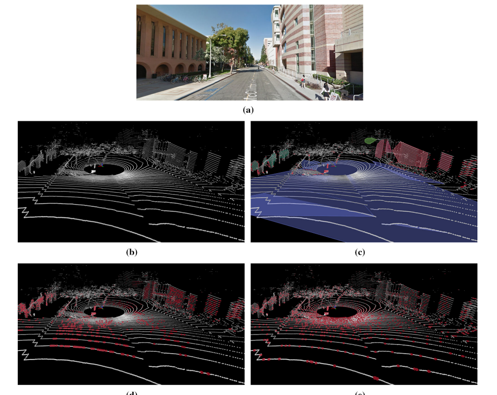
   
5. 计算位姿变换

   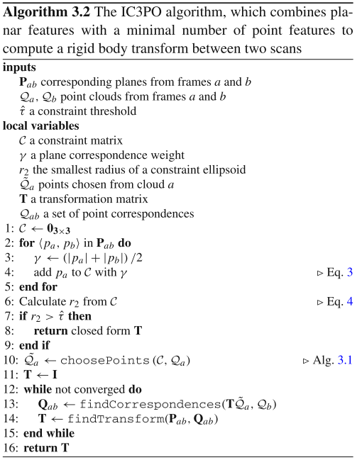
   
   A.仅平面的约束估计
   
   如果约束球的所有方向的约束都符合阈值要求，那么就执行仅平面的约束估计
   
   首先是求解平移估计:
   
   $$
   Mt=d\\
   (M是帧a平面法向量组成的矩阵，并且按照逆方差缩放)\\
   M=\begin{bmatrix}
   n^T_{a_1}/(\rho_{a1}+\rho_{b_1})\\
   n^T_{a_2}/(\rho_{a2}+\rho_{b_2})\\
   ...\\n^T_{a_n}/(\rho_{an}+\rho_{b_n})
   \end{bmatrix}\\
   (d是帧a和帧b平面间的距离，并且按照逆方差缩放)\\
   d=\begin{bmatrix}
   d_{a1}-d_{b1}/(\rho_{a1}+\rho_{b_1})\\
   d_{a2}-d_{b2}/(\rho_{a2}+\rho_{b_2})\\
   ...\\d_{an}-d_{bn}/(\rho_{an}+\rho_{b_n})
   \end{bmatrix}\\
   $$
   

求解出t即为平移

   旋转求解采用航空工程中的"q方法":
$$
B=\sum^N_{i=0}\frac{n_{ai}n^T_{bi}}{\rho_{ai}+\rho_{bi}}\\
   K=\begin{bmatrix}
  B+B^T-Itr(B)&Z \\
  Z^T&tr(B)
\end{bmatrix}\\
Z=\begin{bmatrix}
 B_{23}-B_{32}\\B_{31}-B_{13}
 \\B_{12}-B_{21}

\end{bmatrix}=\sum^N_{i=0}\frac{n_{ai}\times n_{bi}}{\rho_{ai}+\rho_{bi}}
$$

   然后对矩阵K进行特征值分解，最大的特征值及对应的特征向量组成四元数.

   B. 加上点约束的位姿求解

   代价函数优化:

$$
min\frac{1}{2}(\rho_\alpha(\|f_\alpha(x)^2\|)+\rho_\beta(\|f_\beta(x)^2\|))
$$

$\alpha$是点的约束，$\beta$是平面的约束

点的约束可以通过GICP执行:

$$
f_\alpha(x)=\sum^N_{i=0}(exp(x)q_{ai}-q_{bi})^TM_i(exp(x)q_{ai}-q_{bi})
$$

6. 位姿图

   红色节点为位姿，蓝色节点为检测到的平面约束
   
   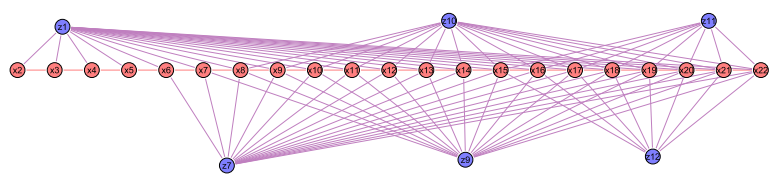
   
7. 实验结果

   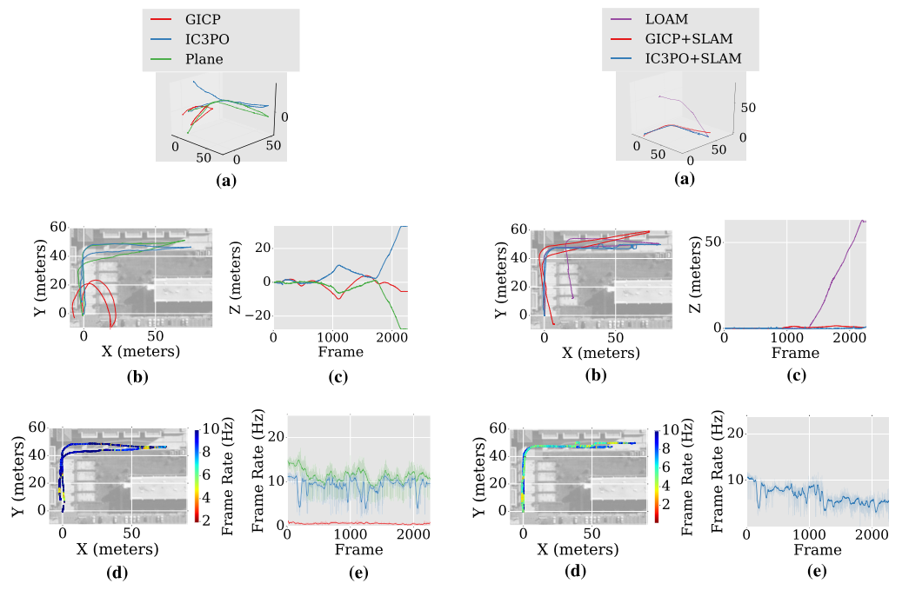
   
   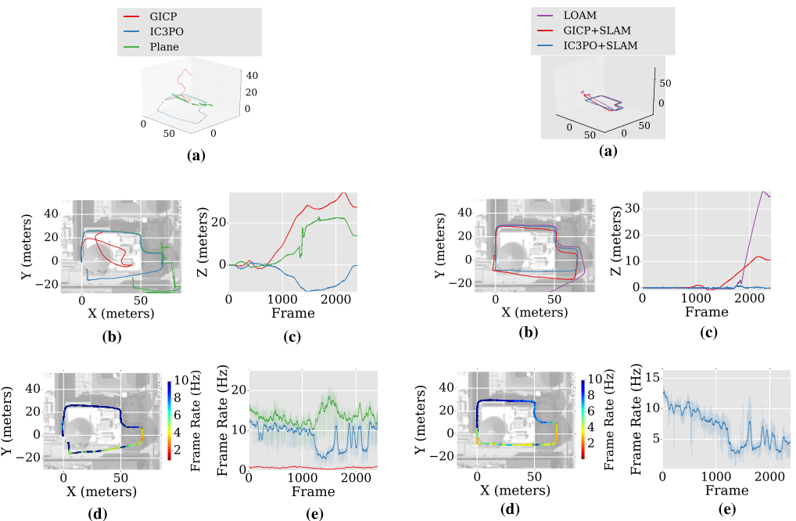
   
   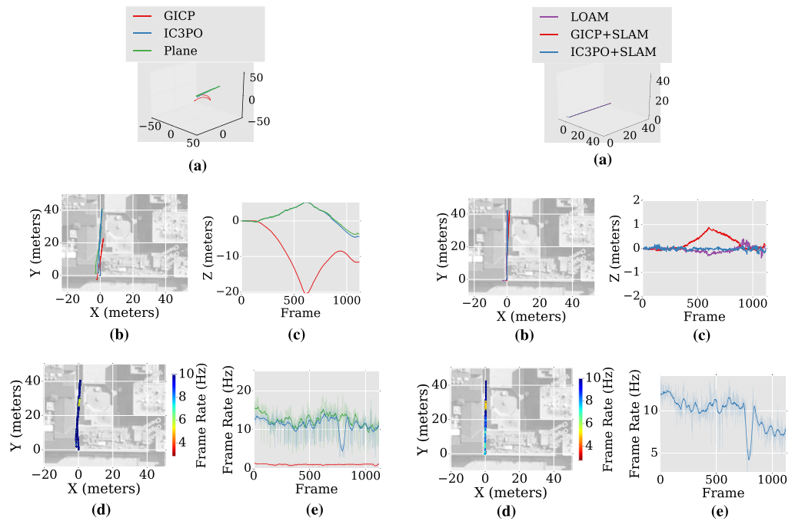
   
   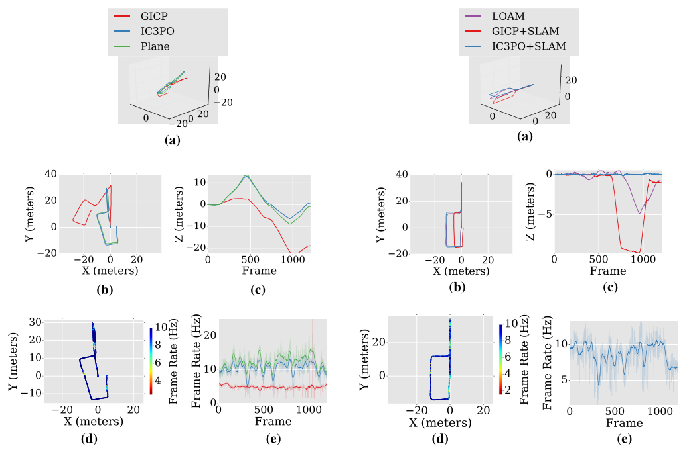
   
   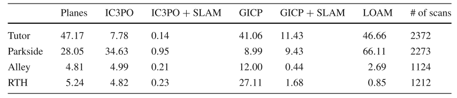
   
   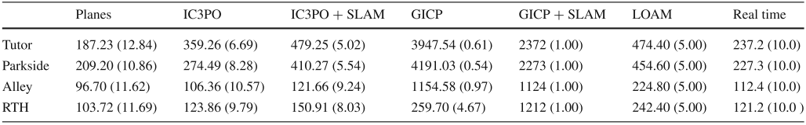
   
## Conclusion

   这篇文章比较系统的介绍了平面特征的使用和补足方式，作者没有过度的使用优化的方法而是采用手推的方式，数学的功底是比较好的，从实验结果来看，在不加入回环的情况下，精度和LOAM差不多，但是时间上快很多，在加入后端回环的情况下，时间和loam差不多，但是精度提升很多.
