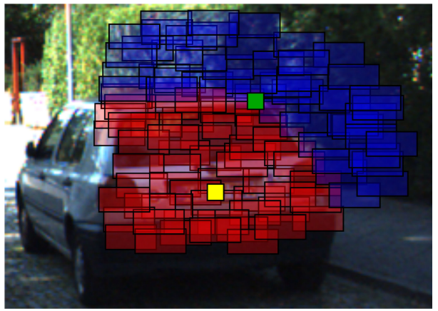
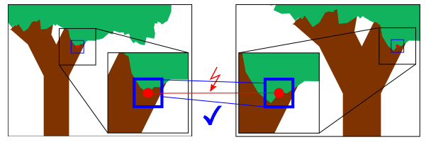
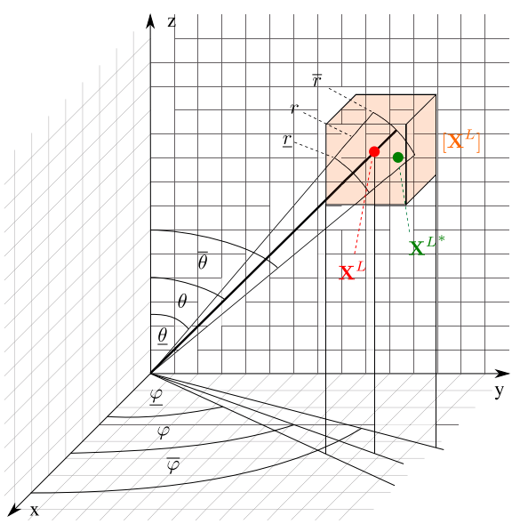
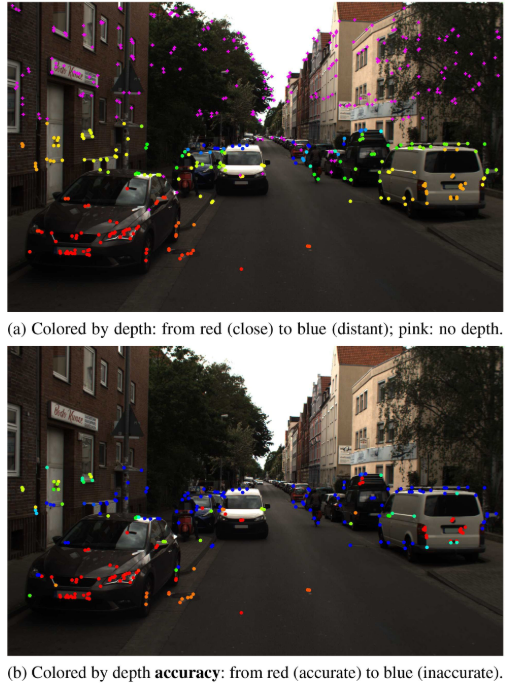
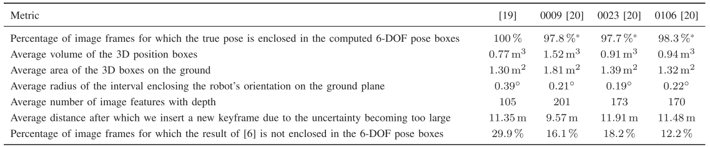
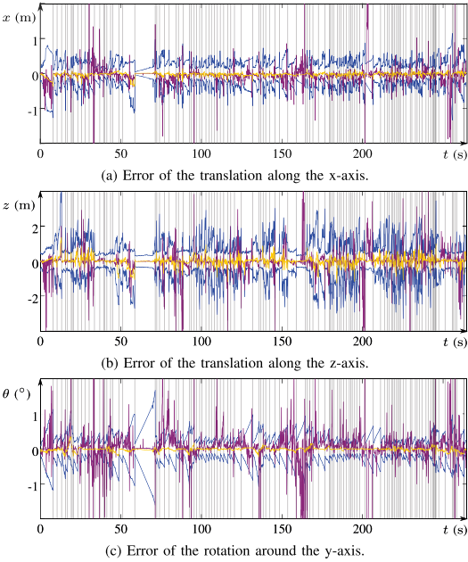
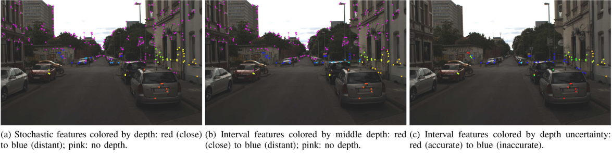

多传感器融合的思路挺多的，这篇文章主要是针对深度融合这个点进行了仔细的探讨。

<!-- more -->

[**《Interval-Based Visual-LiDAR Sensor Fusion》（RAL2021 ）**](https://ieeexplore.ieee.org/document/9349119)

## Motivation

   将激光和视觉的深度信息进行融合是一个主流的方案，但是，现有的方法忽略的融合信息的不确定性，大部分的融合方案是直接将根据算法算出的最可靠的激光点和特征点进行关联，然后将激光的深度赋值给视觉的特征点(VLOAM,LIMO均如此)，但是这样并不符合实际情况，因为传感器的测量误差一般是未知的，所以作者在这篇论文中提出了用区间深度的分析代替点值深度，虽然最后的实验比较一般，但是确实是一个有意思的思路。

## Contribution

1. 提出了用区间的方法来融合相机和雷达深度，可以保持了对于不满足高斯分布的错误的鲁棒性
2. 基于这个区间的方法实现了一个里程计，从实验结果上证明了鲁棒性

## Content

1. 区间分析简述
   
   如下图，方框代表一个深度区间，红框代表近深度，蓝框代表远深度，图中的黄点相交于深度相近的框，因此可以精确的得出它的深度，图中的绿点相交的深度框差距比较大，所以因此深度不确定性会比较大。
   
   
   
2. 相机模型

   这个模块简单的介绍了下它用的是针孔相机模型，然后介绍了特征点匹配深度的原理(其实跟上面一样)。

   	
   
3. 激光雷达模型

   如下图，激光雷达根据角度和半径进行区间划分，类似于体素格划分。

   	
   
4. 激光投影

   将激光转换到相机坐标系然后投影到相机平面:
   
   $$
   \begin{pmatrix}
   \hat{x}^C_i\\\hat{y}^C_i
    \end{pmatrix}=f_{proj}(X^L_i,R^C_L,t^C_L)=\begin{pmatrix}
   \frac{R_1X^L_i+t_1}{R^3X^L_i+t_3}\\
   \frac{R_2X^L_i+t_2}{R^3X^L_i+t_3}
   \end{pmatrix}
   $$
   
   因为误差的存在，所以外参标定和坐标测量，都不会完全精确，所以用区间代替上面的值:
   
   $$
   [\hat{X}^C_i]=\begin{pmatrix}
   [\hat{x}^C_i]
   \\ [\hat{y}^C_i]
   \end{pmatrix}=[f]_{proj}([X^L_i],[R^C_L],[t^C_L])
   $$
   
   最终效果图如下:
   
   	
   
5. 深度融合

   $$
   [\hat{X}^C_j]=([\hat{x}^C_j][\hat{y}^C_j])(深度图区间的图像坐标)
   \\
   S_j=\{i\in\{1,\dots,N_l\}|[\hat{X}^C_i]\cap[\hat{X}^C_j]\ne\empty\}(找出所有深度区间的交集的并集)\\
   [z^C_j]=U[z^C_i]\\
   [X^C_j]=[z^C_j]\begin{pmatrix}
   [\hat{x}^C_j]\\ [\hat{y}^C_j]\\1
   \end{pmatrix}(深度赋值)
   $$
   
   	
   
6. 里程计

   a. 有深度图区间赋值深度的约束
   
   $$
   f^{one}_j(R^f_g,t^f_g,\hat{X}^f_g,X^g_j)=\begin{pmatrix}
   (R_1-\hat{x}^f_jR_3)X^g_f+t_1-\hat{x}^f_jt_3\\
   (R_2-\hat{x}^f_jR_3)X^g_f+t_2-\hat{x}^f_jt_3
   \end{pmatrix}\\
   =0
   $$
   
   b. 无深度区间赋值深度的约束
   
   $$
   f^{no}_j(R^f_g,t^f_g,\hat{X}^f_j,\hat{X}^g_j)\\
   =(-\hat{y}^f_jT_3+T_2\ \ \hat{x}^f_jT_3-T_1\ \ -\hat{x}^f_jT_2+\hat{y}^f_jT_1)R^f_g\hat{X}^g_j=0\\
   $$
   
7. 实验

   
   
   
   
   
   
## Conclusion

   这篇论文的重点其实就是提出了一个区间分析的深度融合策略，实验部分做的其实比较粗糙，但是效果图挺有意思的，中RAL的原因，应该首先是区间分析确实比较新颖，另外就是效果图吸引了编辑的目光。