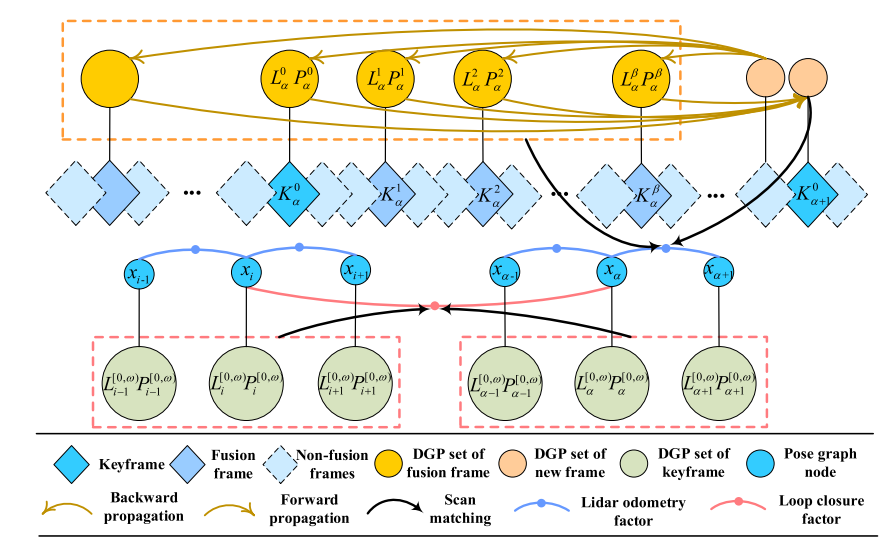
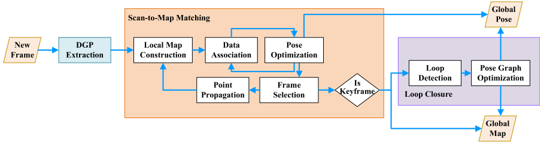
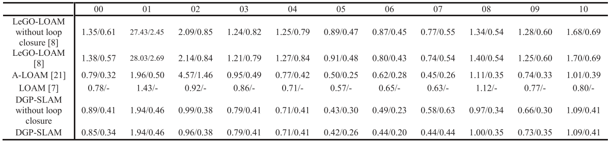
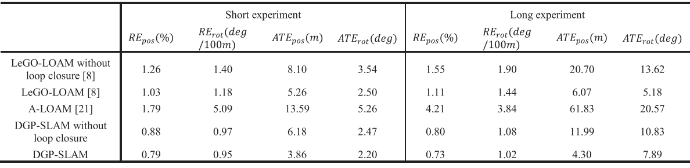
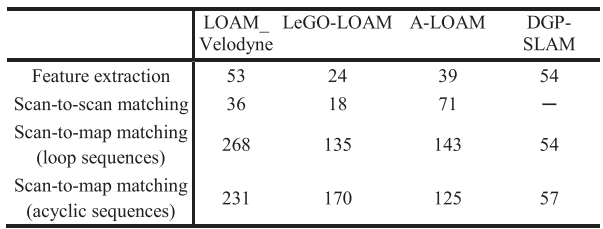
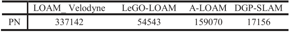

基于激光的SLAM目前虽然比较成熟，但是时间上会受到建图的制约，这篇文章主要是针对这个点进行的改进。

<!-- more -->

**《A Novel 3D LiDAR SLAM Based on Directed Geometry Point and Sparse Frame》（RAL2021 ）**

## Motivation

   目前的激光slam方法的效率比较低，没法实现太快的频率，主要原因是受到建图的制约，作者针对这一点，将激光SLAM分成基于DGP(直接基于点的里程计)和稀疏帧建图，从而提升了整体的效率。

## Contribution

1. 提出了一个新的适合激光雷达点的点特征描述方式，命名为直接几何点(就是带有平面法向量　的点)，这个可以显著的减少地图内的点的数量从而提高效率
2. 稀疏帧的分布减少了运行时间并且点的传播机制一定程度上弥补了稀疏帧带来的精确度降低的影响。

## Content 

1. 时序框图

   K指的是稀疏帧，右上角0的K指的是关键帧，L和P分别指的是角点点集和平面点点集

   
   
2. 算法流程

   

3. DGP提取

   采用lego-loam的方法将地面点划分为平面点，然后将剩余的点采用loam的方法划分平面点和角点，并且往平面点和角点的点集里都加入方向向量属性。
   
4. 稀疏帧的选择

   根据距离上一个稀疏帧过去的距离进行判定，大于阈值则加入新的稀疏帧.
   
5. 位姿估计

   a. 首先将局部点集投影到最近的稀疏帧
   b. 然后根据三个指标:点之间的距离，点线点面之间的距离,方向向量的差别来判定是否将地图点和稀疏帧的点进行数据关联，上述三个指标差异最小的为最匹配的数据帧
   c. 然后根据loam的点线和点面优化公式进行优化
   
6. 点的传播

   看相对于稀疏帧的位置，如果在前面就用上一帧的位姿将点投影到上一帧，反之就投影到下一帧。
   
7. 实验

   
   
   
   
   
   
   
   
## Conclusion

   这篇论文主要的创新点就是基于loam之类的激光里程计选取特征点方式的基础上给点加了一个向量特征，然后提出了一个稀疏帧的概念来减少计算，整体精度上有一定的提高，时间上提升的比较多。
   