目前大部分的融合都是基于优化的，但是滤波的融合方式在某些场景下，效果优于优化，所以仍然有很多人针对滤波的融合的进行改进

<!-- more -->

**《MaRS: A Modular and Robust Sensor-Fusion Framework》（RAL2021 ）**

## Motivation

   目前的基于滤波的传感器融合方式大多都是针对一个特定的场景问题，不能支持动态的添加额外的传感器信息，即使有些滤波融合框架允许动态的添加传感器信息，但是添加会导致时间复杂度指数级的增长，本文的研究背景就是基于这两个问题。

## Contribution

1. 提出了一个模块化的多传感器融合滤波器，具有在线添加以前未定义的传感器的能力，并具有延迟和异步测量功能。 这些传感器将基于其外部状态进行自我初始化和校准，并添加到系统中
2. 一种正确的协方差分割的新方法，该方法在单独连接的段的隔离处理过程中保留协方差矩阵的属性。 这使框架在受限平台上既一致又在计算上易于处理：复杂度仅线性取决于传感器的数量和传播步长恒定/与传感器的数量无关。
3. 丰富的仿真和数据集实验验证

## Content 

1. 模块化的滤波器融合方式

   下图左是目前比较流行的诸如EKF之类的滤波，协方差矩阵在每次状态更新时是全部进行更新，下图右是作者提出的模块化的滤波器，只有核心状态和当前活跃的传感器协方差进行更新

   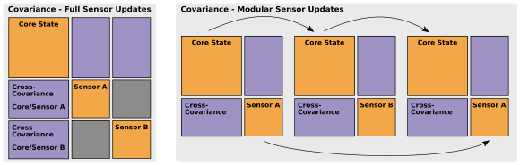
   
   对于核心状态的定义: 核心状态指的是用来保证控制状态的必不可少的信息, 在文章中定义为平移+速度+方向+陀螺仪偏差+加速度偏差,即:
   
   $$
   X_C=[p^T_{WI},v^T_{WI},q^T_{WI},b^T_{w},b^T_{a}]^T
   $$
   
   导数分别如下:
   
   $$
   \hat{p}_{WI}=v_{WI}\\
   \hat{v}_{WI}=R_{(q_{WI})}(a_m,b_a,n_a)-g\\
   \hat{q}_{WI}=\frac{1}{2}\Omega(\omega_m-b_{\omega}-n_{\omega})q_{WI}\\
   \hat{b}_w=n_{b_{\omega}},\hat{b}_a=n_{b_a}
   $$
   
   需要注意的是，如果加入额外的传感器，一般情况下是需要估计外参的，那么可以加入外参的状态并且实时更新，比如说两个传感器S1和S2,那么核心状态就需要加入外参矫正状态进行相应的扩展:
   
   $$
   X=[X_C;X_{S_1};X_{S_2}]
   $$
   
   观察额外的传感器会在核心状态和传感器状态之间引入互相关，从而导致协方差矩阵P中的互协方差,所以联合协方差矩阵可以表示为:
   
   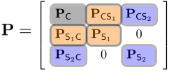
   
   在上面给出相关状态的描述后，作者接着给出了一种将核心状态和传感器协方差分量进行分割的方法,如下图:
   
   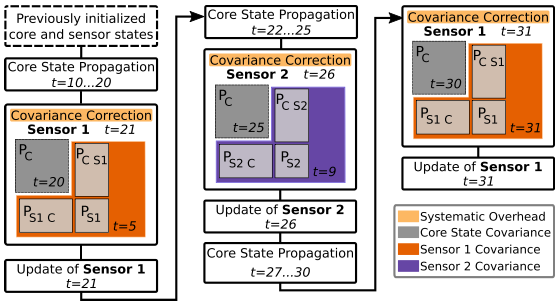
   
2. 持续的模块化的协方差估计
   
   上述的协方差分割引入了两个问题，一个问题是由于这种方法，两个或多个传感器永远不会在同一步骤中更新，因此，不会生成传感器之间的互协方差项，针对这个问题，作者默认是传感器的信息是相互独立的
   
   另一个问题是协方差分段对联合方差矩阵的有效性不能有效解释，因为协方差段是针对不同时间点计算的，并且不包括相同数量的样本数据，这导致了非正半确定性，针对这个问题，作者提出了预处理步骤，以重新引入在传播和各个更新阶段未处理的信息。 然后，从扩充矩阵中选择最接近的有效（正-半限定）协方差矩阵
   
   a.传播
   
   $$
   \Phi(m,n)=\Phi_n\Phi_{n-1}\dots\Phi_m \ with \ t(m)<t(n)\ \ (状态转移公式)\\
   P_{CS,n(-)}=\Phi_C(m,n)P_{CS,m}\Phi_S(m,n)^T\ \  \  \ (\Phi_C(m,n)表示核心状态的转移, \Phi_S(m,n)表示传感器状态的转移)
$$
   
   b.更新

   这里主要讨论的是协方差矫正问题(因为在测量更新后，协方差很有可能是非正定的)，采用的方法是：
   
   I:ABS(绝对特征值矫正),只保存由特征向量张开的维度.
   
   II:Zero(零特征值矫正),执行获得正行列式所需的最小变化

   III:Delta(增量特征值矫正), 将负特征值设置为正的经验参数

3. 最终实现的框架

   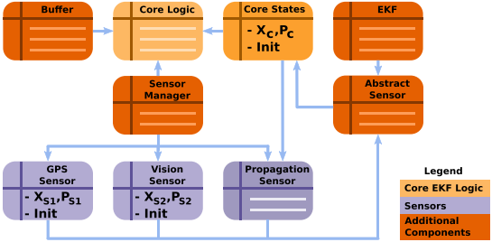
   
   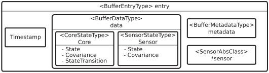
   
4. 实验

   I: 通过仿真数据集验证三个矫正协方差方法的有效性的实验
   
   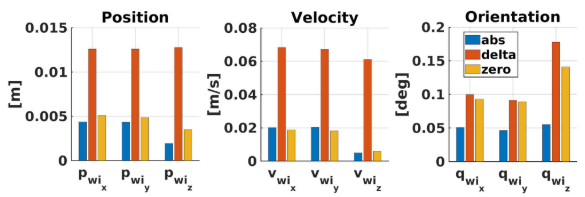
   
   II: 和传统滤波对比
   
   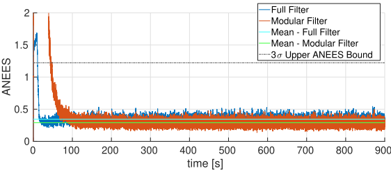
   
   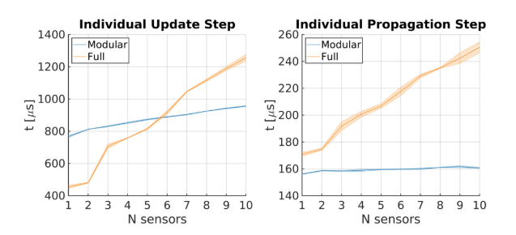
   
   III: 飞行器实验
   
   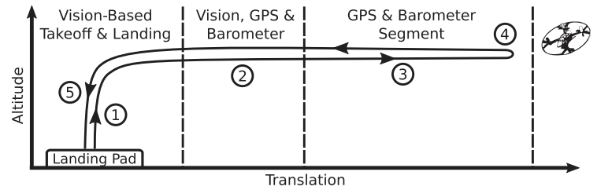
   
   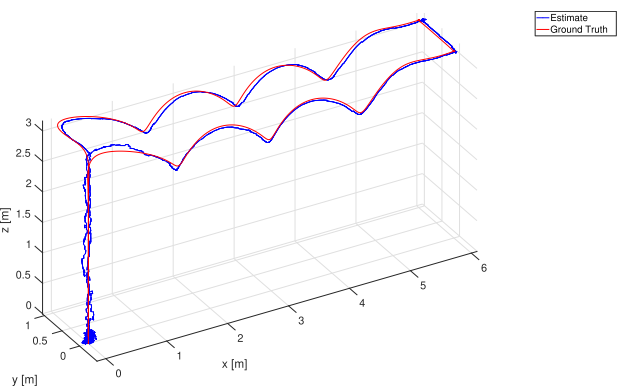
   
   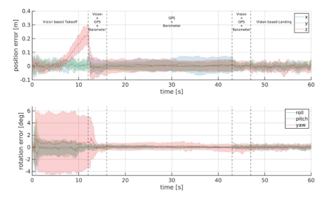
   
   
## Conclusion

   这篇文章讲的是对于滤波融合传感器的改进，改进的点在于协方差状态更新，并且使用了一些基于特征值的方法来保证协方差在更新过程中的有效性，并且因为更新的步骤是模块化更新，从而时间上如果要添加更多的传感器是优于传统的EKF的。