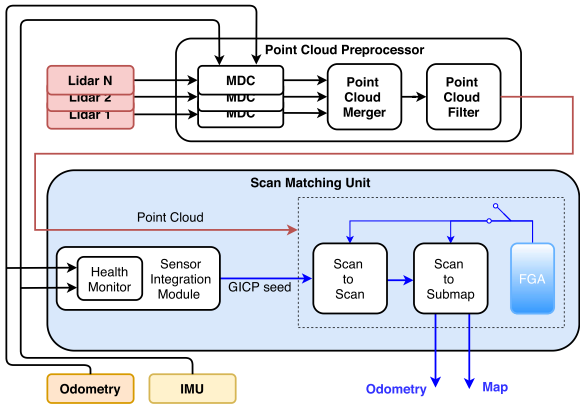
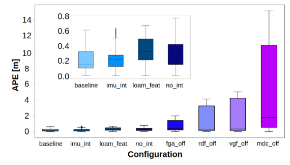
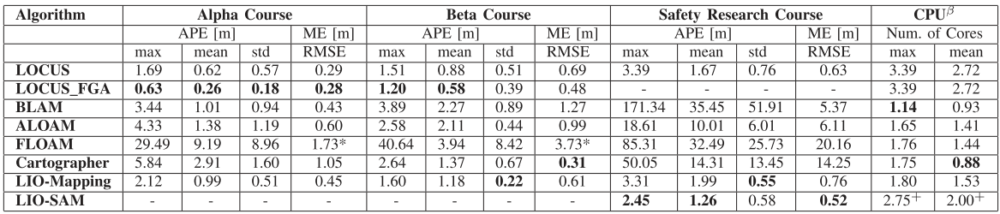
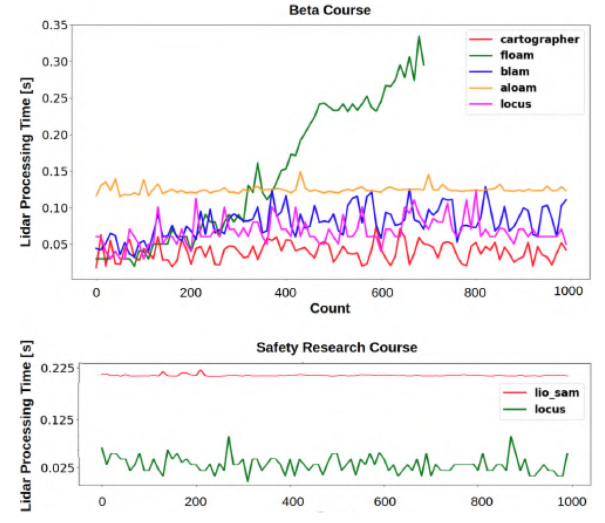

里程计是SLAM的核心基础，尤其是在多变的环境下，里程计的可靠性和精确度更加是非常重要的，本文提出的里程计是作者参加美国国防部地下越野挑战赛获得冠军的里程计部分。

<!-- more -->

**《LOCUS: A Multi-Sensor Lidar-Centric Solution for High-Precision Odometry and 3D Mapping in Real-Time》（RAL2021 ）**

## Motivation

   黑暗、遮蔽物（如雾、灰尘、烟雾）、自相似区域缺乏显著的感知特征以及湿滑的地形（导致感觉运动不平稳）是对机器人操作造成严重感知挑战的常见特征,为了在这些条件下获得鲁棒的里程计性能,人们通常会将激光雷达和其他传感器结合，但是其他传感器很有可能会退化，所以不是很可靠，本文基于这个背景，提出了一个主体是激光雷达里程计，并且对于融合的其他传感器失败的情况下仍然鲁棒的里程计。

## Contribution

1. 提出了一个以激光雷达为中心的里程计，这个里程计可以在压力大的环境下实现鲁棒感知，并且能够减轻传感器故障的压力
2. 系统依靠传感模式之间的松耦合切换方案，对一个或多个传感器通道的下降或丢失具有故障保护。
3. 该系统还可以将领域知识（如果可用）结合起来，例如在人造结构中的平地(人工特征)。
4. 我们提出了一个消融研究的轨迹，然后比较性能与六个最先进的方法使用的数据在现场测试获得了最好的结果。

## Content

1. 系统框图

   主要分为点云预处理和扫描匹配模块，点云预处理又可以分成

   
   
2. 点云预处理

   主要包括运动畸变矫正，点云合成和点云滤波，点云畸变矫正通过IMU给出的运动先验或者线性运动模型给出；点云合成就类似于图片合成，将多个激光雷达获得的点云合并成一个激光雷达坐标系下的点云；点云滤波器由三维体素网格滤波器和随机下采样滤波器的顺序组合而成，可以单独调谐、激活和停用，主要起到降低数据量和减少离群点的作用。
   
3. 扫描匹配单元

   这个部分主要是执行基于GICP的帧到帧和帧到地图的匹配优化步骤(类似于LOAM)。
   
   首先使用一个健康检查模块(文章中介绍了很多检测的指标，比如说特征数量，协方差检查，速率分析和可观测性分析，但是实际上，在应用的过程中，作者只使用了频率分析，即频率>1hz的里程计信息就认为是健康的)。
   
   无论是否有先验的健康的里程计信息，都开始执行帧帧匹配模块(GICP优化):
   
   $$
   \hat{T}^{k-1}_k=argmin\delta(T^{k-1}_kL_k,L_{k-1})
   $$
   
   然后以帧帧匹配获得的里程计位姿作为先验来进一步执行帧-图优化(这两步其实都是loam的逻辑):
   
   $$
   \hat{T}^{k-1}_k=argmin\delta(T^{k-1}_kL_k,S_k)
   $$
   
   最后加入地平面检测来进一步优化位姿(文章中的做法主要是判断IMU是否长时间内没有方向的改变)
   
4. 实验

   I:下图是不同的消融实验在**alpha**的**subT**数据集的表现:
   
   **baseline**是使用了这个文章中所有提出的技术，**IMU_INT**指的是没有里程计先验(VIO/WIO),**NO_INT**指的是没有任何先验,**loam_INT**指的是用loam的点策略代替文章中的点云滤波,**fga_off**指的是没有地面点辅助策略,**rdf_off**指的是没有随机降采样滤波,**vgf_off**指的是没有体素格滤波,**mdc_off**指的是没有点云去畸变
   
   
   
   II:下面是不同的算法在DAPRA提供的三个数据集中的实验效果:
   
   
   
   III:时间对比实验
   
   
   
## Conclusion

   通读全文，本文的创新性感觉主要就两点，针对多个激光雷达生成点云的合并以及对于多个传感器的运动先验的处理，其他的点感觉和loam差不多，实验效果上，精度确实是他给出的表里的最好的数据，但是我比较奇怪的是我测试floam的时间并没有随时间变多，为什么他这个floam每帧时间都在变多，很奇怪。