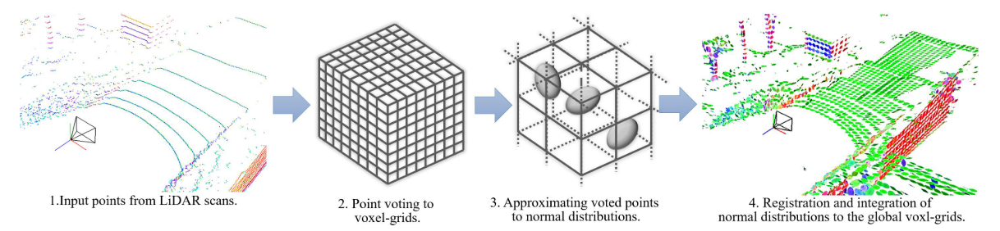
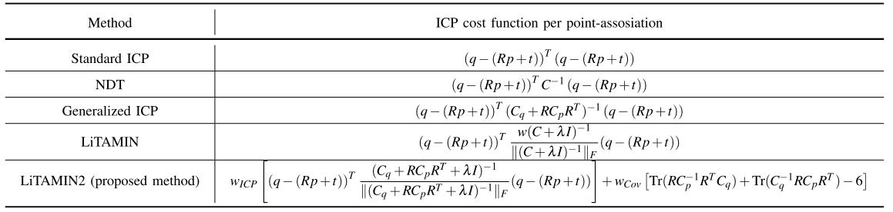
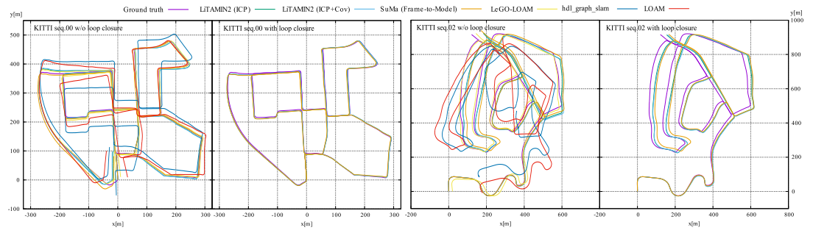
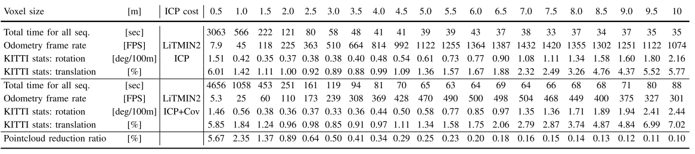

ICRA陆陆续续发榜了，这篇文章的工作很厉害，把激光的运行频率提升到了500-1000hz,下面就来看看他是怎么做到的。

<!-- more -->

**《LiTAMIN2: Ultra Light LiDAR-based SLAM using Geometric Approximation applied with KL-Divergence》（ICRA2021 ）**

## Motivation

   目前的激光雷达的运行速度受到点数量的约束，无法达到很快的频率，即使有些工作通过点的挑选策略缩短了ICP的时间，但是运行的精度会受到很大的影响，所以为了避免这个问题，作者在文中引入KL散度来反应两个概率分布的关系。

## Contribution

1. 提出了一种方法，使得基于ICP的雷达方法达到500-1000hz并且精度保持不变。
2. 丰富的实验证明。

## Content 

1. 缩小点数量的方法

   基于体素格的方法，但是不用体素格的均值而是采用协方差，并且匹配的方法参考了NDT,采用正态分布到正态分布建图的匹配为了提升整体的精度
   
   
   
2. ICP代价函数的改进

   具体如下图，主要分成两个部分的残差:
   
   
   
3. 实验

   
   
   
   
   

## Conclusion

   这篇文章主要是提出了改进体素格划分的方法，加入了KL散度并且也考虑了分布和分布之间的关联，从最后的结果来看，确实是产生了很好的效果.