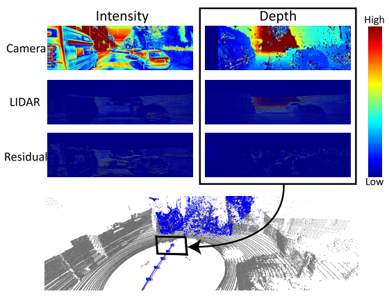
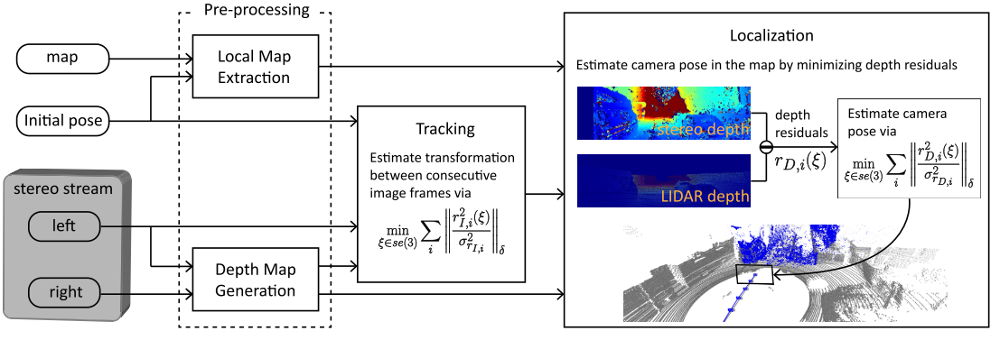
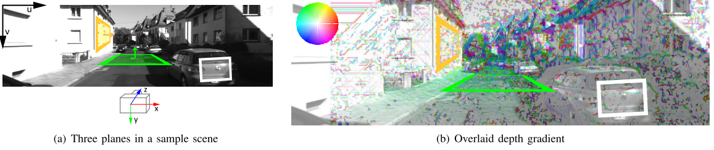
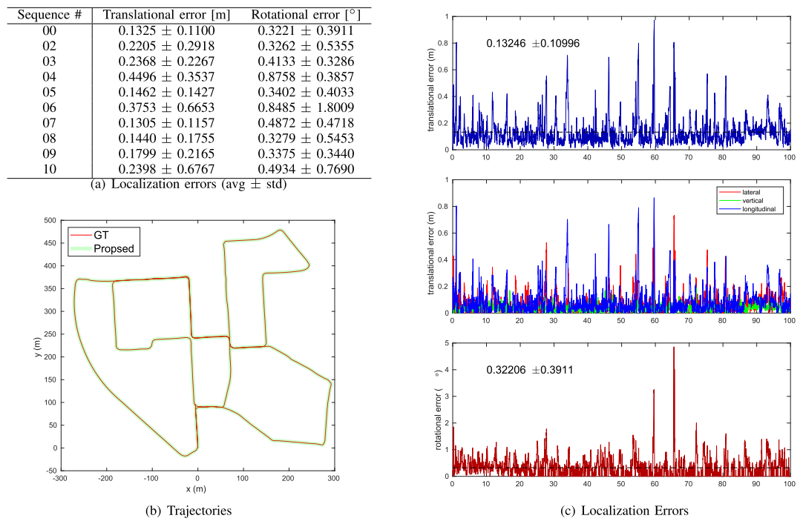
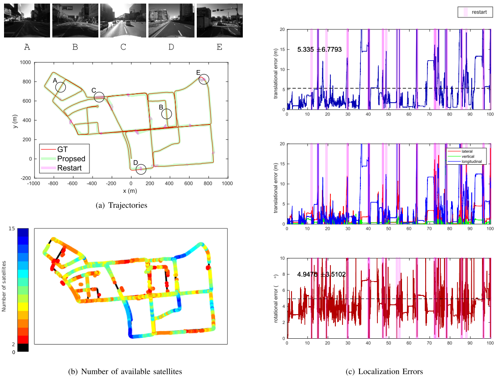

激光数据如何和视觉数据进行关联一直是一个比较有意思的方向，这篇文章提出了深度残差关联的思想，挺有意思的，下面进行解读

<!-- more -->

**《Stereo Camera Localization in 3D LiDAR Maps》（IROS2018 ）**

## Motivation

   主要是为了融合相机和雷达的信息来提高定位精度，考虑到目前激光雷达建图的精度已经很高，所以采用在线相机和离线激光雷达地图进行深度匹配的方法来进行定位，其实这样类似的思路在之前已经有过很多，分别是用几何进行匹配(ICP,NMI,NID)或者用光度误差(激光雷达地图的点的强度和像素强度)或者这两者混合，但是作者认为光度误差不可行因为这两者的差异太大，所以它采用了几何匹配的方式，但是没有采用ICP,而是对比深度的差异来进行定位(其实就类似于光度误差匹配).

## Contribution

1. 提出了一种方法通过最小化深度残差解决了多模态匹配问题.
2. 同时估计出6DOF位姿.
3. 提出的方法是轻量的并且仅仅使用CPU.

  

## Content 

1. 系统框图

   系统由四个模块组成: 在预处理中，对从地图和立体图像流中获取的原始数据进行处理，用于后续的跟踪定位模块。
   
   在深度图生成中，利用立体视差生成深度图。在局部地图提取中，从全局地图中提取与深度地图匹配的局部三维地图。
   
   为了确定摄像机姿态的初始猜测，在定位之前执行跟踪模块。该模块对连续图像帧间的相对姿态进行估计。
   
   最后，利用跟踪过程中得到的局部地图、深度地图和假定的姿态估计出6自由度相机的姿态

   
   
2. 局部激光雷达地图提取和双目相机深度图生成

   局部激光雷达地图提取是为了提取出可以由当前相机姿态观测到的点，作者使用了pcl库的octree算法进行了这个模块。
   
   双目相机深度图通过opencv的SGBM算法进行生成.
   
3. 视觉跟踪

   这个其实类似于基于像素强度的直接法的光度误差匹配，目的是为了给出相机位姿的初值。误差公式如下:
   
   $$
   E(\xi)=\sum_i\|\frac{r^2_{I,i}(\xi)}{\sigma^2_{r_{I,i}}}\|_\delta\\
   r_{I,i}(\xi)=I_{n-1}[\pi(T(\xi)T^{n-1}_n)*\pi^{-1}(x_i,d_i)]-I_n[x_i]\\
   $$
   
4. 相机定位

   这里主要就是采用了深度误差的计算，形式上和上述的光度误差公式形式一样，深度误差的计算如下:
   
   $$
   r_{D,i}(\xi)=[T(\xi)T^C_M*p_i]-D(\pi(T(\xi)T^C_M*p_i))
   $$
   
   这个误差的雅克比表示如下:
   
   $$
   J_i=[0,0,1,0](T^C_Mp_i)^{\odot}-\frac{\partial D(x_i) }{\partial x_{i}}*\frac{\partial \pi(p_i)}{\partial p_i}(T^C_Mp_i)^{\odot}\\
   \frac{\partial\pi(p_i)}{\partial p_i}=\begin{bmatrix}
     f_x/z&0 &-(f_x/z^2)*x &0\\
     0& f_y/z & -(f_y/z^2)*y &0 \\
     0& 0 & 0 &1
   \end{bmatrix}
   $$
   
   这种误差的引入有个好处就是可以对不同的方向有着不同的约束，如下图:
   
   
   
5. 实验

   a. kitti
   
   
   
   b. 作者自己采集的数据集
   
   

## Conclusion

   这篇文章提出了深度误差的概念，通过将激光雷达局部图的深度图和双目相机生成的深度进行匹配，得到了一个像素的深度误差，从最后的结果来看，效果是比较好的。