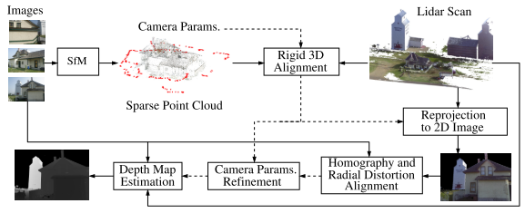
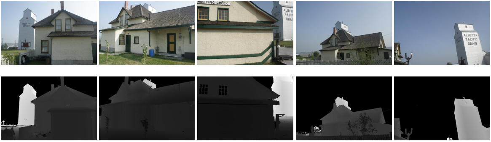

这篇文章是17年的ICASSP关于激光雷达生成深度图的文章，下面进行分析

<!-- more -->

**《FUSING STRUCTURE FROMMOTION AND LIDAR FOR DENSE ACCURATE DEPTH MAP ESTIMATION》（ICASSP 2017 ）**

## Motivation

   这篇文章的出发点主要是考虑到之前的将激光雷达生成深度图和相机进行数据关联的方法不够耦合，因为之前的做法主要是在平面上确定一个区域来和激光雷达进行匹配，所以作者想到将二维图像重投影后和激光雷达进行匹配会不会精度更高，这是本文的出发点。

## Contribution

1. 提出了一种新的框架，用于融合三维激光雷达扫描和二维摄影的不同数据模式，以估计密集的深度图。
2. 这种方法不需要固定激光雷达和相机的相对位置，并且可以方便地独立部署传感器进行数据采集。
3. 将SfM与激光雷达扫描相结合，通过在二维重投影空间中匹配图像，得到了一个精确的变换，而不是在三维空间和二维图像平面上确定一组容易出错的跨域特征对应。

  

## Content 

1. 框架图

   相机图像输入，通过SFM恢复成三维的稀疏点云，然后将这个稀疏点云和激光雷达点云进行ICP对齐(因为不知道相机和雷达的外参)获取到激光和相机的相对位置关系，在这个相对位置关系的基础上，将激光雷达点云投影到相机图像坐标系上从而获得深度图。

2. 初始的3D-2D变换估计

   主要就是用SFM恢复出一个点云，然后将这个点云和激光雷达点云根据CPD进行匹配。
   
3. 3D-2D位姿变换的优化

   加入这一步的主要原因有两个: 一是因为SFM采用BA作为全局优化方式，很容易陷入一个局部最小值，二是因为在之前的相机模型中并没有考虑径向畸变，所以作者的解决方案是使用ICP和径向畸变模型来进行优化
   
4. 深度图生成

   基于之前获得的位姿变换将激光雷达点云生成深度图，并且使用双边滤波器来进行增强生成的深度图的分辨率
   
5. 实验

## Conclusion

   ICASSP这个会议，虽然是信号处理领域的一个顶会，但是这篇文章的内容未免有点少，这篇文章的主要创新点就是一个深度图之前的预处理流程。