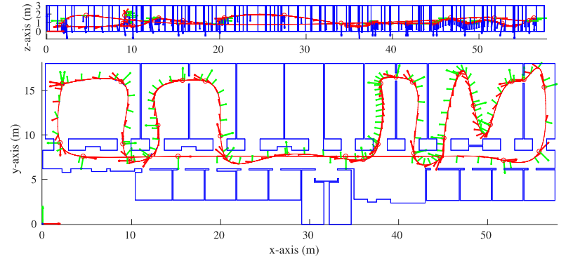
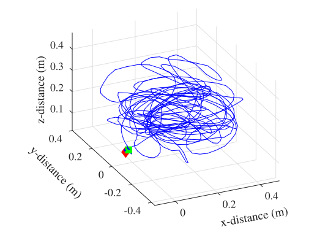

这两周主要在思考怎么将平面特征加入激光雷达，这篇论文是18年的iros，下面一起来分析下

<!-- more -->

**《LIPS: LiDAR-Inertial 3D Plane SLAM》（IROS 2018 ）**

## Motivation

   出发点主要是因为人造的结构化信息比较多，同时也指出了将平面特征应用于激光点云的问题，问题一是如何参数化平面，一个用的比较多的方法就是用法向量来代表平面，这个方法又被称为海塞方法，但是这个方法存在一个问题是过参数化，在优化的时候，如果没有额外的约束，则必然会出问题。为了避免这个过参数化的问题，又引入了包含两个角度的极坐标和一个距离标量，但是这种表示方法会在角度为90°的时候遇到模糊问题。所以，作者综合考虑，采用最近点表示方法来表示一个平面(由平面上最接近给定参考系的点进行定义)，CP表示法不仅能捕捉到所有的几何平面信息，而且通过简单的加性误差状态运算，最小限度地表示平面，具有数值优势

## Contribution

1. 建立最近点（CP）平面表示法、奇异性分析及其在三维平面SLAM中作为平面表示和误差状态的应用
2. 设计了一种具有鲁棒相对平面锚定因子的激光雷达惯性三维平面SLAM（LIPS）系统，有效地克服了CP表示的奇异性问题
3. 代码是开源的。
4. 进行了模拟和真实环境的实验

  

## Content 

1. 对于图优化基本框架和IMU预积分的基本理论跳过，因为本文的分析重点是如何通过激光点云构建面特征，故跳过.
2. 最近点平面表示法

   可以描述为一个平面上离原点最近的点，这种描述的优点主要在于一是它已经是最优的了，另一点在于如果选定合适的参考系，他是没有奇异性的(对于局部平面经过位移变换接近当前参考系的平面，作者采取直接丢弃的方法)．所以最终的平面表示形式如下:
   
$$
^G\Pi=^Gn^Gd\\
\begin{bmatrix}
 ^Gn\\^Gd
\end{bmatrix}=\begin{bmatrix}
 ^G\Pi/\|^G\Pi\|\\\|^G\Pi\|
\end{bmatrix}
$$

3. 锚定平面因子

   主要是为了防止上述的局部平面位姿变换奇异性的问题，将参考帧锚定在世界帧，需要注意的是平面表示法采用的是最近点表示法，所以需要注意在平面变换的时候，是需要重新确定最近点的，如下图:
   

   所以相应的位姿的变换表示如下:

$$
\begin{bmatrix}
^Ln \\^Ld
\end{bmatrix}=\begin{bmatrix}
 ^L_AR&& 0\\-^Ap^T_L
&&1
\end{bmatrix}\begin{bmatrix}
 ^An\\^Ad

\end{bmatrix}
$$

   根据这个位姿变换，新的平面可以表示如下

$$
^L\Pi(x)=(^L_AR^An)(^Ad-{^Ap^T_L}^An )
$$

   所以，平面残差可以直接表示为:

$$
residual=^L\Pi(x)-^L\hat{\Pi}(^L\hat{\Pi}是通过当前点云测量得到的值)
$$

4. 点云到面的压缩

   作者采用RANSAC压缩点成面，并且将点云的测量建模为零均值高斯噪声，然后通过权重LM最小化提取点和局部CP测量值之间的点到面的距离:
   
$$
^L\Pi^*=argmin_{^L\Pi}\sum_i\|\frac{^L\Pi^T}{\|^L\Pi\|} ^Lp_{mi}-\|^L\Pi\|\|^2_{W^{-1}_i}
$$

   求解LM过程如下:

$$
^L\tilde{\Pi}=-(\sum_iJ^T_iW_iJ_i)^{-1}(\sum_iJ^T_iW_ir_i(^L\hat{\Pi}))\\
J_i=\frac{^Lp^T_{mi}}{\|^L\hat{\Pi}\|}-(^Lp^T_{mi} \Pi)\frac{^L\hat{\Pi}^T}{\|^L\hat{\Pi}\|^3}-\frac{^L\hat{\Pi}^T}{\|^L\hat{\Pi}\|}\\
W_i=(\frac{^L\hat{\Pi}^T}{\|^L\hat{\Pi}\|}R_d\frac{^L\hat{\Pi}}{\|^L\hat{\Pi}\|})^{-1}
$$

   协方差可以定义如下:

$$
P_{\Pi}=(\sum_iJ^T_iW_iJ_i)^{-1}
$$

5. 实验

   a  模拟实验

   b 真实环境实验

## Conclusion

   这篇文章的工作其实实际意义不大，从他的实验中可以看出，要么是测试人造的平面，要么是模拟实验，没有真实道路条件的实验，所以它的着重的创新点也就是对于激光点云如何定义平面的思考，它把一个平面离坐标系最近的点和相应的法向量作为定义参数确实是一个值得尝试的方向。