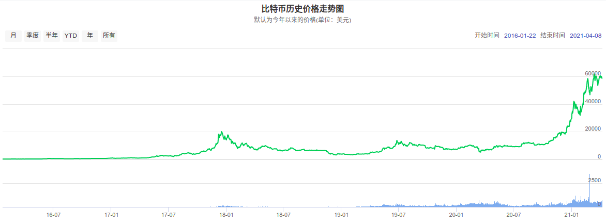

# 虚拟币操作短期小结(2021.2.22-2021.4.9)

陆陆续续的操作虚拟币也有一个多月了，中间曾经翻倍过100%，也曾跌倒只有30%(真的是高风险高收益)，下面对这一个月来的操作和心态做一个总结.

## 开篇强调:一定要是闲钱投资，绝对禁止借款上杠杆
虽然说今年上半年至少到６月前，虚拟货币都绝对是牛市，但是无论是什么投资都需要严格遵守的两个准则就是闲钱投资和禁止借钱杠杆

### 虚拟货币交易的相关知识

1. 什么是虚拟货币

   曾经我以为虚拟货币只是一串无用的代码，记得17年大二英语课还做过演讲抨击过炒作虚拟货币的行为(hhhh,还是太年轻), 但是有句话说得好:"原来本没有路,走的人多了也变成了路"(鲁迅说我没说过)，虽然去中心化是一个大势，但是如果疫情没有爆发，虚拟币市值的快速增长估计会遥遥无期，因为在之前各国央行就已经有使用数字货币的计划,文字很枯燥，我们直接上图:　
   

另外再看一张美元指数的图:
