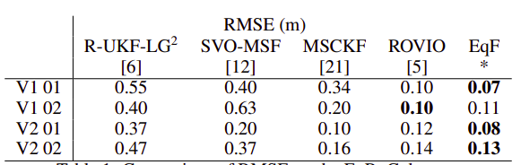

这篇文章提出了对于VIO上的流型的新的定义，实验效果很好，下面一起来分析下

<!-- more -->

**《An Equivariant Filter for Visual Inertial Odometry》（ICRA 2021 ）**

## Motivation

   首先将基于滤波的VIO里程计和基于优化的VIO里程计进行对比，解释了为什么选择基于滤波的方法，因为基于滤波的方法具有更低的内存需求，CPU使用率和处理时间等优点。然后从几何角度分析基于滤波的VIO,基于流型不变性提出了一个新的李群，并且这个李群可以应用于等变滤波器(之前的李群应用于ekf的时候会受到不可观测状态的较大约束，这个提出的方法很大程度上缓解这一点)。

## Contribution

1. 将VI-SLAM流形构造为视觉惯性SLAM的状态空间，在该状态空间中提出了与参照系变化相关的系统不可观察性。
2. 提出了VI-SLAM群，证明了它对VI-SLAM总空间、流形和输出空间的作用是等价的。
3. 将上述的群应用于等变滤波器取得了领先的实验效果。

## Content 

1. 相关的定义

   状态:
   $$
   (P,v,p_1,\dots,p_n)\in SE(3)\times R^3\times(R^3)^n
   $$
   
   另一方面，为了避免一个视觉观测奇异化的问题(即观测的特征点落在了坐标系原点上),将状态空间修改为:
   
   $$
   I_n^{VI}(3):=SE(3)\times R^3 \times(R^3)^n-e
   $$
   
   然后可以将整个VIO系统动力学建模为:
   
   $$
   \frac{d}{dt}(P,v,p_i)=f_{(\Omega,a)}(P,v,p_i)\\
   \dot{P}=PU(\Omega,v)\\
   \dot{v}=-\Omega^{\times}v+a-gR^T_Pe_3\\
   \dot{p}_i=0
   $$
   
2. VIO的不变性分析

   首先定义半直接的群积,单位和逆
   $$
   S^1\times_{e^3}R^3:=\{(\theta,x)|\theta\in S^1,x\in R^3\}\\
   (\theta^1,x^1)\cdot(\theta^2,x^2)=(\theta^1+\theta^2,x^1+R_{e_3}(\theta^1)x^2)\\
   id_{S^1\times_{e_3}R^3}=(0,0_{3\times1})\\
   (\theta,x)^{-1}=(-\theta,-R_{e3}(\theta)x)
   $$
   
   可以发现，它是一个子群:
   
   $$
   SE_{e3}(3):=\{(R,x)\in SE(3)|Re_3=e_3\}\leq SE(3)
   $$
   
   然后定义群的一个右操作
   
   $$
   \alpha(S,(P,v,p_i)):=(S^{-1}P,v,S^{-1}(p_i))\\
   $$
   
   可以发现，关于这个群的右操作，是不变的:
   
   $$
   f_{(\Omega,a)}(\alpha(S,(P,v,p_i)))=d\alpha_Sf_{\Omega,a}(P,v,p_i)\\
   h(\alpha(S,(P,v,p_i)))=h(P,v,p_i)
   $$
   
3. VISLAM的流型

   利用上面所说的不变性的性质，基于之前定义的状态空间提出一个新的状态空间的定义:
   
   $$
   [P,v,p_i]=\{\alpha(S,(P,v,p_i))|S\in SE_{e3}(3)\}
   $$

4. 用于VI-SLAM的等变滤波器

   等变滤波器利用了在齐次空间的系统的对称性输出线性化为常数的状态流形上的固定线性化点。所以对原点进行选择，根据下面两个函数进行坐标系和局部坐标系的定义:
   
   $$
   \delta([P,v,p_i]):=\begin{Bmatrix}
    V_{R^Te_3}(R^T_Pe_3)\\
    v-v^o\\
    T^{-1}_C(P^{-1}(p_1)-P^{o-1}(p^o_{1}))\\
    \dots\\
   T^{-1}_C(P^{-1}(p_n)-P^{o-1}(p^o_{n}))
   \end{Bmatrix}\\
   \delta(y_1,\dots,y_n):=(v_{y_1}(y_1),\dots,(v_{y_n}(y_n))
   $$
   
   然后相应的EQF的更新过程如下:
   
   $$
   \dot{X}=\dot{X}\wedge(\phi(X,\delta^o),(\Omega,a))-\Delta X\\
   \dot{b}=-\beta\\
   \Delta:=D_{E|id}\phi_{\delta^o}(E)\cdot D_{\delta|\delta^o\delta^-1}T\\
   \begin{pmatrix}
    \beta\\T
   
   \end{pmatrix}:=\sum(0\ 	C^{oT})Q^{-1}_t\delta(\rho(\dot{X}^{-1},h(\delta)))\\
   (\dot{P},\dot{v},\dot{p}_i):=\Phi((\dot{A},\dot{w},\dot{Q}_i),(P^o,v^o,p^o_i))
   $$
   
5. 实验结果

   
   
   

## Conclusion

   这篇文章从数学的角度对于基于滤波的SLAM状态进行了改进，并且将这个改进的状态和EQF相结合取得了很好的效果，具体的细节还没有弄懂，后续做VIO确实要重读。