这篇文章的作者是LIO-SAM的作者，LIO-SAM是一个紧耦合的激光惯性系统，在这篇文章中，作者把它自己的LIO-SAM和VINS-MONO结合，取得了不错的里程计效果。

<!-- more -->

**《LVI-SAM: Tightly-coupled Lidar-Visual-Inertial Odometry via Smoothing and Mapping》（ICRA 2021 ）**

## Motivation

   回顾LIO-SAM，其实在做LIO-SAM的论文实验的时候，作者用的设备就是一个带有摄像头的lidar+IMU设备，所以估计作者在写完LIO-SAM就准备直接加入视觉信息了，融合原因大体逃不出一个精确性和鲁棒性。

## Contribution

1. 基于因子图融合提出了一个紧耦合的LVIO框架
2. 提出的框架可以通过故障检测绕过失败的子系统
3. 丰富的实验。

## Content 

1. 系统框图

   如下图，由两个子系统组成，一个是VIO系统，一个是LIO系统，VIO系统通过单独处理相机+IMU数据给出一个里程计结果, LIS系统通过提取匹配雷达特征给出一个雷达里程计结果，最后，通过联合优化IMU预积分约束，视觉里程计约束，激光雷达里程计约束和回路闭合约束在变量图中的状态估计，可以解决状态估计问题.
   
   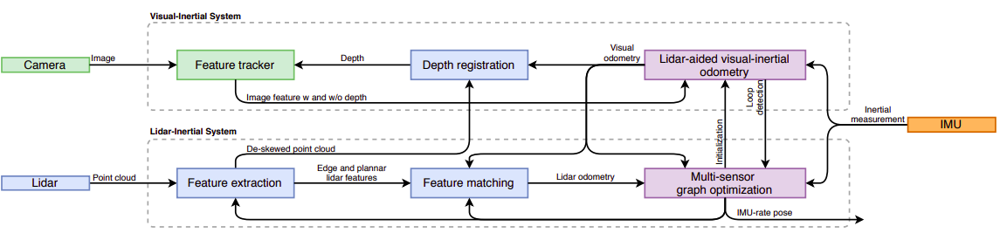
   
2. 视觉惯性系统(VIS)

   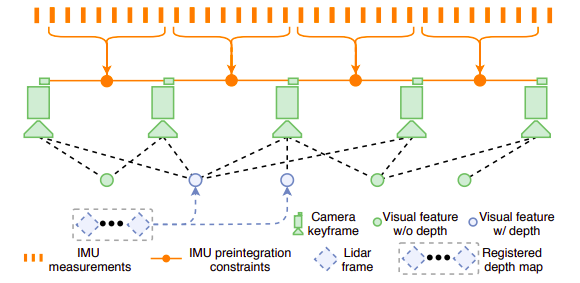

   这部分完全照搬的VINS-MONO,所以详细的细节部分直接看VINS-MONO的原论文就可以，这里主要说一下他如何在这里加入了激光的信息:
   
   a.初始化
   
   基于优化的VIO通常会因在初始化时解决非线性问题产生比较大的误差,另外初始化的结果比较依赖于初始的运动和IMU的精确度,VINS-MONO在慢速或者匀速运动时的初始化结果会比较差,原因是因为在这个速度下的IMU获得的加速度不足以为尺度提供比较好的约束。
   
   因此为了提升VIS的初始化效果，作者采用LIS辅助初始化的方式(因为可以从LIS中直接获得深度).然后把这些从LIS获得的状态和IMU偏差进行插值并且和图像帧进行关联，关联后的状态和IMU偏差作为VIS初始化的结果。
   
   b.特征深度关联
   
   为了获取一个更精确的特征点深度，采用vloam的做法，将雷达点和视觉特征投影到图像坐标上的一个球上，然后降采样找到距离视觉特征点最近的三个深度点，然后得到对应特征点的深度，如下图:
   
   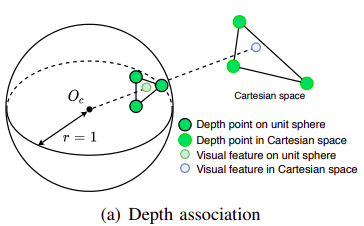
   
   然后对于不同时间戳获得的深度，需要进行进一步的验证，文章中图画的很厉害，但是实际上的做法就是检测匹配到的深度的插值不能大于2m.
   
   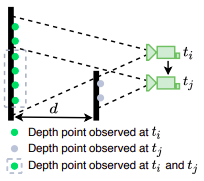
   
   最后的一个特征点获取深度的匹配结果如下图(右边一列绿色的点代表成功匹配到深度的视觉特征点):
   
   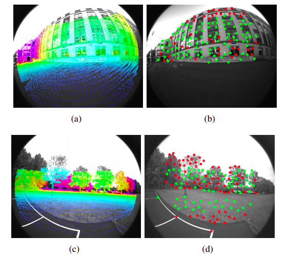
   
3. VIS的失效性检测

   这个部分就又得称赞作者的文字表达艺术了，只是加入了一个特征点少于一点阈值和IMU偏差大于一定阈值的判定，就可以说是加入了一个失效性检测模块....

4. 激光惯性系统(LIS)

   如下图，这个部分是基于作者自己的LIO-SAM进行改编的，维护了具有四种因子的因子图约束，分别是IMU预积分约束，视觉里程计约束，激光里程计约束，回环约束。（具体的因子表示参考LIO-SAM）,下面分析这个模块和VIS进行互动的部分.

   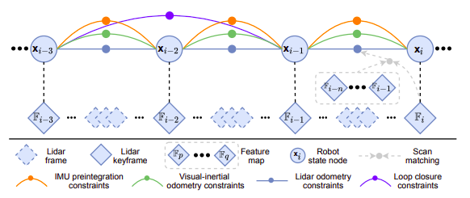
   
   a.初始化
   
   这里的初始化不同于VIS的初始化的意思，这里的初始化指的是在每一帧雷达做扫描匹配前需要给定的初值，在这里采取的方法是，有VIS结果用VIS, 没有就用自己的。
   
5. 激光失效性检测

   这个部分相比于上面视觉的部分就实在很多，主要在文章中判定两种情况的失效，如下图:(左边是激光雷达头朝下，右边是一个空旷的无纹理环境)
   
   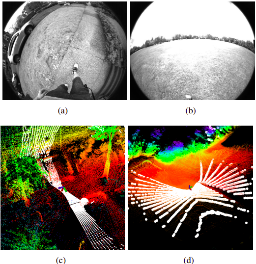
   
   作者解决这个问题的办法是:
   
   针对非线性优化问题:
   
   $$
   min_T\|AT-b\|^2
   $$
   
   如果发现$A^T A$最小的特征值在第一次优化时小于一个阈值，说明失效
   
6. 实验

   a.消融实验
   
   A1分别研究是是否带有深度图对于VIS的影响，A2代表纯粹的LIS,A3研究的是的是否带有深度图对于整体框架的影响，A4研究的是闭环检测的影响.
   
   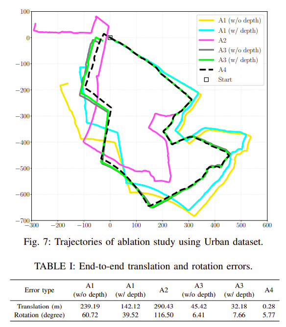
   
   b.手持场景和数据集实验
   
   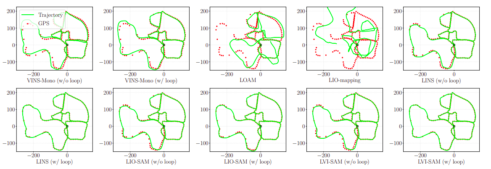
   
   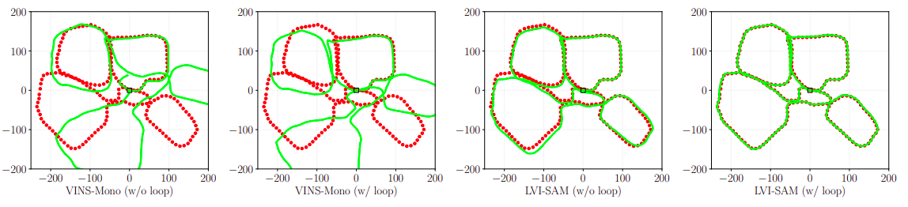
   
   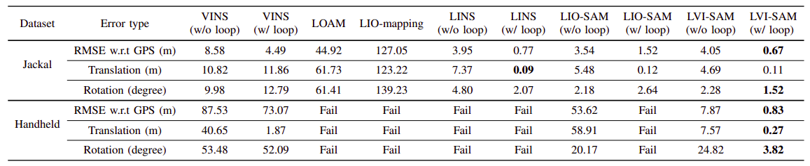
   
## Conclusion

   这篇文章的作者真的很厉害，他的每一份工作都是开源的，这篇文章可以说是他之前提出LIO-SAM后顺手做的工作，工作量不大，但是也中了，说明这个方向目前中论文还是不难的。
