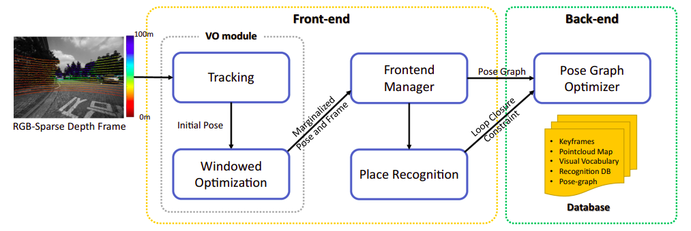
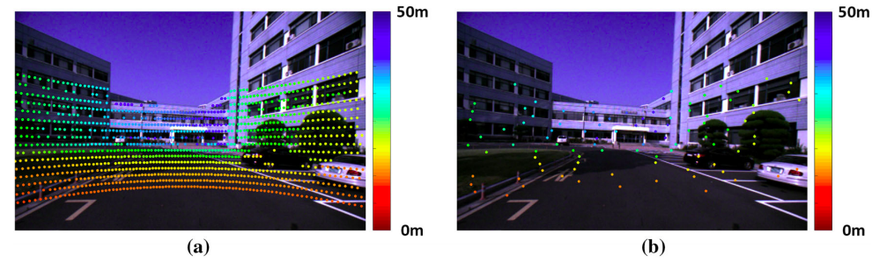
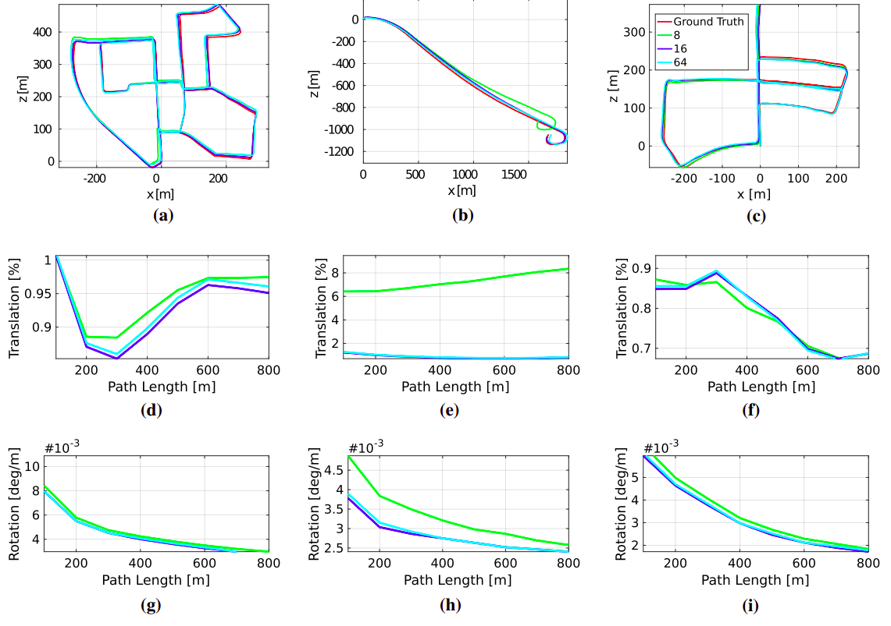
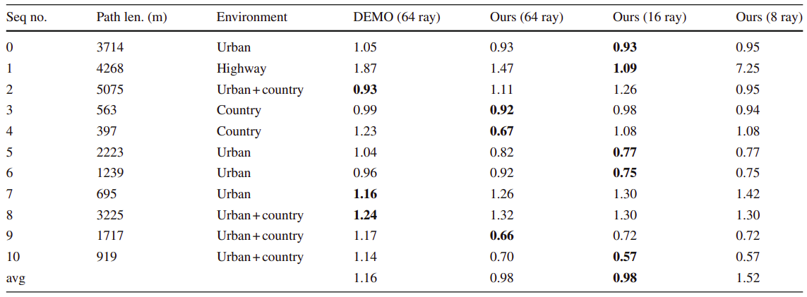

AR(autonomous Robots)是一个挺不错的期刊,这是去年AR收录的一篇激光视觉融合的论文,下面进行解析.

<!-- more -->

**《DVL-SLAM: sparse depth enhanced direct visual-LiDAR SLAM》（autonomous Robots 2020 ）**

## Motivation

   目前的激光视觉融合深度的方式主要是通过基于关键帧的方法或者融合深度图的方式，当稀疏性变得严重的时候，这些方法会有比较大的局限，比如说无法精确匹配，作者发现通过联合优化多个关键帧的每个测量从而直接利用稀疏深度会产生更好的效果，可以有效缓解受到稀疏性干扰的缺点。

## Contribution

1. 提出了一个基于直接法视觉SLAM的融合稀疏雷达深度的方法
2. 基于滑窗的优化克服了稀疏雷达深度和异构传感器视角的缺陷
3. 提供了一个闭环约束
4. 丰富的实验

## Content 

1. 系统框图

   如下图，分为前段和后端，前端数据融合输出一个初步的里程计，后端全局位姿图优化

   
   
2. 激光点的投影选择

   为了计算复杂度，点要进行挑选，主要是根据雷达点在球体坐标的稀疏分布和图像的梯度，在文章中，作者把方位角和俯仰角分成两个角度，然后根据这个划分单元，然后单元对应的图像部分具有更大的梯度的话，就把这个选为计算点
   
   
   
3. 残差计算滑窗优化回环检测

   老一套不做解释，不记得了的可以看原文。
   
4. 实验结果

   
   
   
   
## Conclusion

   这篇论文是将直接法的vo和激光深度进行结合，实验只和demo进行了比较，但是也不能完全胜出demo，不过它的点的选择优化思路确实值得借鉴。
