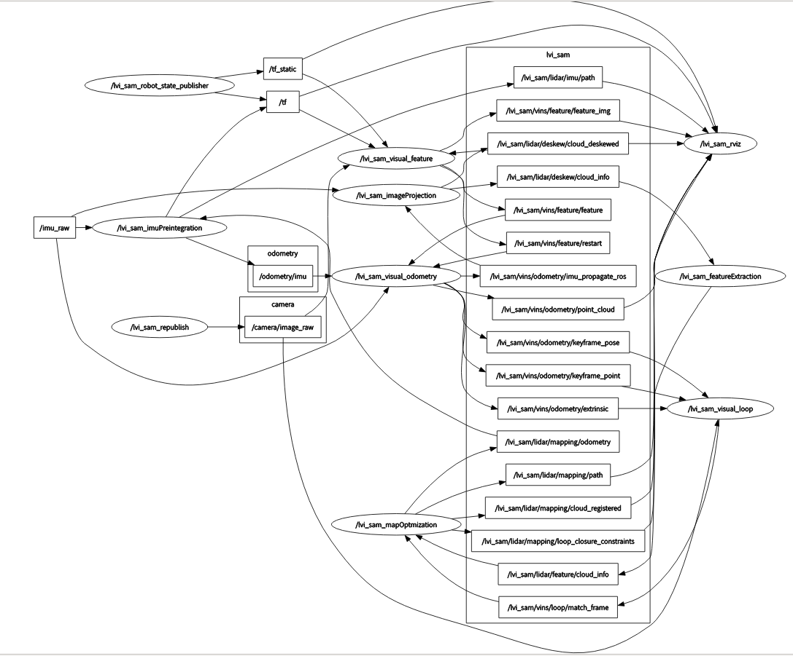

---

layout: post
title: "LVI-SAM代码注释"
date:   2021-04-28
tags: [code note]
comments: true
author: xuwuzhou
---

LVI-SAM 代码注释，这篇博客的工作主要是集中于相机和激光之间的互动的分析.

<!-- more -->

## Node Graph

   可以看出，主要节点分别是/lvi_sam_imuPreintegration(IMU预积分节点) ,  /lvi_sam_mapOptmization(因子图优化节点) ,/lvi_sam_featureExtraction(激光雷达特征点提取节点) , /lvi_sam_imageProjection(生成深度图),/lvi_sam_visual_feature(生成视觉特征点),/lvi_sam_visual_loop(回环检测), /lvi_sam_visual_odometry(视觉里程计)



## Node: lvi_sam_imuPreintegration

输入:

主要是输入两个信息，IMU信息(需要注意的是,IMU原始信息被三个节点利用了，分别是(lvi_sam_imuPreintengration节点, lvi_sam_imageProjection节点, lvi_sam_visual_odometry 节点)和Odometry信息

```c++
ros::Subscriber subImu;
ros::Subscriber subOdometry;

subImu=nh.subscribe<sensor_msgs::Imu>(imuTopic, 2000, &IMUPreintegration::imuHandler, this , ros::TransportHints().tcpNoDelay());
subOdometry = nh.subscribe<nav_msgs::Odometry>(PROJECT_NAME + "/lidar/mapping/odometry", 5, &IMUPreintegration::odometryHandler, this, ros::TransportHints().tcpNoDelay());

```

输出:

主要是输出轨迹odometry信息,path是为了rviz显示:


```c++
ros::Publisher pubImuOdometry;
ros::Publisher pubImuPath;

pubImuOdometry = nh.advertise<nav_msgs::Odometry> ("odometry/imu", 2000);
pubImuPath     = nh.advertise<nav_msgs::Path>     (PROJECT_NAME + "/lidar/imu/path", 1);
```

从这个输入输出其实就能看出这个节点的作用，对于图优化给出的位姿作为先验执行滤波得到预测输入给视觉节点, 也就是论文中所说的激光辅助视觉初始化的预处理部分, 代码里的工作就是滤波那一套，每个函数作者都给出了详细的注释，可以自行翻阅.

## Node: lvi_sam_imageProjection

   这个节点可以理解为建立深度图的节点，其实如果读过demo_lidar(v-loam的前期版本)代码的话，其实发现这个部分和demo_lidar的深度图建立模块部分基本是重合的.

输入:

输入主要是三个信息，原始IMU信息, 里程计信息(VIS系统输出的), 原始点云信息

```
subImu = nh.subscribe<sensor_msgs::Imu> (imuTopic, 2000, &ImageProjection::imuHandler, this, ros::TransportHints().tcpNoDelay());
subOdom = nh.subscribe<nav_msgs::Odometry>(PROJECT_NAME + "/vins/odometry/imu_propagate_ros", 2000, &ImageProjection::odometryHandler , this, ros::TransportHints().tcpNoDelay());
subLaserCloud = nh.subscribe<sensor_msgs::PointCloud2>(pointCloudTopic, 5, &ImageProjection::cloudHandler, this, ros::TransportHints().tcpNoDelay());
```

输出:

输出主要是一个信息，cloud_info是深度图点云信息用于给特征点查找深度，cloud_deskewed是用于给rviz显示用的.

```
pubExtractedCloud = nh.advertise<sensor_msgs::PointCloud2> (PROJECT_NAME + "/lidar/deskew/cloud_deskewed", 5);
pubLaserCloudInfo = nh.advertise<lvi_sam::cloud_info>      (PROJECT_NAME + "/lidar/deskew/cloud_info", 5);
```

IMU处理函数:

接收IMU信息并且存入待处理队列

```
sensor_msgs::Imu thisImu = imuConverter(*imuMsg);
std::lock_guard<std::mutex> lock1(imuLock);
imuQueue.push_back(thisImu);
```

先验里程计处理函数:

接收里程计信息并且存入待处理队列

```
std::lock_guard<std::mutex> lock2(odoLock);
odomQueue.push_back(*odometryMsg);
```

点云处理函数:

```
if (!cachePointCloud(laserCloudMsg))
    return;
if (!deskewInfo())
    return;
projectPointCloud();
cloudExtraction();
publishClouds();
resetParameters();
```


## Content 