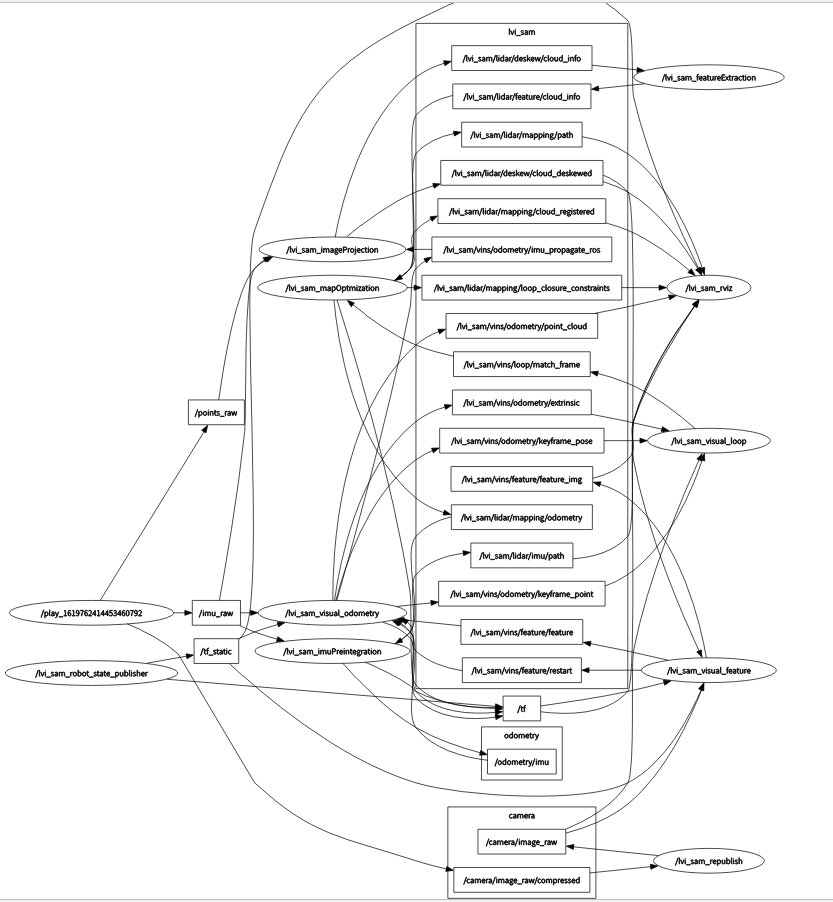

---

layout: post
title: "LVI-SAM代码注释"
date:   2021-04-28
tags: [code note]
comments: true
author: xuwuzhou
---

LVI-SAM 代码注释，这篇博客的工作主要是集中于相机和激光之间的互动的分析.

<!-- more -->

## Node Graph

   可以看出，主要节点分别是/lvi_sam_imuPreintegration(IMU预积分节点) ,  /lvi_sam_mapOptmization(因子图优化节点) ,/lvi_sam_featureExtraction(激光雷达特征点提取节点) , /lvi_sam_imageProjection(生成深度图),/lvi_sam_visual_feature(生成视觉特征点),/lvi_sam_visual_loop(回环检测), /lvi_sam_visual_odometry(视觉里程计)



## Node: lvi_sam_imuPreintegration

输入:

主要是输入两个信息，IMU信息(需要注意的是,IMU原始信息被三个节点利用了，分别是(lvi_sam_imuPreintengration节点, lvi_sam_imageProjection节点, lvi_sam_visual_odometry 节点)和Odometry信息

```c++
ros::Subscriber subImu;
ros::Subscriber subOdometry;

subImu=nh.subscribe<sensor_msgs::Imu>(imuTopic, 2000, &IMUPreintegration::imuHandler, this , ros::TransportHints().tcpNoDelay());
subOdometry = nh.subscribe<nav_msgs::Odometry>(PROJECT_NAME + "/lidar/mapping/odometry", 5, &IMUPreintegration::odometryHandler, this, ros::TransportHints().tcpNoDelay());

```

输出:

主要是输出轨迹odometry信息,path是为了rviz显示:


```c++
ros::Publisher pubImuOdometry;
ros::Publisher pubImuPath;

pubImuOdometry = nh.advertise<nav_msgs::Odometry> ("odometry/imu", 2000);
pubImuPath     = nh.advertise<nav_msgs::Path>     (PROJECT_NAME + "/lidar/imu/path", 1);
```

从这个输入输出其实就能看出这个节点的作用，对于图优化给出的位姿作为先验执行滤波得到预测输入给视觉节点, 也就是论文中所说的激光辅助视觉初始化的预处理部分, 代码里的工作就是滤波那一套，每个函数作者都给出了详细的注释，可以自行翻阅.

## Node: lvi_sam_imageProjection

   这个节点可以理解为建立深度图的节点，其实如果读过demo_lidar(v-loam的前期版本)代码的话，其实发现这个部分和demo_lidar的深度图建立模块部分基本是重合的.

输入:

输入主要是三个信息，原始IMU信息, 里程计信息(VIS系统输出的), 原始点云信息

```c++
subImu = nh.subscribe<sensor_msgs::Imu> (imuTopic, 2000, &ImageProjection::imuHandler, this, ros::TransportHints().tcpNoDelay());
subOdom = nh.subscribe<nav_msgs::Odometry>(PROJECT_NAME + "/vins/odometry/imu_propagate_ros", 2000, &ImageProjection::odometryHandler , this, ros::TransportHints().tcpNoDelay());
subLaserCloud = nh.subscribe<sensor_msgs::PointCloud2>(pointCloudTopic, 5, &ImageProjection::cloudHandler, this, ros::TransportHints().tcpNoDelay());
```

输出:

输出主要是一个信息，cloud_info是深度图点云信息用于给特征点查找深度，cloud_deskewed是用于给rviz显示用的.

```c++
pubExtractedCloud = nh.advertise<sensor_msgs::PointCloud2> (PROJECT_NAME + "/lidar/deskew/cloud_deskewed", 5);
pubLaserCloudInfo = nh.advertise<lvi_sam::cloud_info>      (PROJECT_NAME + "/lidar/deskew/cloud_info", 5);
```

IMU处理函数:

接收IMU信息并且存入待处理队列

```c++
sensor_msgs::Imu thisImu = imuConverter(*imuMsg);
std::lock_guard<std::mutex> lock1(imuLock);
imuQueue.push_back(thisImu);
```

先验里程计处理函数:

接收里程计信息并且存入待处理队列

```c++
std::lock_guard<std::mutex> lock2(odoLock);
odomQueue.push_back(*odometryMsg);
```

点云处理函数:

cachePointCloud函数就是做点云的有效性鉴别(主要是通过判断时间戳和ring), deskerInfo函数是做的判断当前点云是否有对应的IMU和里程计信息, cloudExtraction函数感觉不是非常有必要，其实就是在fullcloud的基础上加了前后五个ring的序号, 另外的publishClouds和resetParameters就是分别进行输出和重置上一次用过的参数.

```c++
if (!cachePointCloud(laserCloudMsg))
    return;
if (!deskewInfo())
    return;
projectPointCloud();
cloudExtraction();
publishClouds();
resetParameters();
```

projectPointCloud函数稍微复杂一点:

```c++
int cloudSize = (int)laserCloudIn->points.size();
        // range image projection
        for (int i = 0; i < cloudSize; ++i)
        {
            PointType thisPoint;
            thisPoint.x = laserCloudIn->points[i].x;
            thisPoint.y = laserCloudIn->points[i].y;
            thisPoint.z = laserCloudIn->points[i].z;
            thisPoint.intensity = laserCloudIn->points[i].intensity;
			//判断这个激光点属于哪个ring,如果超出ring的范围则抛弃
            int rowIdn = laserCloudIn->points[i].ring;
            if (rowIdn < 0 || rowIdn >= N_SCAN)
                continue;

            if (rowIdn % downsampleRate != 0)
                continue;
			//水平角度
            float horizonAngle = atan2(thisPoint.x, thisPoint.y) * 180 / M_PI;

            static float ang_res_x = 360.0/float(Horizon_SCAN);
            //Horizon_SCAN默认值设置的是1800,应该是指的水平方向被分成了1800份，那么这个激光雷达的旋转速度应该就是2pi/1800 rad/s
            int columnIdn = -round((horizonAngle-90.0)/ang_res_x) + Horizon_SCAN/2;
            //columnIdn是这个激光点所在的列的序号，所以可以认为是一个圆，超出减去一个圆
            if (columnIdn >= Horizon_SCAN)
                columnIdn -= Horizon_SCAN;

            if (columnIdn < 0 || columnIdn >= Horizon_SCAN)
                continue;
			//这个激光点到当前激光雷达原点坐标系的距离
            float range = pointDistance(thisPoint);
            
            if (range < 1.0)
                continue;

            if (rangeMat.at<float>(rowIdn, columnIdn) != FLT_MAX)
                continue;

            // for the amsterdam dataset
            // if (range < 6.0 && rowIdn <= 7 && (columnIdn >= 1600 || columnIdn <= 200))
            //     continue;
            // if (thisPoint.z < -2.0)
            //     continue;
			//这个rangeMat可以理解为激光点云组成的矩阵，值是距离
            rangeMat.at<float>(rowIdn, columnIdn) = range;
			//这里是对激光点云变换到初始(世界)坐标系
            thisPoint = deskewPoint(&thisPoint, laserCloudIn->points[i].time); // Velodyne
            // thisPoint = deskewPoint(&thisPoint, (float)laserCloudIn->points[i].t / 1000000000.0); // Ouster
			//存储这个点云
            int index = columnIdn  + rowIdn * Horizon_SCAN;
            fullCloud->points[index] = thisPoint;
        }
```

## Node: lvi_sam_visual_feature

   这个节点的主要任务就是生成视觉特征点然后送给下一个VIS节点进行视觉里程计的计算.

   输入:

   输入主要是原始图像信息和上一个imageProjection节点变换到世界坐标系的当前点云信息

```c++
ros::Subscriber sub_img   = n.subscribe(IMAGE_TOPIC,       5,    img_callback);
ros::Subscriber sub_lidar = n.subscribe(POINT_CLOUD_TOPIC, 5,    lidar_callback);
```

   输出:

   输出是给出一个带有深度的特征点和是否重启的信号.

```c++
pub_feature = n.advertise<sensor_msgs::PointCloud>(PROJECT_NAME + "/vins/feature/feature",     5);
pub_match   = n.advertise<sensor_msgs::Image>     (PROJECT_NAME + "/vins/feature/feature_img", 5);
pub_restart = n.advertise<std_msgs::Bool>         (PROJECT_NAME + "/vins/feature/restart",     5);
```

   点云处理函数lidar_callback:

```c++
void lidar_callback(const sensor_msgs::PointCloud2ConstPtr& laser_msg)
{
    static int lidar_count = -1;
    //相当于降采样
    if (++lidar_count % (LIDAR_SKIP+1) != 0)
        return;

    // 0. listen to transform, 接收位姿变换
    static tf::TransformListener listener;
    static tf::StampedTransform transform;
    try{
        listener.waitForTransform("vins_world", "vins_body_ros", laser_msg->header.stamp, ros::Duration(0.01));
        listener.lookupTransform("vins_world", "vins_body_ros", laser_msg->header.stamp, transform);
    } 
    catch (tf::TransformException ex){
        // ROS_ERROR("lidar no tf");
        return;
    }
	// 当前位姿的表示
    double xCur, yCur, zCur, rollCur, pitchCur, yawCur;
    xCur = transform.getOrigin().x();
    yCur = transform.getOrigin().y();
    zCur = transform.getOrigin().z();
    tf::Matrix3x3 m(transform.getRotation());
    m.getRPY(rollCur, pitchCur, yawCur);
    Eigen::Affine3f transNow = pcl::getTransformation(xCur, yCur, zCur, rollCur, pitchCur, yawCur);

    // 1. convert laser cloud message to pcl 将点云转换成PCL格式
    pcl::PointCloud<PointType>::Ptr laser_cloud_in(new pcl::PointCloud<PointType>());
    pcl::fromROSMsg(*laser_msg, *laser_cloud_in);

    // 2. downsample new cloud (save memory) 调用PCL的降采样算法
    pcl::PointCloud<PointType>::Ptr laser_cloud_in_ds(new pcl::PointCloud<PointType>());
    static pcl::VoxelGrid<PointType> downSizeFilter;
    downSizeFilter.setLeafSize(0.2, 0.2, 0.2);
    downSizeFilter.setInputCloud(laser_cloud_in);
    downSizeFilter.filter(*laser_cloud_in_ds);
    *laser_cloud_in = *laser_cloud_in_ds;

    // 3. filter lidar points (only keep points in camera view) 保证当前点云的点在当前相机视角FOV内
    pcl::PointCloud<PointType>::Ptr laser_cloud_in_filter(new pcl::PointCloud<PointType>());
    for (int i = 0; i < (int)laser_cloud_in->size(); ++i)
    {
        PointType p = laser_cloud_in->points[i];
        if (p.x >= 0 && abs(p.y / p.x) <= 10 && abs(p.z / p.x) <= 10)
            laser_cloud_in_filter->push_back(p);
    }
    *laser_cloud_in = *laser_cloud_in_filter;

    // TODO: transform to IMU body frame
    // 4. offset T_lidar -> T_camera   将点云从激光雷达坐标系变成相机坐标系(pcl居然有这么一个函数，作者确实厉害)
    pcl::PointCloud<PointType>::Ptr laser_clou d_offset(new pcl::PointCloud<PointType>());
    Eigen::Affine3f transOffset = pcl::getTransformation(L_C_TX, L_C_TY, L_C_TZ, L_C_RX, L_C_RY, L_C_RZ);
    pcl::transformPointCloud(*laser_cloud_in, *laser_cloud_offset, transOffset);
    *laser_cloud_in = *laser_cloud_offset;

    // 5. transform new cloud into global odom frame 再把点云变换到世界坐标系
    pcl::PointCloud<PointType>::Ptr laser_cloud_global(new pcl::PointCloud<PointType>());
    pcl::transformPointCloud(*laser_cloud_in, *laser_cloud_global, transNow);

    // 6. save new cloud 最后把变换完成的点云存储到待处理队列
    double timeScanCur = laser_msg->header.stamp.toSec();
    cloudQueue.push_back(*laser_cloud_global);
    timeQueue.push_back(timeScanCur);

    // 7. pop old cloud 保持队列里的点云的时长不超过一定的时间 
    while (!timeQueue.empty())
    {
        if (timeScanCur - timeQueue.front() > 5.0)
        {
            cloudQueue.pop_front();
            timeQueue.pop_front();
        } else {
            break;
        }
    }

    std::lock_guard<std::mutex> lock(mtx_lidar);
    // 8. fuse global cloud 将队列里的点云输入作为总体的待处理深度图
    depthCloud->clear();
    for (int i = 0; i < (int)cloudQueue.size(); ++i)
        *depthCloud += cloudQueue[i];

    // 9. downsample global cloud 深度图降采样
    pcl::PointCloud<PointType>::Ptr depthCloudDS(new pcl::PointCloud<PointType>());
    downSizeFilter.setLeafSize(0.2, 0.2, 0.2);
    downSizeFilter.setInputCloud(depthCloud);
    downSizeFilter.filter(*depthCloudDS);
    *depthCloud = *depthCloudDS;
}
```


   图像处理函数img_callback, 这个函数的大部分基本和VINS一致，我就不贴代码，主要分析一下如何赋值深度的(对应的代码是Line:170-178):

```c++
        // get feature depth from lidar point cloud
        pcl::PointCloud<PointType>::Ptr depth_cloud_temp(new pcl::PointCloud<PointType>());
        mtx_lidar.lock();
        *depth_cloud_temp = *depthCloud; //这个就是上一个处理函数得到的由最近几个点云构成的深度点云候选集
        mtx_lidar.unlock();

        //get_depth函数见下面分析,就是从深度图点云获取深度
        sensor_msgs::ChannelFloat32 depth_of_points = depthRegister->get_depth(img_msg->header.stamp, show_img, depth_cloud_temp, trackerData[0].m_camera, feature_points->points);
        feature_points->channels.push_back(depth_of_points);
```


get_depth函数分析, 这个操作其实跟demo_lidar的获取深度的操作基本一样，下面进行分析:

```c++
    sensor_msgs::ChannelFloat32 get_depth(const ros::Time& stamp_cur, const cv::Mat& imageCur, 
                                          const pcl::PointCloud<PointType>::Ptr& depthCloud,
                                          const camodocal::CameraPtr& camera_model ,
                                          const vector<geometry_msgs::Point32>& features_2d)
    {
        // 0.1 initialize depth for return 初始化
        sensor_msgs::ChannelFloat32 depth_of_point;
        depth_of_point.name = "depth";
        depth_of_point.values.resize(features_2d.size(), -1);

        // 0.2  check if depthCloud available 检查是否有有效的深度图点云候选集
        if (depthCloud->size() == 0)
            return depth_of_point;

        // 0.3 look up transform at current image time 
        try{
            listener.waitForTransform("vins_world", "vins_body_ros", stamp_cur, ros::Duration(0.01));
            listener.lookupTransform("vins_world", "vins_body_ros", stamp_cur, transform);
        } 
        catch (tf::TransformException ex){
            // ROS_ERROR("image no tf");
            return depth_of_point;
        }

        double xCur, yCur, zCur, rollCur, pitchCur, yawCur;
        xCur = transform.getOrigin().x();
        yCur = transform.getOrigin().y();
        zCur = transform.getOrigin().z();
        tf::Matrix3x3 m(transform.getRotation());
        m.getRPY(rollCur, pitchCur, yawCur);
        Eigen::Affine3f transNow = pcl::getTransformation(xCur, yCur, zCur, rollCur, pitchCur, yawCur);

        // 0.4 transform cloud from global frame to camera frame 再把深度图点云候选集从全局坐标系变成当前相机坐标系
        pcl::PointCloud<PointType>::Ptr depth_cloud_local(new pcl::PointCloud<PointType>());
        pcl::transformPointCloud(*depthCloud, *depth_cloud_local, transNow.inverse());

        // 0.5 project undistorted normalized (z) 2d features onto a unit sphere 将之前视觉追踪得到的特征点归一化到球坐标系,方便查找最近的深度图点云的点
        pcl::PointCloud<PointType>::Ptr features_3d_sphere(new pcl::PointCloud<PointType>());
        for (int i = 0; i < (int)features_2d.size(); ++i)
        {
            // normalize 2d feature to a unit sphere
            Eigen::Vector3f feature_cur(features_2d[i].x, features_2d[i].y, features_2d[i].z); // z always equal to 1
            feature_cur.normalize(); 
            // convert to ROS standard
            PointType p;
            p.x =  feature_cur(2);
            p.y = -feature_cur(0);
            p.z = -feature_cur(1);
            p.intensity = -1; // intensity will be used to save depth
            features_3d_sphere->push_back(p);
        }

        // 3. project depth cloud on a range image, filter points satcked in the same region. 
        float bin_res = 180.0 / (float)num_bins; // currently only cover the space in front of lidar (-90 ~ 90)
        cv::Mat rangeImage = cv::Mat(num_bins, num_bins, CV_32F, cv::Scalar::all(FLT_MAX));

        for (int i = 0; i < (int)depth_cloud_local->size(); ++i)
        {
            PointType p = depth_cloud_local->points[i];
            // filter points not in camera view 这一步貌似意义不大，因为之前已经做过相机FOV的判定
            if (p.x < 0 || abs(p.y / p.x) > 10 || abs(p.z / p.x) > 10)
                continue;
            // find row id in range image 找到第几行
            float row_angle = atan2(p.z, sqrt(p.x * p.x + p.y * p.y)) * 180.0 / M_PI + 90.0; // degrees, bottom -> up, 0 -> 360
            int row_id = round(row_angle / bin_res);
            // find column id in range image 找到第几列
            float col_angle = atan2(p.x, p.y) * 180.0 / M_PI; // degrees, left -> right, 0 -> 360
            int col_id = round(col_angle / bin_res);
            // id may be out of boundary 阈值判定
            if (row_id < 0 || row_id >= num_bins || col_id < 0 || col_id >= num_bins)
                continue;
            // only keep points that's closer 始终让投影的点云图的深度是最小的.
            float dist = pointDistance(p); 
            if (dist < rangeImage.at<float>(row_id, col_id))
            {
                rangeImage.at<float>(row_id, col_id) = dist;
                pointsArray[row_id][col_id] = p;
            }
        }

        // 4. extract downsampled depth cloud from range image 这一步所说的降采样的作用实质上是通过上一步的dist的判定得到的，可以视为是上一步的一部分
        pcl::PointCloud<PointType>::Ptr depth_cloud_local_filter2(new pcl::PointCloud<PointType>());
        for (int i = 0; i < num_bins; ++i)
        {
            for (int j = 0; j < num_bins; ++j)
            {
                if (rangeImage.at<float>(i, j) != FLT_MAX)
                    depth_cloud_local_filter2->push_back(pointsArray[i][j]);
            }
        }
        *depth_cloud_local = *depth_cloud_local_filter2;
        publishCloud(&pub_depth_cloud, depth_cloud_local, stamp_cur, "vins_body_ros");

        // 5. project depth cloud onto a unit sphere 对于筛选过的点云，归一化并且投影到球坐标
        pcl::PointCloud<PointType>::Ptr depth_cloud_unit_sphere(new pcl::PointCloud<PointType>());
        for (int i = 0; i < (int)depth_cloud_local->size(); ++i)
        {
            PointType p = depth_cloud_local->points[i];
            float range = pointDistance(p);
            p.x /= range;
            p.y /= range;
            p.z /= range;
            p.intensity = range;   //注意，他这里存储的深度是点到坐标系原点的距离而不是z值
            depth_cloud_unit_sphere->push_back(p);
        }
        if (depth_cloud_unit_sphere->size() < 10)
            return depth_of_point;

        // 6. create a kd-tree using the spherical depth cloud  使用PCL的KD-Tree方便查找
        pcl::KdTreeFLANN<PointType>::Ptr kdtree(new pcl::KdTreeFLANN<PointType>());
        kdtree->setInputCloud(depth_cloud_unit_sphere);

        // 7. find the feature depth using kd-tree 使用KD-Tree的KnearestSearch方法进行搜索
        vector<int> pointSearchInd;
        vector<float> pointSearchSqDis;
        float dist_sq_threshold = pow(sin(bin_res / 180.0 * M_PI) * 5.0, 2);// 阈值，可以容忍的最远误差
        for (int i = 0; i < (int)features_3d_sphere->size(); ++i)
        {
            kdtree->nearestKSearch(features_3d_sphere->points[i], 3, pointSearchInd, pointSearchSqDis);
            if (pointSearchInd.size() == 3 && pointSearchSqDis[2] < dist_sq_threshold)
            {//A,B,C分别是恢复出的三个点的坐标
                float r1 = depth_cloud_unit_sphere->points[pointSearchInd[0]].intensity;
                Eigen::Vector3f A(depth_cloud_unit_sphere->points[pointSearchInd[0]].x * r1,
                                  depth_cloud_unit_sphere->points[pointSearchInd[0]].y * r1,
                                  depth_cloud_unit_sphere->points[pointSearchInd[0]].z * r1);

                float r2 = depth_cloud_unit_sphere->points[pointSearchInd[1]].intensity;
                Eigen::Vector3f B(depth_cloud_unit_sphere->points[pointSearchInd[1]].x * r2,
                                  depth_cloud_unit_sphere->points[pointSearchInd[1]].y * r2,
                                  depth_cloud_unit_sphere->points[pointSearchInd[1]].z * r2);

                float r3 = depth_cloud_unit_sphere->points[pointSearchInd[2]].intensity;
                Eigen::Vector3f C(depth_cloud_unit_sphere->points[pointSearchInd[2]].x * r3,
                                  depth_cloud_unit_sphere->points[pointSearchInd[2]].y * r3,
                                  depth_cloud_unit_sphere->points[pointSearchInd[2]].z * r3);

                // https://math.stackexchange.com/questions/100439/determine-where-a-vector-will-intersect-a-plane
                Eigen::Vector3f V(features_3d_sphere->points[i].x,
                                  features_3d_sphere->points[i].y,
                                  features_3d_sphere->points[i].z);
				// 计算得出相交于ABC构成的平面的深度值
                Eigen::Vector3f N = (A - B).cross(B - C);
                float s = (N(0) * A(0) + N(1) * A(1) + N(2) * A(2)) 
                        / (N(0) * V(0) + N(1) * V(1) + N(2) * V(2));
                //一些判定深度是否成立的条件，比如说最大深度和最小深度不超过2，深度s要大于0.5,因为激光雷达有盲区，0.5m以内的绝对不是正确的的
                float min_depth = min(r1, min(r2, r3));
                float max_depth = max(r1, max(r2, r3));
                if (max_depth - min_depth > 2 || s <= 0.5)
                {
                    continue;
                } else if (s - max_depth > 0) {
                    s = max_depth;
                } else if (s - min_depth < 0) {
                    s = min_depth;
                }
                // convert feature into cartesian space if depth is available, 将视觉的特征点乘以深度得到真实尺度
                features_3d_sphere->points[i].x *= s;
                features_3d_sphere->points[i].y *= s;
                features_3d_sphere->points[i].z *= s;
                // the obtained depth here is for unit sphere, VINS estimator needs depth for normalized feature (by value z), (lidar x = camera z)
                features_3d_sphere->points[i].intensity = features_3d_sphere->points[i].x;
            }
        }

        // visualize features in cartesian 3d space (including the feature without depth (default 1)) 可视化
        publishCloud(&pub_depth_feature, features_3d_sphere, stamp_cur, "vins_body_ros");
        
        // update depth value for return 更新
        for (int i = 0; i < (int)features_3d_sphere->size(); ++i)
        {
            if (features_3d_sphere->points[i].intensity > 3.0)
                depth_of_point.values[i] = features_3d_sphere->points[i].intensity;
        }

        // visualization project points on image for visualization (it's slow!) 下面是输入给rviz的信息，可以略过.
        if (pub_depth_image.getNumSubscribers() != 0)
        {
            vector<cv::Point2f> points_2d;
            vector<float> points_distance;

            for (int i = 0; i < (int)depth_cloud_local->size(); ++i)
            {
                // convert points from 3D to 2D
                Eigen::Vector3d p_3d(-depth_cloud_local->points[i].y,
                                     -depth_cloud_local->points[i].z,
                                      depth_cloud_local->points[i].x);
                Eigen::Vector2d p_2d;
                camera_model->spaceToPlane(p_3d, p_2d);
                
                points_2d.push_back(cv::Point2f(p_2d(0), p_2d(1)));
                points_distance.push_back(pointDistance(depth_cloud_local->points[i]));
            }

            cv::Mat showImage, circleImage;
            cv::cvtColor(imageCur, showImage, cv::COLOR_GRAY2RGB);
            circleImage = showImage.clone();
            for (int i = 0; i < (int)points_2d.size(); ++i)
            {
                float r, g, b;
                getColor(points_distance[i], 50.0, r, g, b);
                cv::circle(circleImage, points_2d[i], 0, cv::Scalar(r, g, b), 5);
            }
            cv::addWeighted(showImage, 1.0, circleImage, 0.7, 0, showImage); // blend camera image and circle image

            cv_bridge::CvImage bridge;
            bridge.image = showImage;
            bridge.encoding = "rgb8";
            sensor_msgs::Image::Ptr imageShowPointer = bridge.toImageMsg();
            imageShowPointer->header.stamp = stamp_cur;
            pub_depth_image.publish(imageShowPointer);
        }
        return depth_of_point;
    }
```

## Node: lvi_sam_visual_odometry

   这个部分其实就是通过视觉特征点输出里程计了，与激光有互动的地方主要体现在两点，一是带有激光雷达深度图获取到深度的视觉特征点，二是把之前激光IMU参与的IMUPreIntegration模块输出的odometry结果作为初始化的值

输入: 输入的分别是IMU预积分得到的里程计，原始IMU信息，经过激光深度图处理过的特征点，是否重启的信息.

```c++
ros::Subscriber sub_imu     = n.subscribe(IMU_TOPIC,      5000, imu_callback,  ros::TransportHints().tcpNoDelay());
ros::Subscriber sub_odom    = n.subscribe("odometry/imu", 5000, odom_callback);
ros::Subscriber sub_image   = n.subscribe(PROJECT_NAME + "/vins/feature/feature", 1, feature_callback);
ros::Subscriber sub_restart = n.subscribe(PROJECT_NAME + "/vins/feature/restart", 1, restart_callback);
```

输出: 这个输出的比较多，但是从rqt_graph来看，真正有效的输出分别是"/vins/odometry/imu_propagate_ros", "/vins/odometry/extrinsic",  "/vins/odometry/keyframe_point", "/vins/odometry/keyframe_pose", "/vins/odometry/point_cloud"

```c++
pub_latest_odometry     = n.advertise<nav_msgs::Odometry>               (PROJECT_NAME + "/vins/odometry/imu_propagate", 1000);
pub_latest_odometry_ros = n.advertise<nav_msgs::Odometry>               (PROJECT_NAME + "/vins/odometry/imu_propagate_ros", 1000);
pub_path                = n.advertise<nav_msgs::Path>                   (PROJECT_NAME + "/vins/odometry/path", 1000);
pub_odometry            = n.advertise<nav_msgs::Odometry>               (PROJECT_NAME + "/vins/odometry/odometry", 1000);
pub_point_cloud         = n.advertise<sensor_msgs::PointCloud>          (PROJECT_NAME + "/vins/odometry/point_cloud", 1000);
pub_margin_cloud        = n.advertise<sensor_msgs::PointCloud>          (PROJECT_NAME + "/vins/odometry/history_cloud", 1000);
pub_key_poses           = n.advertise<visualization_msgs::Marker>       (PROJECT_NAME + "/vins/odometry/key_poses", 1000);
pub_camera_pose         = n.advertise<nav_msgs::Odometry>               (PROJECT_NAME + "/vins/odometry/camera_pose", 1000);
pub_camera_pose_visual  = n.advertise<visualization_msgs::MarkerArray>  (PROJECT_NAME + "/vins/odometry/camera_pose_visual", 1000);
pub_keyframe_pose       = n.advertise<nav_msgs::Odometry>               (PROJECT_NAME + "/vins/odometry/keyframe_pose", 1000);
pub_keyframe_point      = n.advertise<sensor_msgs::PointCloud>          (PROJECT_NAME + "/vins/odometry/keyframe_point", 1000);
pub_extrinsic           = n.advertise<nav_msgs::Odometry>               (PROJECT_NAME + "/vins/odometry/extrinsic", 1000);

```

IMU处理函数:

```c++
void imu_callback(const sensor_msgs::ImuConstPtr &imu_msg)
{
    //时间戳判断是否符合
    if (imu_msg->header.stamp.toSec() <= last_imu_t)
    {
        ROS_WARN("imu message in disorder!");
        return;
    }
    last_imu_t = imu_msg->header.stamp.toSec();
    //存入待处理队列
    m_buf.lock();
    imu_buf.push(imu_msg);
    m_buf.unlock();
    con.notify_one();//这个是辅助互斥锁的函数

    last_imu_t = imu_msg->header.stamp.toSec();

    {
        std::lock_guard<std::mutex> lg(m_state);
        //线性预测初始化
        predict(imu_msg);
        std_msgs::Header header = imu_msg->header;
        if (estimator.solver_flag == Estimator::SolverFlag::NON_LINEAR)
            pubLatestOdometry(tmp_P, tmp_Q, tmp_V, header, estimator.failureCount);
    }
}
```

odometry处理函数: 直接就是一个存储到队列的操作

```
void odom_callback(const nav_msgs::Odometry::ConstPtr& odom_msg)
{
    m_odom.lock();
    odomQueue.push_back(*odom_msg);
    m_odom.unlock();
}
```

restart处理函数:  起到的作用是如果检测到重启信号，那么就重置参数，重新开始初始化

```c++
void restart_callback(const std_msgs::BoolConstPtr &restart_msg)
{
    if (restart_msg->data == true)//检测到重启信号
    {
        ROS_WARN("restart the estimator!");
        m_buf.lock();
        while(!feature_buf.empty())
            feature_buf.pop();//清空feature队列
        while(!imu_buf.empty())
            imu_buf.pop();//清空IMU队列
        m_buf.unlock();//
        m_estimator.lock();
        estimator.clearState();//清空状态
        estimator.setParameter();//重置参数
        m_estimator.unlock();
        current_time = -1;
        last_imu_t = 0;
    }
    return;
}
```

feature处理函数:  存储特征点到待处理队列.

```c++
void feature_callback(const sensor_msgs::PointCloudConstPtr &feature_msg)
{
    if (!init_feature)
    {
        //skip the first detected feature, which doesn't contain optical flow speed, 因为光流追踪是需要至少两帧的，所以需要跳过
        init_feature = 1;
        return;
    }
    m_buf.lock();
    //存入队列
    feature_buf.push(feature_msg);
    m_buf.unlock();
    con.notify_one();//互斥锁的辅助
}
```

Process函数: 这个节点与其他节点略微有一点区别，在于它的里程计整体是放在process函数进行处理的，这个函数基本和VINS-MONO的一样，就不做解读, 有需要的可以翻阅VINS-MONO的注释.

## TBD

## Content 