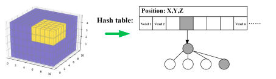

这篇论文的工作其实和之前解读的LOCUS的工作同属于一个比赛(DARPA)的作品，这个工作在DARPA的比赛中的城市赛道获得了第二名(第一名是LOCUS)，地下赛道获得了第一名, 从结果来看是很好的，下面进行解读

<!-- more -->

**《Super Odometry: IMU-centric LiDAR-Visual-Inertial Estimator for
Challenging Environments》（Arxiv . to be print）**

## Motivation

   这个文章里写的motivation和LOCUS的几乎一样，应该是DAPRA这个比赛就专注于这种场景，场景具体体现为在没有GPS的情况下，并且周围光源很弱和很多空气灰尘和不明显的环境纹理. 然后加上紧耦合不能实时切换主要传感器和松耦合不够精确的缺点，作者采取了一个紧耦合和松耦合相结合的方法进行传感器融合。

## Contribution

1. 我们提出了第一条以IMU为中心的传感器融合管道，能够在极端且具有挑战性的环境中进行准确的实时状态估计。
2. 提出的融合方法结合了紧耦合和松耦合的两个方式的优点
3. 提出了动态八叉树的三维点管理方法
4. 这个提出的方法已经在包括无人机和地面机器人等多个实体上得到了验证，另外在多个极端性的场景下进行了测试，包括剧烈运动，低光照，长廊和低粉尘。

## Content 

1. 系统框图

   如下图，其实主要就分成三个部分,IMU odometry, VIO, LIO,IMU odometry的约束由视觉和雷达同时提供并且输出先验给VIO和LIO.

   
   
2. IMU 里程计因子

   因为IMU预积分的时候使用了两个传感器的因子，所以需要对他们的因子进行权重的处理，权重是通过观测的可靠性分析给出的(这个地方作者说的很模糊，只是说视觉退化的场景视觉权重低，激光退化的场景激光权重低), 所以最后的因子表现形式如下:Em是边缘化残差
   
$$
E=\sum_{(i,j)\in B}e^{LIO}_{i,j}W^{-1}_{i,j}e^{LIO}_{i,j}+\sum_{(i,j)\in B}e^{VIO}_{i,j}W^{-1}_{i,j}e^{VIO}_{i,j}+E_m
$$

3. LIO

   这个模块主要可以分成四个部分，一是PCA特征提取，二是多尺度线性ICP，三是LIO因子优化，四是动态八叉树建图.
   

a.PCA特征提取

   提取出点线面三种特征:

   定义: $\theta\_i=\sqrt{\lambda\_i}$ ($\lambda\_i$是PCA分解出的特征值)

   然后根据下面的判断来分类特征:

$$
点:\theta_{1D}=\frac{\theta_1-\theta_2}{\theta_1}\\
线:\theta_{2D}=\frac{\theta_2-\theta_3}{\theta_1}\\
面:\theta_c=\frac{\theta_3}{\theta_1+\theta_2+\theta_3}
$$

b.多尺度ICP

   这个指的是同时优化点点，点线，点面误差(v,k分别是线特征和面特征的方向向量和法向量):

$$
e^{popo}_i=q_i-(Rp_i+t)\\
e^{poline}_j=v_j\times(q_j-(Rp_j+t))\\
e^{poplane}_k=n^T_k	(q_k-(Rp_k+t))
$$

c.优化

   这个优化也就是把上面三个残差加上IMU预积分和IMU里程计给出的约束放到一起优化:

$$
min_{T_{i+1}}\{\sum \omega_ie^{popo}_{i+1}+\sum\omega_ie^{poli}_{i+1}+\sum\omega_ie^{popl}_{i+1}+\sum\omega_ie^{imu}+e^{prior}_{imuodom}\}
$$

d.动态八叉树

   作者认为传统的KD树不适合动态更新点云地图，如下图，每次更新都要重新生成一个KDtree,时间消耗很大:

   作者提出的八叉树将体素格首先哈希存储，然后每个体素格再哈希存储一个点构成的八叉树，最后更新的时候只需要更新局部的八叉树，时间消耗比较小

4. VIO

   这部分作者写的比较简单，说是同时优化重投影误差，IMU预积分，边缘化残差，和IMUodom:
   
5. 实验结果

   四种实验场景的截图:
   
   
   
   
   
   长廊测试轨迹:
   
   
   
   粉尘环境轨迹
   
   
   
   八叉树和KD树时间对比
   
   

## Conclusion

   这篇文章主要的亮点在于两个，一个是框架是以IMU为中心的类紧耦合体系，方便增删传感器的同时，位姿结果也很好，另外就是八叉树点云存储管理方式的提出，从结果来看要比KD树好很多。
