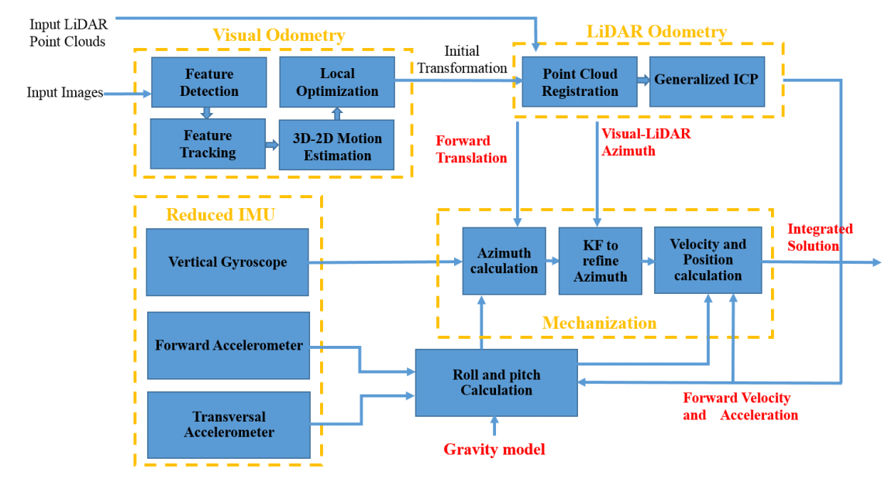
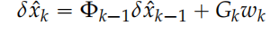
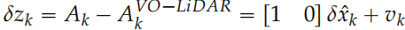
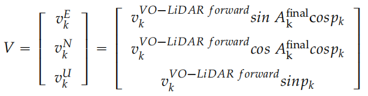
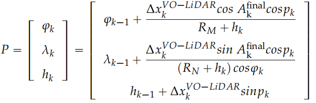
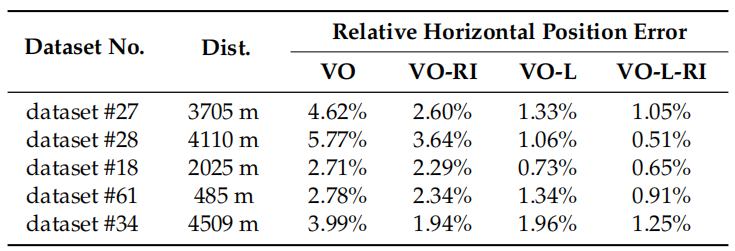

<!-- more -->

**《Visual-LiDAR Odometry Aided by Reduced IMU》（ISPRS2016）**

## Motivation

   多传感器融合提升里程计精度

## Contribution

1. 一个松耦合的传感器融合框架
2. 视觉提供雷达配准的初始位姿，用EKF结合IMU数据输出最终位姿
3. 视觉辅助激光里程计，只使用激光估计的位姿与IMU做融合

## Content 

1. 框架图

   a. 启动视觉里程计（常规的特征点提取匹配步骤，没有用到雷达深度）
   
   b. 视觉里程计作为高频初始位姿输出给雷达里程计作为ICP的初值
   
   c. 雷达里程计接收到初值后进行点云注册和启动ICP
   
   d. IMU持续接收信息用来和雷达位姿进行KF融合：
   
   I: 误差状态模型:
   
   
   
   II: 评价模型
   
   
   
   III: 最后更新后的速度和位姿：
   
   
   
   
   
2. 实验结果

   
   
## Conclusion

   这篇论文当时找的时候是通过vloam的引用找的，但是可以看出他的论文效果比较一般，就最后的结果而言，我觉得甚至都比不上aloam，我觉得这篇论文的唯一的贡献就在于提出了雷达位姿和IMU的KF公式
   