视觉SLAM目前主要分为直接法或者特征法，基于特征法的性能更好但是也具有更高的延迟，基于直接法的视觉SLAM虽然延迟低，但是不适用于某些场景并且大部分时候比基于特征点法的性能更差，所以如何平衡延迟和性能的问题一直是视觉SLAM一个很重要的命题.

<!-- more -->

**《Good Feature Matching: Toward Accurate, Robust VO/VSLAM With Low Latency》（TOR 2020）**

## Motivation

   本文的出发点是平衡性能和延迟的差距，基于特征点法提出了本文的改进方法:good feature匹配，good features匹配的实验基础是一部分的视觉特征点集可以提供绝大部分的视觉跟踪所需要的信息。另外，特征点匹配是和子矩阵选择紧密相关的，本文通过模拟实验研究得出了Max-logDet矩阵是表现最好的子矩阵的结论。

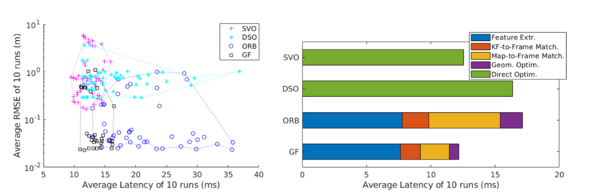

## Contribution

1. 研究了最小二乘姿态优化的误差模型，将姿态优化的性能与加权雅可比矩阵的谱特性联系起来
2. 对位姿优化中最小二乘指标条件进行了探讨，得出了Max-lodDet是最优度量的结论
3. 引入一种有效的良好特征选择算法，使用Max logDet度量，比最先进的特征选择方法快一个数量级
4. 在一个最先进的基于特征的VSLAM系统上，通过多个基准、传感器设置和计算平台，综合评估所提出的良好特征匹配。评估结果表明，该方法既减少了延迟，又保持了准确性和鲁棒性。

## Content 

1. 最小二乘优化的研究

   这个部分的主要目的是确定哪些矩阵影响姿态协方差。最小二乘问题可以表示如下:(x是相机位姿,p是三维特征点,z是对应的二维图像测量)
   
   $$
   min\|h(x,p)-z\|^2
   $$

   非线性优化又可以一阶近似成下面的形式(H是对应的雅克比):
   
   $$
   \|h(x,p)-z\|^2\approx \|h(x^{(s)},p)+H_x(x-x^{(s)}-z)\|^2
   $$
   
   然后位姿可以迭代更新如下:
   
   $$
   x^{(s+1)}=x^{(s)}+H^{+}_x(z-h(x^{(s), p})
   $$
   
   高斯牛顿法的精确度取决于残差误差$\epsilon\_r$,残差误差又可以分为测量误差$\epsilon\_z$和建图误差$\epsilon\_p$,利用h（x，p）在估计的位姿x（s）和地图点p处的一阶近似，将位姿优化误差与测量误差和地图误差联系起来，得到位姿优化误差为:
   
   $$
   \epsilon_x=H^+_x\epsilon_r=H^+_x(\epsilon_z-H_p\epsilon_p)
   $$
   
   在测量误差和建图误差都符合高斯分布的前提下，可以得出残差误差也符合高斯分布，并且可以表示为:
   
   $$
   \sum_r(i)=\sum_z(i)+H_p(i)\sum_p(i)H_p(i)^T
   $$
   
   执行Cholesky分解可以得到:
   
   $$
   \sum_r(i)=W_r(i)W_r(i)^T
   $$
   
   从所有的n个残差中组合$W\_r(i)$ 可以得到一个$2n\times 2n$的块对角权重矩阵$W\_r$,并且可以得到协方差矩阵:
   
   $$
   \sum_x=H^+_x\sum_r(H^+_x)^T=H^+_xW_r(H^+_xW_r)^T
   $$
   
   可以得到:
   
   $$
   W^{-1}_rH_x\sum_x(W^{-1}_rH_x)^T=I
   $$
   
   按照矩阵逐块乘法的操作将$W^{-1}\_r$和$H\_x$相乘,得到:
   
   $$
   H_c=\begin{bmatrix}
    W^{-1}_r(0)H_x(0)\\
    \dots
   \\
   W^{-1}_r(n-1)H_x(n-1)
   \end{bmatrix}
   $$
   
   最终协方差矩阵可以表示为:
   
   $$
   \sum_x=H^+_c(H^+_c)^T=(H^T_cH_c)^{-1}
   $$
   
   最终得到的这个矩阵是影响位姿优化精度的矩阵.
   
2. 使用最大对数行列式(max-logdet)的good feature选择
   
   good features选择问题可以定义为:给定一个集合在2-D-3-D特征匹配中，从中找到一个不变的基数子集，这样当仅使用该子集时，最小二乘姿态优化的误差最小。基于前面的讨论，好的特征选择问题等价于子矩阵选择：给定一个矩阵Hc，选择行块的子集，使所选子矩阵的整体谱特性尽可能地保持不变
   
   - 在子矩阵选择中的子模块性质
   这个部分没读懂，主要就是从下面四个矩阵中分析得出最大对数行列式最优的结论
   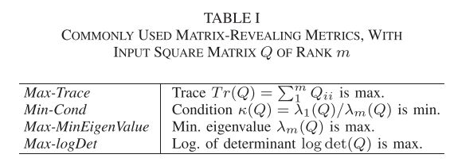
   
   - 不同参数的模拟实验

   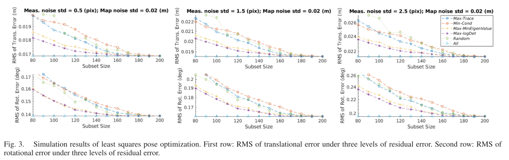
   
3. 有效的good feature的选择

   根据以往的文献调研结果，在保持$P!=NP$假设的前提下，最大对数行列式的近似贪心比例为$1-1/e$. 懒贪心是贪心算法的一个改进，但是因为最大对数行列式的上界过于粗糙:
   
   $$
   log det(Q)\le\sum^m_{i=1}log(Q_{ii}),rank(Q)=m
   $$
   
   所以导致最后的时间无法满足实时性的要求(30ms),基于这个背景，作者提出了懒贪心的改进算法"lazier than lazy greedy", 这个算法的核心思想比较简单，在每一轮贪婪选择中，不是遍历所有n个候选，而是只评估候选的随机子集来识别当前的最佳特征，随机子集的大小可以被衰减因子$\delta$控制:
   
   $$
   subset=(n/k)log(1/\delta)
   $$
   
   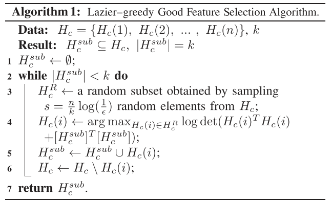
   
   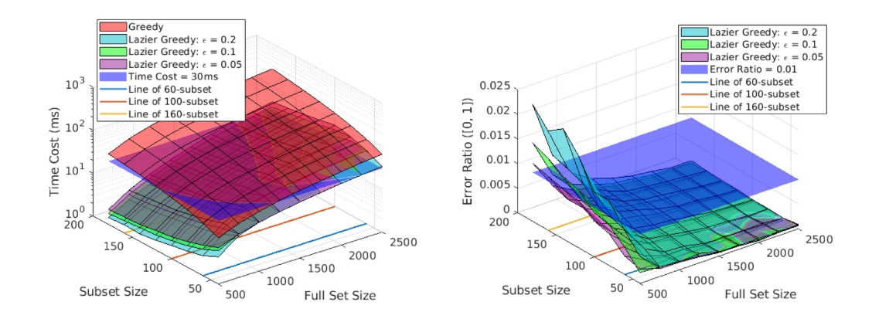
   
   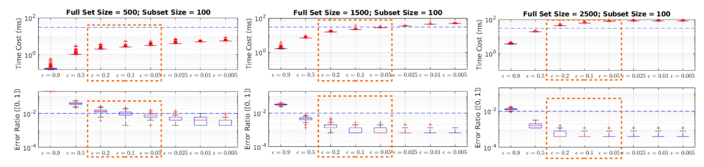
   
4. 	good feature匹配在单目SLAM的应用

   这个问题定义为在二维特征点和三维地图点关系未知的情况下，如何确定哪些点作为匹配的目标和优先顺序，改进主要体现在三点:
   
   a : 在构造矩阵Hc(算法2的第1-4行)时，去除对2-D-3-D匹配的依赖。构造Hc需要知道二维测量的协方差矩阵Σz(i)。为了避免这个信息，假设一个常量prior(例如，2*2的单位矩阵),在特征匹配的初始阶段（算法2的第3行）
   
   b : 在更新良好特征选择（算法2第10行）中的子集之前，添加特征匹配条件检查：仅当当前最佳三维特征（具有最高logDet边距增益）与某个2-D度量成功匹配时，矩阵（特征）子集才应相应更新。对于当前最佳的三维特征，在图像帧上使用大小固定的局部搜索窗口（以三维特征的二维投影为中心）搜索可能的二维测量值。如果没有任何二维测量可以与当前最佳三维特征相匹配，则继续匹配下一个最佳三维特征（算法2的第15–17行）。通过融合良好的特征选择和特征匹配，选择策略成为一种主动匹配算法：特征匹配工作优先考虑具有最高潜在增益的子集（以logDet表示）
   
   c : 通过更新测量协方差，来自成功特征匹配的信息有助于后续良好的特征Σz(i)和关联块矩阵Hc(i)的选择(算法2的第11行)。测量协方差Σ假设z(i)与测量提取的标度/金字塔水平成二次曲线；一旦从2-D–3-D特征匹配中知道金字塔级别，它就会更新。匹配特征的校正块Hc（i）被连接到所选子矩阵中，贪婪匹配的下一次迭代开始（算法2的第18-20行）。
   
   d : 算法2的第6行和第8行中的循环包含时间预算tmax条件，而不是在候选匹配池中彻底搜索k个匹配。时间预算是合理的，因为子模块特性与收益递减相关（即，第j次匹配的边际值小于早期匹配）。搜索时间过长会丧失平衡准确性和延迟的任务。在实验中，tmax=15 ms，并且很少达到.
   
   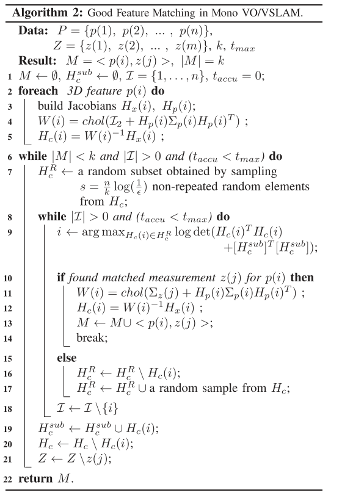
   
5. good feature匹配在双目SLAM的应用

   与单目VO/VSLAM相比，双目VO/VSLAM在数据关联中增加了一个模块: 双目匹配，它将左右帧之间的测量关联起来。由于双目算法将现有的3-D投影特征与两帧的2-D测量值相关联，因此每个成对测量值为最小二乘目标提供两倍的行数(仅在位姿和BA中)。双目方法还通过从左帧和右帧的三角化提供了对新地图点的即时初始化。但是，当前位姿的优化（如在位姿跟踪中所追求的那样）仅受益于与现有三维投影特征相关联的双目匹配！通过扩展这个特性，设计了一个比原来的双目SLAM时间消耗更低的方法，并且把双目匹配推迟到图帧匹配之后。
   
   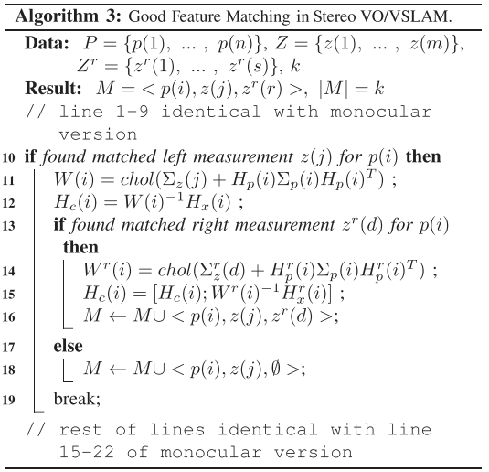
   
6. 实验

   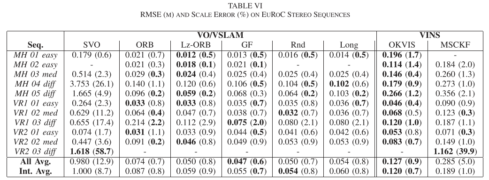
   
   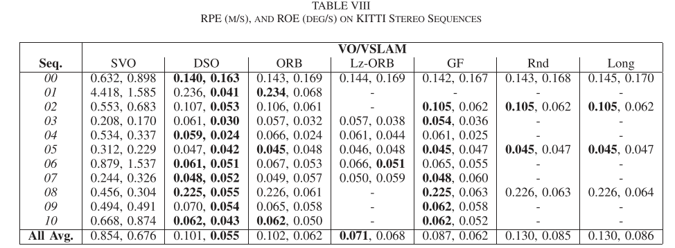

   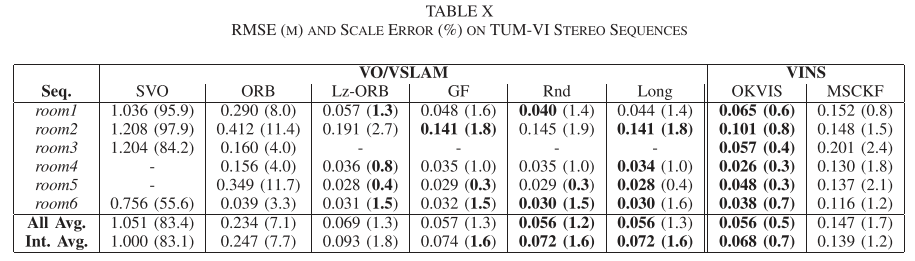

## Conclusion

   这篇文章只能说一声很厉害，数学层面上对于特征点匹配的方法进行了改进，并且取得了一定的效果，膜.
