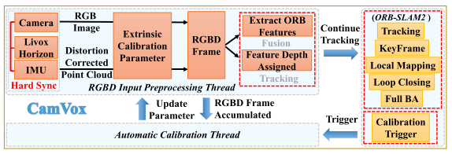
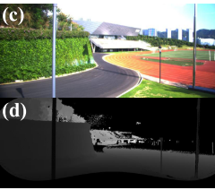
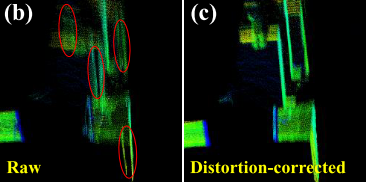
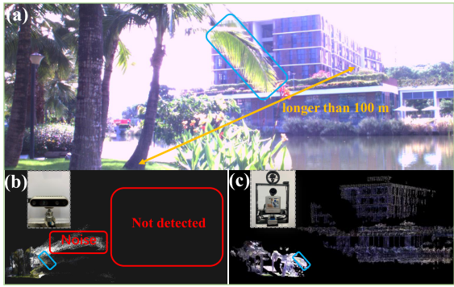
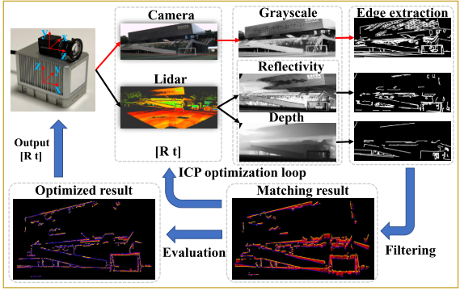
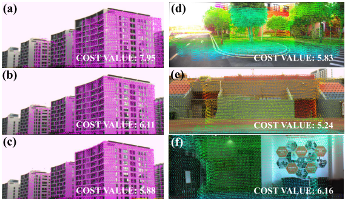
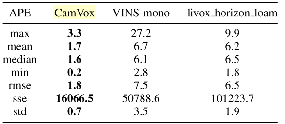

如何将低成本激光雷达和低成本相机进行结合是一个有着实际工业应用价值的命题，这篇文章将Livox雷达改编进ORB-SLAM进行了探索。

<!-- more -->

**《CamVox: A Low-cost and Accurate Lidar-assisted Visual SLAM System》（ICRA 2021）**

## Motivation

   本文的出发点是性价比，低成本lidar+低成本相机。首先利用livox雷达的非重复性，提出了一种适用于非受控场景的相机雷达自动标定方法，通过将livox雷达作为深度传感器应用到ORB-SLAM中，实现了不错的效果。

## Contribution

1. 在预处理步骤融合激光雷达和相机输入。仔细地进行时间同步，通过IMU数据校正非重复扫描的lidar点中的失真，并将其转换为相机帧。
2. 与其它深度相机相比，激光雷达点云的测量精度和测量范围都有很大的提高，SLAM系统可以高效率地进行大比例尺的测绘，并能在室外强阳光环境下稳定地工作。
3. 利用Livox激光雷达的非重复扫描特性，在非受控场景下对相机和激光雷达进行自动校准。

## Content

1. 系统框图

   主要分为三个部分，RGBD输入预处理模块负责把同步好的相机和雷达模块处理成一个独立的RGBD帧，主线程是ORB-SLAM2的处理模块，自动标定线程在触发状态时对激光雷达和相机传感器进行在线标定。

2. 预处理步骤

   预处理线程从激光雷达中提取原始点，经IMU校正后，根据相机的外部标定投影到深度图像中, 深度图及对应的RGB图像如下:
   

   需要注意的是因为运动会产生点云畸变，所以通过IMU进行插值去畸变，过程如下图:

   另外，为了证明深度相机和激光雷达的差距，作者做了如下图的验证 :

3. 自动标定步骤

   在静止的状态下积累一段时间的激光点云，同时捕捉相应的图像。首先利用反射率和深度值，通过初始外部参数将稠密点云投影到成像平面上，然后进行轮廓提取，与摄像机图像轮廓进行比较。具体过程如下图:
   

   考虑到在一次错误的匹配中很少有点实际参与距离的计算，代价函数的值就被困在这个局部极小值之内。在这种情况下，增加一定程度的不匹配来改进ICP中的成本函数，改进的代价函数如下(n是相机边缘点与雷达边缘点的距离小于一定的阈值的数量，m是最近点的数量,N是相机点的数量,b是权重，设置为10):

$$
CF=\sum^n_{i=1}\sum^m_{i=1}\frac{Distance(P^{cam}_i,P^{lidar}_{ik})}{n\times m}+b\times \frac{N-n}{N}
$$

4. 实验

a 自动标定实验:

图a是未标定的，图b是自动标定的，图c是手动标定的，图def是其他场景	

自采数据集rmse

## Conclusion

   这篇文章整体上可以理解为是一种激光辅助视觉的传感器融合方法，并且提出了一个针对于livox这种低成本雷达和相机在线标定的方法，在ORB-SLAM2的框架上，因为深度传感器改成激光雷达，所以可靠点的数量增加很多，所以最后的精度提升很多。
