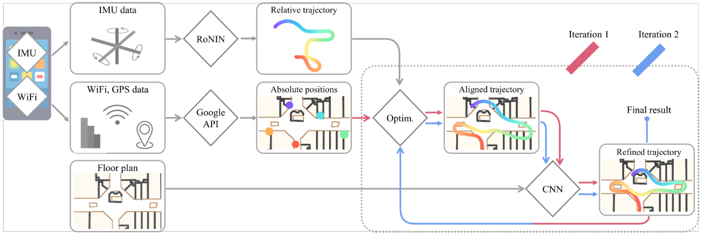
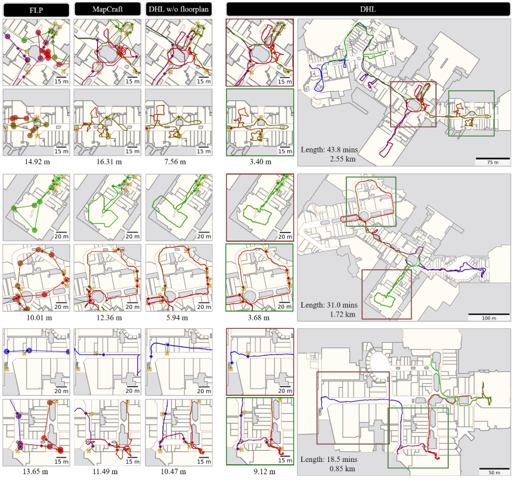
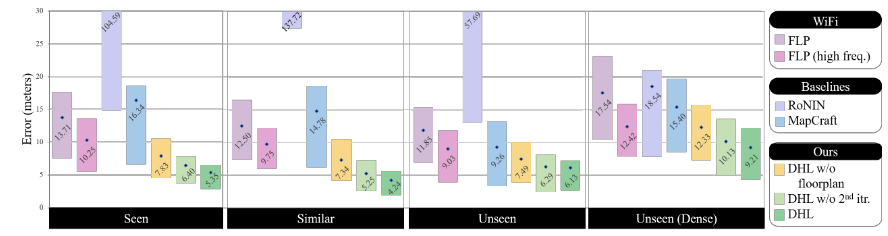
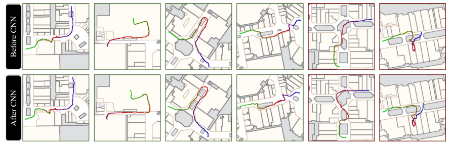

基于wifi和手机自带IMU的室内离线定位.

<!-- more -->

**《Fusion-DHL: WiFi, IMU, and Floorplan Fusion for Dense History of Locations in Indoor Environments》（ICRA 2021）**

## Motivation

   在室内场景下，用激光雷达定位是不太现实的，一是因为激光雷达的盲区大，二是因为激光雷达的对于室内的一些无结构环境效果差，三是因为激光雷达贵，基于视觉的室内定位虽然效果很好，但是如果室内的光照差，也会有差的影响。所以，在这篇论文里，作者提出了基于手机自带的IMU和室内wifi和室内平面设计图相结合的方法进行传感器融合。

## Contribution

1. 一种新的具有地面真实位置的多模态传感器数据集。
2. 提出了一种融合WIFI,IMU,楼层图的新的方法，即先使用RoNIN来估计一个相对的运动轨迹，然后调用google基于Wifi定位的api来获得稀疏全局定位并且将惯性轨迹和地图进行匹配，最后通过一个CNN来优化定位轨迹和平面图 。 
3. 提出的系统可与任何现代智能手机配合使用，同时对设备的额外能耗要求最低，并且IMU是唯一的额外数据采集设备。

## Content

1. 系统框图

   输入是IMU数据，全局定位api(文中用的是google FLP,1/60HZ)和一个全局定位的楼层图。在有了输入以后，先通过RONIN输出一个50Hz的相对运动轨迹; 然后，采用非线性最小二乘优化方法，通过FLP和正则化项，利用以传感器为中心的误差模型，对受位置约束的轨迹进行全局定位。除了全局定位之外，这种对准消除了惯性导航固有的尺度和/或旋转漂移；接着，用CNN来估计与平面图一致的对齐轨迹的修正; 最后，系统再次运行优化和CNN步骤，同时将位置约束从FLP改为当前位置历史估计，每200帧进行一次二次采样

2. 基于优化融合IMU和Wifi

   从RoNIN得到的相对运动轨迹是每帧f的速度s和运动方向$\Theta$构成的序列:$[s\_f,\Theta\_f]$, 那么，相应的位置可以计算为:
   
   $$
   \sum^f_{i=1}s_i[\cos \Theta_i,\sin \Theta_i]^T
   $$
   
   考虑到IMU的误差主要来源是累计旋转误差和尺度误差,因此通过添加尺度矫正因子$\Delta s\_f$和$\Delta \Theta\_f$ 和第一帧的初值$\Delta\overrightarrow{P\_0} $来矫正位置:
   
   $$
   \overrightarrow{P_f}=\Delta\overrightarrow{P_0}+\sum^f_{i=1}s_i\cdot\Delta s_i[cos(\Theta_i+\Delta\Theta_i),sin(\Theta_i+\Delta\Theta_i)]^T
   $$
   
   最后，总体的优化公式表述如下:第一项是矫正位置和FLP获得的位置之间的距离和FLP所允许的误差阈值的差，第二项是正则化的尺度修正，第三项是正则化的角度修正
   
   $$
   \sum_{f\in F_{flp}}max(\|\overrightarrow{P_f}-\overrightarrow{P^{FLP}_f}\|^2-r^{FLP}_f,0)+w_1E^{REG}_1({\Delta_{S_f	}})+w_2E^{REG}_2({\Delta\Theta_f})
   $$

3. 基于CNN融合楼层图

   FLP获得的位姿误差经常会超过10m,所以在这里作何考虑基于楼层图用CNN优化整体轨迹.用的网络是U-Net.
   
4. 实验结果

   
   
   
   
   
   
## Conclusion

   这篇文章提出了一种多模态传感器融合算法,它将WiFi、IMU和floorplan信息融合在一起来计算位姿，与目前的工业现状（即谷歌融合定位提供商）相比，精度提升了一倍。但是这个目前的缺点是不能够实时，是离线的。

