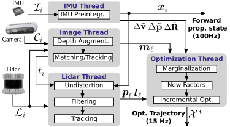
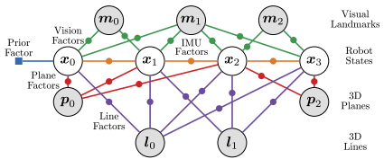

<!-- more -->

**《Unified Multi-Modal Landmark Tracking for Tightly Coupled Lidar-Visual-Inertial Odometry》（ICRA 2021）**

## Motivation

   就目前而言，多传感器融合方向，相机＋视觉＋IMU仍然处在松耦合融合的层面，基于增量平滑的紧耦合方法目前仍然有待研究，并且可以预见的是会有比较好的效果，通常来讲，在多传感器融合方向，主要是解决两个问题，如何在计算量有限的平台下实现一个鲁邦性能和如何同步多个传感器不同的频率，这两个问题目前在已有的松耦合融合方法里已经得到了比较好的解决。因此，作者想到了解决实验中遇到的两个问题: 1.如何提取和跟踪稀疏轻量级的特征; 2.如何开发一个相关因子图，可以利用IMU预积分动态的将点云投影到附近相机帧的时间戳。(第一点的motivation可以避免匹配整个点云或者跟踪上百个特征点，第二点的motivation可以尽可能的平滑多传感器的影响)

## Contribution

1. 提出了一种新的因子图公式，在一个一致的优化过程中紧密地融合了视觉、激光雷达和IMU测量.
2. 提出了一种有效的提取激光雷达特征的方法，然后将其优化为地标。激光雷达和视觉特征都有一个统一的表示，因为标志物都被视为n维参数流形（即点、线和平面）。这种紧凑的表示允许我们以标称帧速率处理所有激光雷达扫描。 
3. 在一系列场景中进行的广泛实验评估表明，与单个传感器模式的方法相比，该方法具有更高的鲁棒性
## Content

1. 系统框图

   如下图，多传感器的输入进行并行处理，后端输出一个高频的传播位姿输出和低频的优化位姿输出。

2. 因子图

   如下图，因子图里主要包括３种因子，先验因子(IMU)，视觉因子(单目和双目)，雷达特征因子(线特征和面特征)，下面进行一一解读
   

   a. IMU因子图

   当前的IMU预积分理论已经模块化，具体的公式推导可以阅读《On-manifold preintegration for real-time visual-inertial odometry》(TOR2017), 这里就直接给出文章中对于IMU问题参数的定义：

$$
r_{I_{i,j}}=[r^T_{\delta_{P_{i,j}}},r^T_{\delta_{v_{i,j}}},r^T_{\delta_{R_{i,j}}},r^T_{\delta_{b^a_{i,j}}},r^T_{\delta_{b^g_{i,j}}}]
$$

   b. 单目视觉特征因子

   这里说的单目视觉特征因子主要指的是经过雷达深度图获取深度的单目重投影误差，具体操作如下图:黄点是视觉FAST特征点,红线是雷达特征线，绿面是雷达特征面，在获取雷达数据后，将雷达点投影到右侧的相机图像上，对于相机特征点和雷达点的距离小于一定阈值的，进行深度关联操作.

   因此，这个因子的残差计算如下:

$$
r_{x_i,m_l}=T^{-1}_im_l-\hat{X}_l
$$

   c. 双目视觉特征因子

   这个主要是防止出现深度图无法和视觉特征关联情况的出现，实质上就是直接采用了双目的重投影误差:

$$
r_{x_i,m_l}=\begin{pmatrix}
 \pi^L_u(T_i,m_l)-u^L_{i,l}\\
 \pi^R_u(T_i,m_l)-u^R_{i,l}
 \\
 \pi_v(T^i,m_l)-v_{i,l}

\end{pmatrix}
$$

   d. 雷达平面因子

   使用海塞法向量来参数化一个不定平面，然后再用一个标量来表示到原点的距离,用⊖表示两个平面的误差,用⊗表示对平面施加一个位姿变换：

$$
p=\{<\hat{n},d>\in R^4 | \hat{n}*(x,y,z)+d=0\}\\
   p_i\ominus p_j=(B^T_p\varepsilon,d_i-d_j )\in R^3\\
   \varepsilon=-\frac{arccos(\hat{n}_i*\hat{n}_j)}{1-(\hat{n}_i*\hat{n}_j)^2}(\hat{n}_j-(\hat{n}_i*\hat{n}_j)\hat{n}_i)\in R^3\\
   predict=(T^{-1}_i\otimes p_l)\
$$
## Conclusion

   这篇文章提出了一种多模态传感器融合算法,它将WiFi、IMU和floorplan信息融合在一起来计算位姿，与目前的工业现状（即谷歌融合定位提供商）相比，精度提升了一倍。但是这个目前的缺点是不能够实时，是离线的。