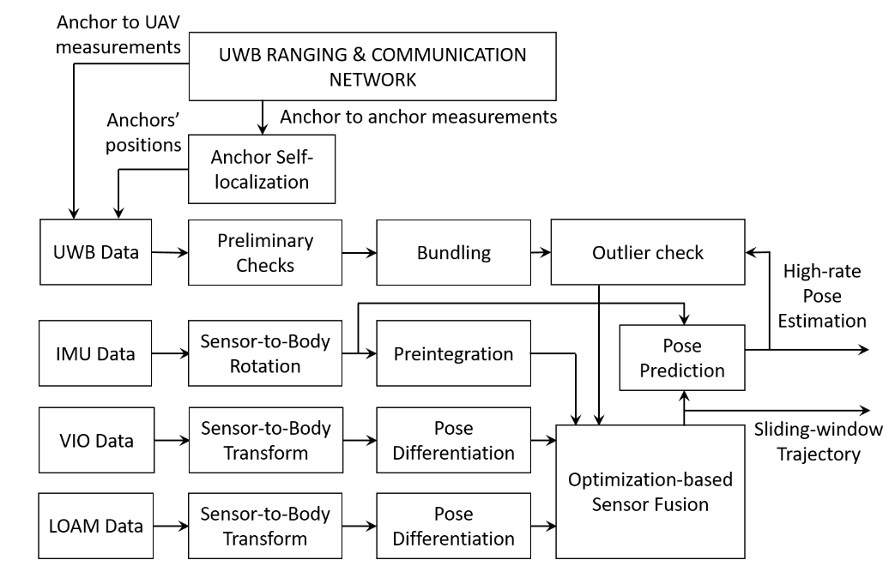
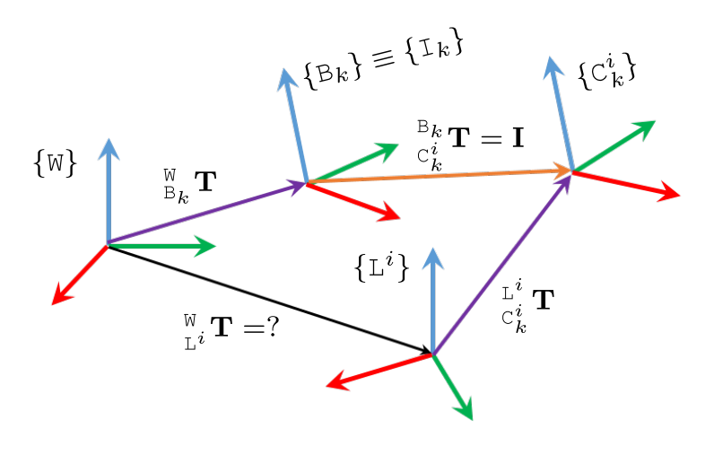
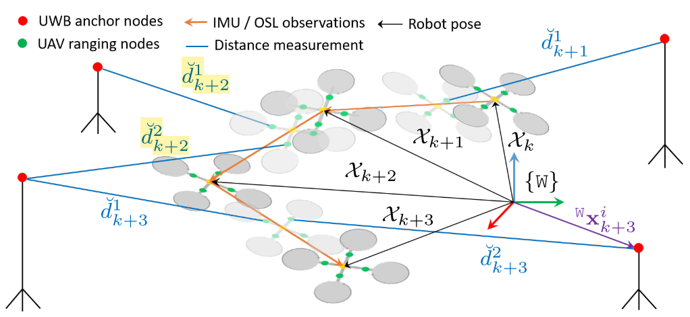
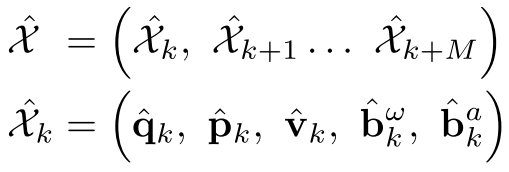
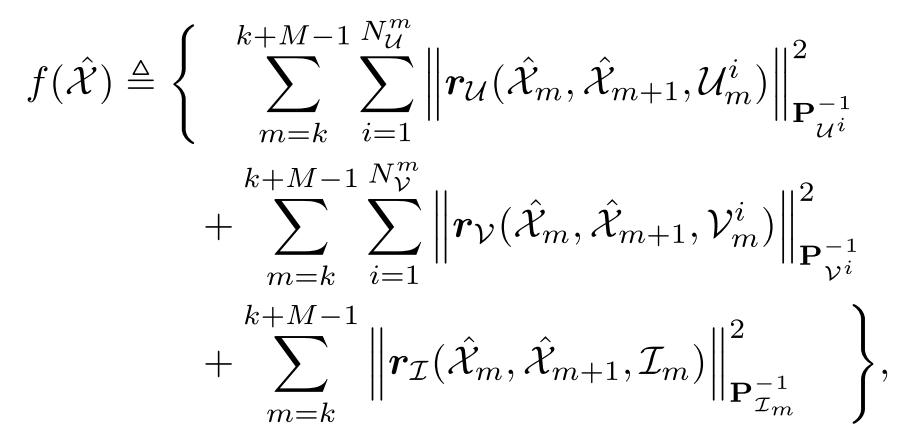
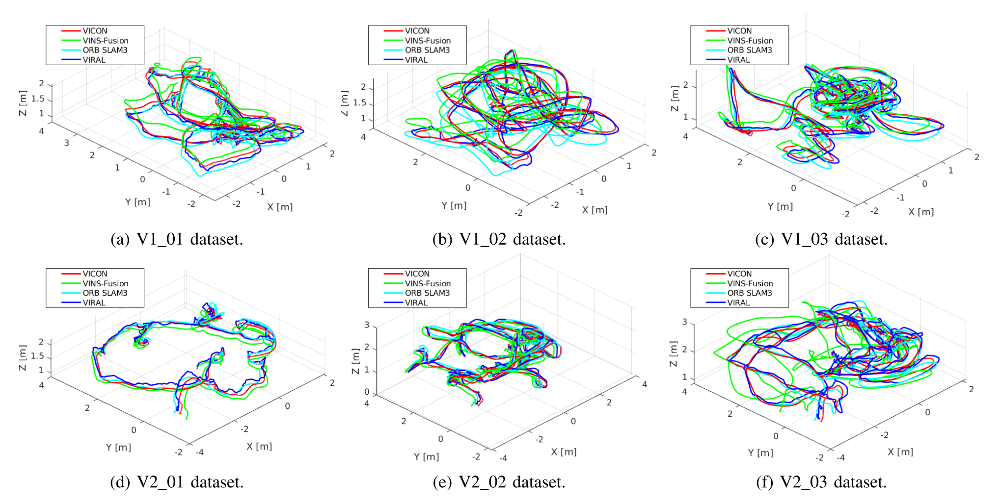
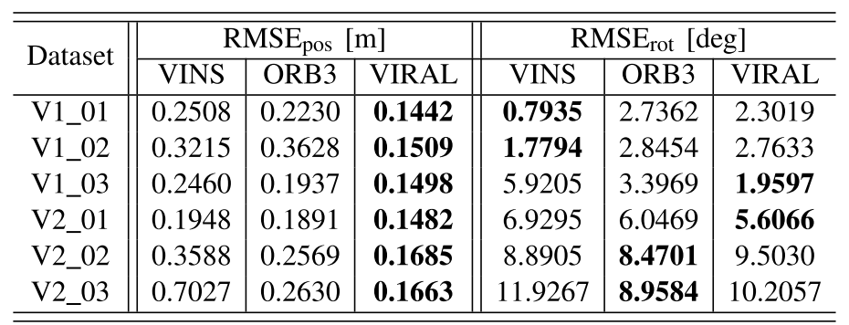
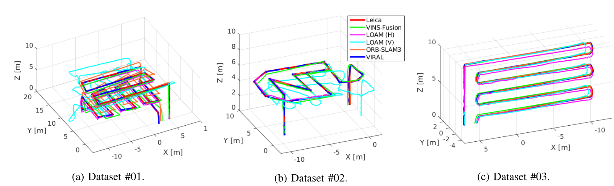
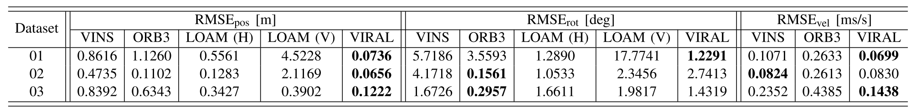

<!-- more -->

**《VIRAL-Fusion: A Visual-Inertial-Ranging-Lidar Sensor Fusion Approach》**

## Motivation

   多传感器融合，提出了一个新的融合框架

## Contribution

1. 覆盖了目前大部分的传感器：UWB,IMU,VIO and LOAM
2. 将IMU预积分和UWB进行了结合
3. 在公开数据集上的实验效果达到了领先
## Content

1. 系统框图

   系统框图，分别输入UWB，IMU，VIO，LOAM的数据，然后通过优化的方式进行数据融合

2. 坐标系统和基于IMU和UWB的滑窗示意图

3. 优化

滑窗内的位姿的定义：

代价函数：

4. 实验

## Conclusion

   这篇论文主要是提出了一个基于优化的多模态传感器融合的框架，这种类似的思路，之前也看过很多篇，不过这篇给我印象最深的一点还是他的实验，基本达到了全线领先，文章中详细推导了他的代价函数，不过还没有时间重新推导，后续有时间要推导一下。