将三维点云投影成图像的形式进行回环检测，这篇论文是scan context的期刊版本，通过学习一个点云描述符，也就是扫描上下文图像（SCI），并通过卷积神经网络将地点识别问题描述为地点分类，在网格地图上进行机器人定位，所以最终的速度比类词袋法的配对查找要快很多，并且从实验结果上来看，通过一天的训练可以实现全年的持久化效果

<!-- more -->

**《1-Day Learning, 1-Year Localization: Long-Term LiDAR Localization Using Scan Context Image》(RAL2019)**

## Motivation

   要想实现无人驾驶，在真实环境的持久定位是必要的，并且基于相机的持久定位是不现实的，因为相机会受到环境的影响。另外，尝试引入先验经验的基于相机进行持久定位的方法是有比较重大的缺陷的，因为对捕获同一地点的各种条件的需求增加了数据库的压力。激光点云的信息很少受到天气光照等因素的干扰，适合持久定位。所以从这个意义上说，使用光探测和测距（LiDAR）进行的单次观测可以代表一个地方的典型特征，消除了对可靠定位的多次经验的需要。

   虽然之前已经有别人做过基于激光的持久定位，但是之前的方法存在的问题在于定位效果不够持久(主要体现在场景发生了缓慢并且持续的变化，或者在同一条街道的不同车道行驶之类)。

   基于这些原因，作者用CNN进行端到端定位，定位器是基于SCI(Scan Context Image)从而将定位任务转换为分类任务

## Contribution

1. 基于提出的SCI( image-shaped point cloud descriptor)引入了基于分类的定位流程。
2. 为了减少长期定位的漂移，提出了一个基于熵的不可见位置识别模块。
3. 分别在NCLT数据集和牛津RobotCar数据集进行了评估(涵盖了四季和严重的道路结构和观察角度变换)，达到了最好的效果。
## Content

1. 系统框图

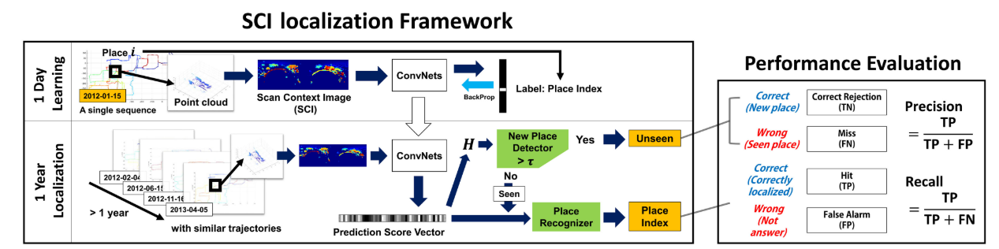

2. SC(scan context)简单回顾

   SC将三维点云作为输入，并且将其最大范围内的平面周围区域划分为扇区和环，这些区域又分别可以分为方位方向和径向方向，扇区和环的交集称为bin。SC只将每个bin的最高值组成二维矩阵的形式，这样可以保持bin之间的排列关系，下图展示了SC的建立过程。
   

3. SCI( image-shaped point cloud descriptor)

   SC只是一个封装了结构信息的单通道矩阵，为了方便CNN的输入，将SC进行正则化并且转换为三通道矩阵。在实际的实验过程中，发现三通道相比单通道提升了识别能力。将SC转化为SCI的过程如上图。
   
4. 定位定义

   这个主要是解释如何将定位任务转化为分类任务:
   
   首先将训练序列覆盖的区域在二维平面上划分为大小相等的网格单元，并为他们分配不同的索引。一个单元格表示一个位置，然后用一个单元格中获得的所有的SCI训练处具有类标签的CNN，标签是对应位置索引的一个热编码向量。标签的维度对应着位置的总数量，然后用分类交叉熵进行训练.具体网络细节如下图:

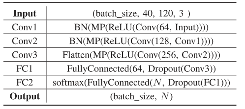

5. N-way SCI增强

   这个部分主要是为了解决长期定位中视角变化的问题，通过N-way SCI增强实现了一定程度上的视角不变性。因为SCI的列顺序代表了机器人的航向，所以可以在训练阶段合成SCI的视角变化。N可以是360除以任意一个整数.

6. 非学习的位置识别

   这点主要考虑到在长期定位中，机器人运动到了一个在训练集中没有出现过的地方的情况。所以在SCI定位之前，首先要判断当前的位置是否是一个新位置来避免错误的判断。在本文中，作者是直接使用输出向量的熵来判断是否当前查询向量存在，从实验结果来看，这种方法的持久鲁棒性高于传统的基于距离阈值的配对位置匹配。熵表示如下($p\_i$是向量p的第i个元素，$H\_max$是N维向量的最大熵):
   
   $$
   H(p)=-\frac{1}{H_{max}}\sum^N_{i=1}p_ilog_2p_i
   $$
   
   判定逻辑是，预测向量的熵高于一个阈值，那么就是新位置，不参与SCI定位。
   
   已有位置和新位置的熵的分布如下:
   

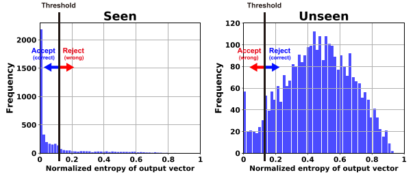

7. 定位

   如果查询被认为是可见的（即，点云是从可见的位置获得的），则使用预测得分向量执行定位。此向量元素的索引（得分最大）被归纳为当前位置。更一般地说，如果查询位置的地面真值索引属于在网络预测得分向量中得分顺序较大的前N个索引的集合，则可以说定位是成功的。

8. 实验

   下图左是NCLT数据集，下图右是Oxfood数据集，Oxfood数据集的激光雷达是2D的，所以所以进行累积扫描生成SCI.
   

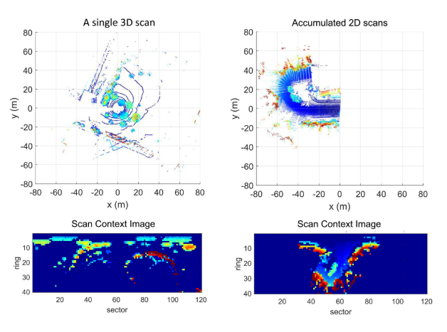

   下表是两个数据集的已有位置和未有位置的一些指标:

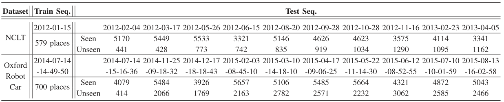

   测试召回率和准确度

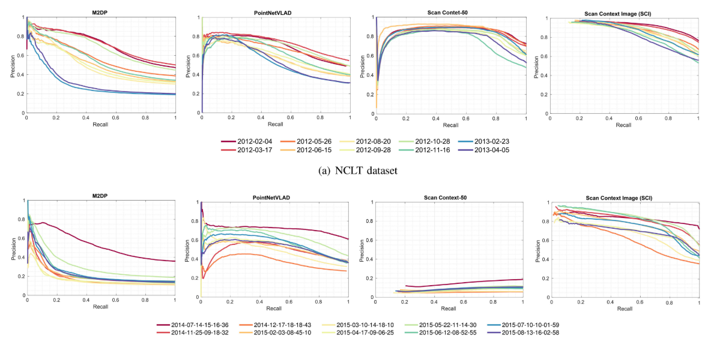

   对于非结构变化具有很强的鲁棒性

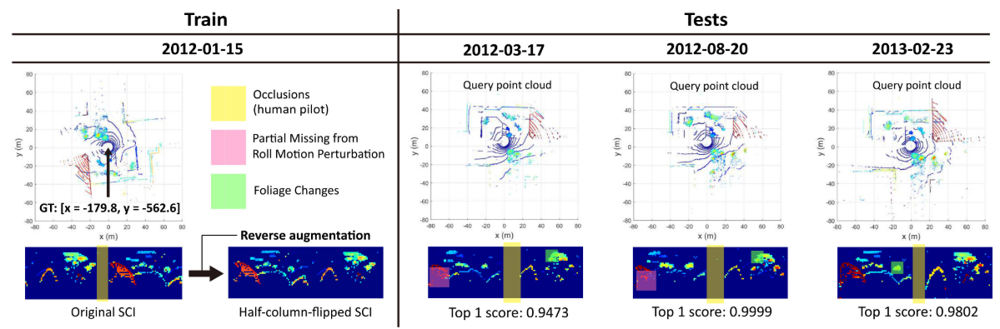

   对于不同候选集的AUC指标

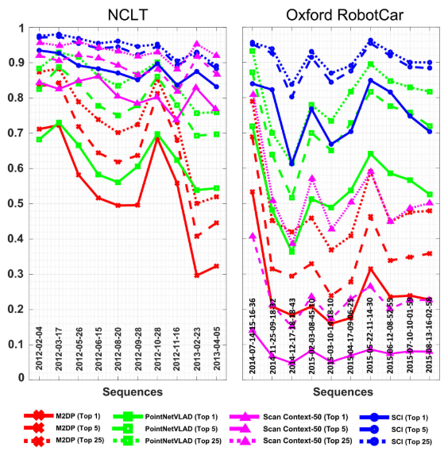

   对于结构性变化也具有很强的鲁棒性

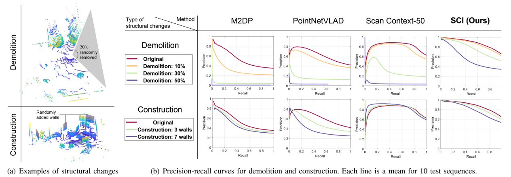

   对于视点变化的鲁棒性

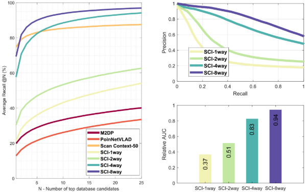

   时间对比

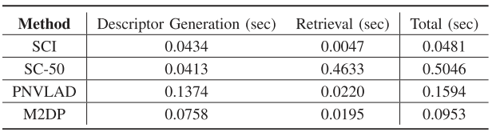

## Conclusion

   这篇论文通过学习点云描述符进行深度学习。与现有的基于成对分数的位置检索方法相比，本文提出的基于分类网络的SCI方法对机器人的长期定位具有更强的鲁棒性。在一年多的时间里表现出了一致的、最先进的性能，即使网络只使用一天的训练集序列进行训练。由于其鲁棒性和全局性能，可以考虑作为ICP的精细定位的初始化。