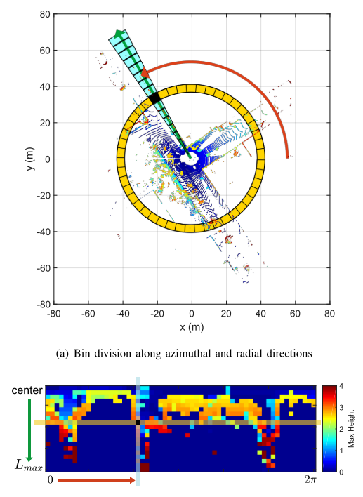
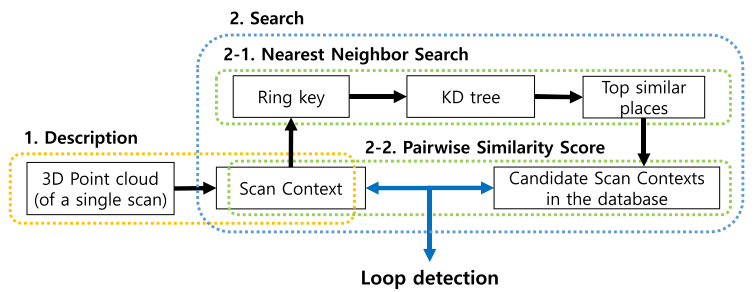
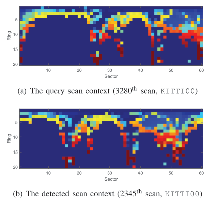
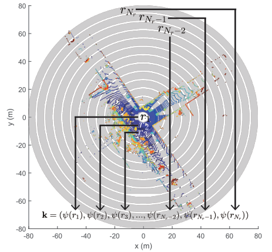
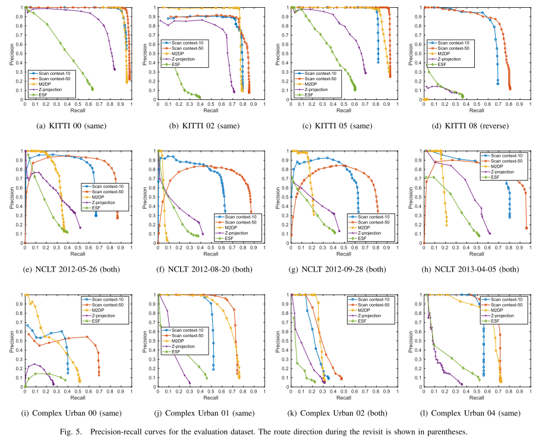
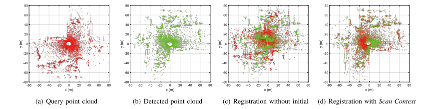
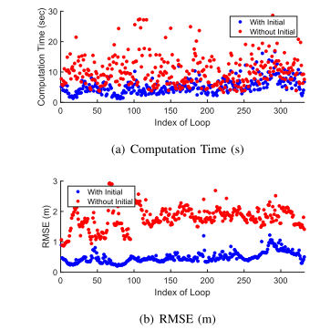
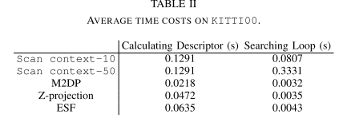

Scan context的会议版本论文。

<!-- more -->

**《Scan Context: Egocentric Spatial Descriptor for Place Recognition within 3D Point Cloud Map》(IROS2018)**

## Motivation

   基于全局定位的需求，Scan context提出了一个不依赖于直方图和先验信息的方法。这个方法可以避免直方图方法带来的描述场景细节不够直接的问题。

   

## Contribution

1. 提出了一个有效的点云格编码方式，这个方式不需要计算点云格内的点云数量并且保持了对于点云密度和法线的不变性。
2. 维持了点云的内部结构，主要是维持了点云内部的点云格之间的绝对位置关系。
3. 有效的两步匹配方法。首先基于旋转不变性描述子来进行最近邻搜索，然后将这个和分层的配对相似性评分结合，避免了搜索所有数据库的过程。
4. 全面的实验结果，和现有的其他方法(M2DP,ESF,Z投影)相比有很大的改进。

## Content

1. 系统框图

   如下图，先把点云输入编码为一个Scan Context，然后从这个SC中生成以环数为维度的向量，然后通过KD树进行最近邻搜索执行闭环检测。

   
   
2. Scan context

   首先将一帧点云以传感器坐标为中心，根据方位和径向(类似于第一个图)进行划分成一个个点云单元$p\_{i,j}$(i表示第i个环，j表示第j个扇形).
   
   每一个单元的值通过单元内的最大高度来设置:
   
   $$
   \phi(P_{i,j})=max_{p\in P_{i,j}}z(p)
   $$
   
   最后，这帧点云所转换成的SC可以矩阵表示为:
   
   $$
   SC=(\phi(P_{i,j})\in R^{N_r\times N_s})
   $$
   
   然后采用root shifting和将点云转换为N个邻居的方法来增强对于平移和同场景异车道的鲁棒性。
   
3. 基于SC的相似性分数计算

   按列序根据余弦公式累加求两个SC矩阵的距离，然后再除以列数量来正则化。
   
   $$
   d(I^q,I^c)=\frac{1}{N_s}\sum^{N_s}_{j=1}(1-\frac{c^q_j\cdot c^c_j}{\|c^q_j\|\|c^q_j\|})
   $$
   
   这个公式对于动态物体是比较鲁棒的，因为它考虑了整体的一致性，但是它有一个问题在于不能保持对于视点变化的不变性，如下图。
   
   
   
   为了缓解这个问题，计算所有可能的列移位扫描上下文的距离，并找到最小距离：
   
   $$
   D(I^q,I^c)=min_{n\in [N_s]}d(I^q,I^c)\\
   n^*=argmin_{n\in[N_s]d(I^q,I^c)}
   $$
   
4. 两步搜索

   主要指的是融合了最近邻搜索和配对搜索的方法。
   
   首先要引入一个对于旋转不变的环密钥K:
   
   $$
   k=(\psi(r_1),\dots,\psi(r_{N_r}) )
   $$
   
   可视化为下图:
   
   
   
   然后根据这个环密钥用L0范式的占用率生成对应的环函数:
   
   $$
   \psi(r_i)=\frac{\|r_i\|_0}{N_s}
   $$
   
   虽然环函数的信息量不如SC，但是它可以用来作为第一步的快速邻搜索和构建KD树。
   
   然后再根据SC的距离公式来搜索最近的候选配对从而执行闭环检测。
   
5. 实验结果

   不同数据集的召回率和精确率对比

   
   
   在ICP中有无SC作为初始化的对比
   
   
   
   
   
   和其他方法的时间对比
   
   
   
## Conclusion

   其实简单理解就是将点云划分为一个个单元，然后对单元里的点云取最高值作为标志，按单元的顺序将点云组成矩阵，然后根据余弦公式计算残差。效果很好，但是对于仅仅取点云的最高值作为标志的做法不太认可，应该是有进一步改进的空间。