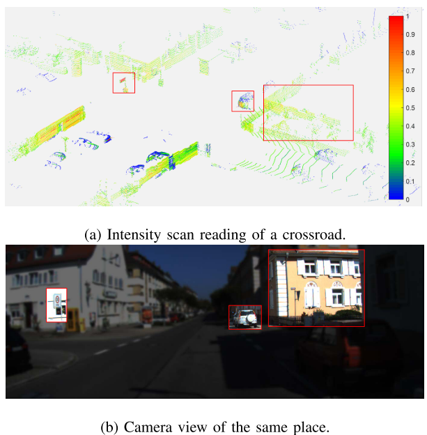

FLoam作者改进的SC

<!-- more -->

**《Intensity Scan Context: Coding Intensity and Geometry Relations for Loop Closure Detection》(ICRA2020)**

## Motivation

   现有的激光雷达回环检测方法都忽略的激光强度的信息，但是实际场景中，强度是一个很关键的信息，本文的作者基于SC加入了强度信息实现了ISC. 并且通过二层搜索提升了搜索速度。

## Contribution

1. 提出了一种新的三维激光雷达扫描全局描述子，该描述子融合了几何特征和强度特征
2. 提出了一种基于两级强度扫描上下文（ISC）再识别的闭环检测策略。平均每个查询只需要1.2毫秒
3. 通过本地实验和公共数据集测试，对所提出的描述方法进行了全面的评价。

## Content

1. 强度校准和预处理

   如下图，不同的材料会反射不同强度的激光.

   
   
   但是强度信息会受到诸如距离和仪器等因素的干扰，为了提高强度信息的信噪比，通过下面的函数进行强度矫正, 这个函数描述了距离的影响，可以通过离线实验来收集。
   
   $$
   n_{cal}=\varphi (\eta_r,d )
   $$
   
   然后考虑到远距离的激光点不够可靠和地面激光点一般用不到，所以采用设置距离阈值和lego-loam的地面店识别方法来进行点云的预处理.
   
2. 强度SC

   首先是按照SC的方法划分扇形和环形，交叉部分划分为一个单元，对于每个单元的强度信息，考虑到大多数情况下，一个单元内属于一个物体，强度变换不大，采取单元内的最高强度作为单元的强度标识，公式描述为:
   
   $$
   \eta_{i,j}=k(S_{i,h})\\
   =\max_{p_k \in S_{i,j}}\eta_k
   $$
   
3. 位置重识别

   考虑到随着时间的增长，数据库会变得十分大加剧了计算的压力，提出了一个二步搜索来加快速度，主要就是在之前加入一个二值运算(01逻辑判定)。
   
   根据单元格内的强度是否为0的标准，生成逻辑矩阵I:
   
   $$
   I(x,y)=\left\{\begin{matrix}
false,if\ \Omega(x,y)=0 \\
true, otherwise
\end{matrix}\right.
   $$
   
   然后，对于两个ISC,他们的几何相似性可以描述为:
   
   $$
   \varphi_g(I^q,I^c)=\frac{XOR(I^q,I^c)}{|I^q|}
   $$
   
   类似于SC,考虑到视点的变化，采用列位移后最大的误差作为几何匹配误差.
   
   最后的误差公式，也采用了SC的余弦表示如下:
   
   $$
   \varphi_i(\Omega^q,\Omega^c)=\frac{1}{N_s}\sum^{N_s-1}_{i=0}(\frac{v^q_i\cdot v^c_i}{\|v^q_i\|\cdot\|v^c_i\|})
   $$
   
4. 一致性验证

   强度回环会不可避免的丢失点云特征的信息，所以，在回环之前通过一致性验证来避免误匹配是有必要的。
   
   首先是时间一致性验证环节，这个环节验证的原理是单通路回环第一次发生的时候，邻居的通路一般也会检测到回环:
   
   $$
   P(P_m,P_n)=\frac{1}{N}\sum^N_{k=1}(\Phi_g(I_{m-k},I_{n-k})+\Phi_i(\Omega_{m-k},\Omega_{n-k}))
   $$
   
   然后再通过ICP来验证几何一致性来判断是否发生误匹配.
   

5.实验结果

   

## Conclusion

   这篇论文提出的ISC,实质上是把之前的SC的高度信息替换为强度信息，后续的误差计算和两步匹配基本都一样，从结果上来看，精度和SC一样，召回率提升了一点，但是感觉使用价值并不如高度，后续有空可以做个对比实验.

   