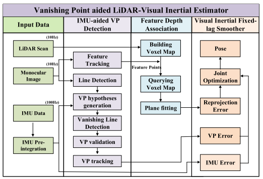

在传感器融合的基础上加入了灭点。

<!-- more -->

**《Vanishing Point Aided LiDAR-Visual-Inertial Estimator》(ICRA2021)**

## Motivation

   这篇文章的动机主要从VIO出发，VIO受制于尺度漂移和旋转漂移 问题，针对旋转漂移问题，作者采用了加入消失点检测的方法来解决，针对尺度漂移问题，就是通过建立体素格级别的深度图来解决.

## Contribution

1. 提出了第一种消失点辅助激光雷达视觉惯性估计器，它利用激光深度和消失点信息在视觉和几何退化环境中实现鲁棒姿态估计
2. 提出了一种新的基于体素图的特征深度关联模块，可以有效地将深度信息分配给视觉特征
3. 提出了一种新颖的消失点检测流程，该流程能够可靠、高效地检测出消失点

## Content

1. 系统框图

   如下图，主要分成三步处理流程，先是IMU辅助下的灭点检测，然后进行特征深度关联，最后进行VIO，VIO主要优化重投影误差，IMU预积分误差和灭点约束误差。

   

2. IMU辅助的灭点检测

   先是通过稀疏光流法和角点检测来跟踪特征，然后用LSD找到线段(记录端点长度和角度)，因为水平线段检测的精度很大程度上和相机的旋转相关，并且如果水平线检测不准确，那么灭点生成就很差，基于这个出发点，采用基于重力的垂直线检测来优化IMU旋转。具体过程如下图:首先根据相机方向，在每个线段的重点得到二维投影向量$Z$, 然后根据线段和它的投影向量的角度对线段进行分类，角度小于一定的阈值视为垂直，在理想情况下，这些垂直线段会穿过灭点在Z轴的投影，根据这个进行进一步的优化，最终的灭点的z轴上的单位向量可以表示为:
   
   $$
   n^c_{vz}=K^{-1}V^c_z/\|K^{-1}V^c_z\|
   $$
   
   然后根据下面的公式获得光流的旋转角度:
   
   $$
   n^c_{vz}=R^c_wV_z
   $$
   
   并且水平线可以表示为:
   
   $$
   HL=K^{-1}R^c_{w_opt}[0,0,1]^T
   $$
   
   
   
   在计算出水平线后，可以得出在X和Y方向上的灭点假设，使用1-line RANSAC来选择地平线，然后将其与水平线相交得出灭点在X的假设:
   
   $$
   n^c_{vx}=K^{-1}V^c_x/\|K^{-1}V^c_x\|\\
   V^c_x=Kn^c_{vx}=KR^c_{w}n^w_{vx}=KR^c_w[cos(\Phi),-sin(\Phi),0]^T
   $$
   
   最终的基于灭点的代价函数可以表示如下:
   
   $$
   E(n^c_{vx})=\sum(n^c_{vx}\cdot u_i)^2+\sum((n^c_{vx}\times n^c_vz)\cdot u_j)^2
   $$
   
3. 基于体素格的特征深度关联

   通用的激光赋值视觉特征深度流程

   
   
4. VIO

   同时优化IMU预积分，Vo重投影，VP残差。
   
5. 实验
   
   
   
   
   
   
   
   
   
   
   
## Conclusion

   这篇论文虽然名称是基于灭点的VIL融合，但是灭点并没有和激光有互动，有互动的是通过IMU给了一个更好的旋转来生成灭点假设，激光的融合还是深度图，尺度变成体素格加快了匹配，从结果来看，比之前的DEMO之类的确实有提升，但是估计是比不过VLOAM或者LVI-SAM的。