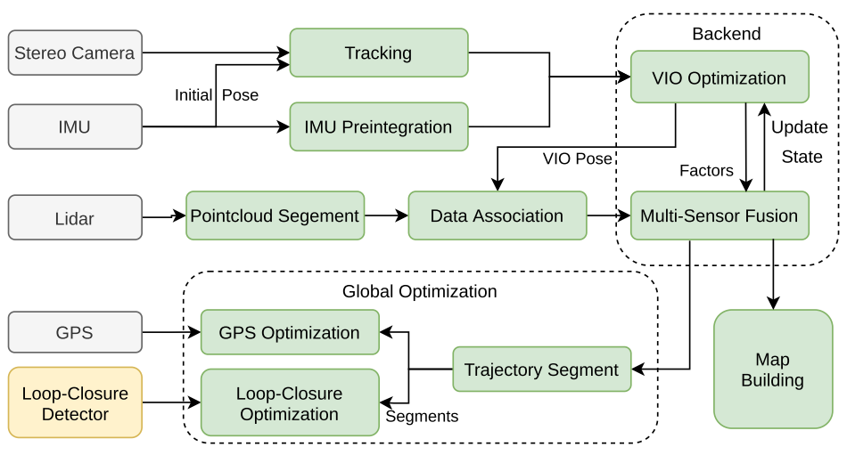
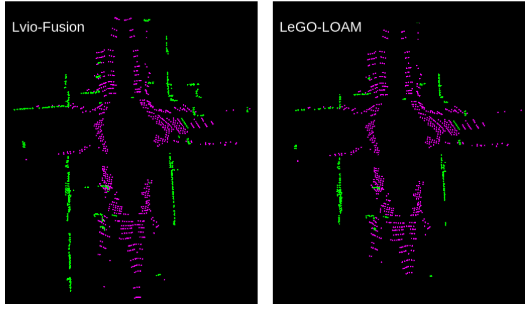
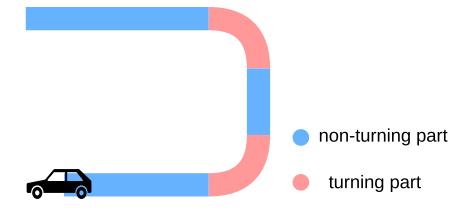
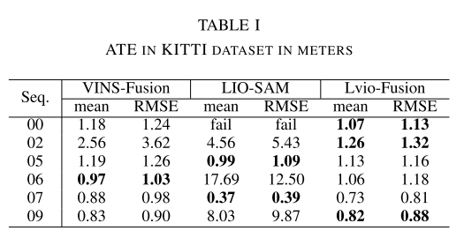
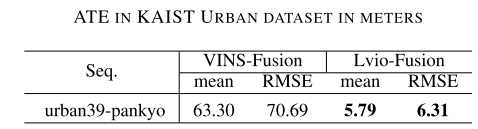
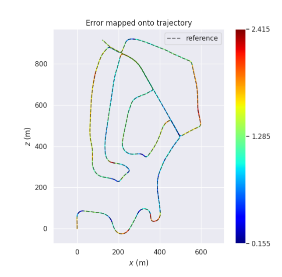
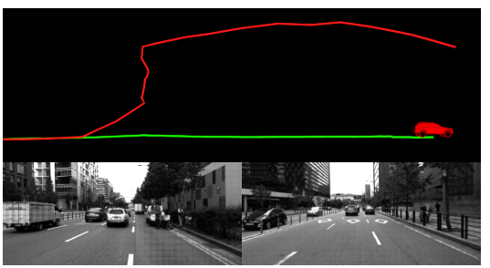
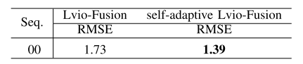

这篇文章是github上面逛到的一个论文，效果很不错，在02的环境下rmse小于5，代码地址: https://github.com/jypjypjypjyp/lvio_fusion

<!-- more -->

**《Lvio-Fusion: A Self-adaptive Multi-sensor Fusion SLAM Framework Using Actor-critic Method》(Arxiv.6.21, 2021)**

## Motivation

   这篇文章整体结构是基于图优化的多传感器融合框架，但是基于这个基础上，首先基于城市环境的累积漂移问题，他做了GPS+回环的分段检测，其次针对多传感器融和的权重问题，它采用了强化学习的actor-critic算法来动态给定传感器的权重。

## Contribution

1. 基于优化的双目相机、lidar、IMU和GPS紧密耦合的多传感器融合框架，实现了高精度、实时的移动机器人轨迹估计
2. 针对城市交通场景，提出了一种分段全局优化方法，该方法可以消除累积漂移，提供全局位置
3. 提出了一种基于actor-critic方法的自适应算法，该算法能够根据不同的环境自适应地调整传感器的权值。

## Content

1. 系统框图

   如下图，视觉前端从双目摄像机中获取三维地标，进行帧间跟踪和三角化。同时，高频IMU测量将为帧间跟踪提供初始姿态，之后再计算视觉帧间IMU预积分。然后进行了VIO局部优化。对于lidar，提取一个以视觉关键帧为中心的点云扫描，然后分割地面点云。以视觉惯性里程计中获得的姿态作为初始姿态，采用loam的特征关联方法，第二次进行局部优化，包括lidar、visual和IMU。此外，还引入GPS约束和回环约束来优化全局姿态图。

   

2. IMU预积分因子

   基本和VINS一样:
   
   $$
   \hat{\omega_t}=\omega_t+b^w_t+n^w_t\\
   \hat{a_t}=R^{BW}_t(a_t-g)+b^a_t+n^a_t\\
   r_{B_i}=\begin{bmatrix}
    r_{v_i}\\
    r_{p_i} \\
    r_{R_i}\\
    r_{b_a{i}}\\
    r_{b_gi}
   
   \end{bmatrix}\\
   =\begin{bmatrix}
    R^T_{i-1}(v_i-v_{i-1}-g\Delta t_i)-\Delta \hat{v}_i\\
    R^T_{i-1}(p_i-p_{i-1}-v{i-1}\Delta t_i-\frac{1}{2}g\Delta t^2_i)-\Delta\hat{p}_i\\
    R^T_{i-1}R_i\hat{R}^i_{i-1}\\
    b_{a_i}-b_{a_{i-1}}\\
   b_{g_i}-b_{g_{i-1}}
   \end{bmatrix}
   $$
   
3. 雷达因子

   这个基本和loam一样，唯一的区别在于曲率的计算方式，原本的loam计算曲率的时候，忽视了激光射线和平面的夹角，所以将曲率的计算改为:
   
   $$
   \Delta r=(r_{i-n}-r_{i+n})/2n\\
   c=\frac{a}{(2n-1)r_i}\sum^{2n-1}_{k=1}(r_{i-n+k}-r_{i-n}-k\Delta r)^2
   $$
   
   经过这个改进的曲率公式处理后，可以识别到相对更远的平面，如下图.
   
   
   
4. 位姿图优化和回环检测

   基于实际实验中的发现，在转弯时产生的旋转误差比不转弯的旋转误差大很多，所以将整个路径根据行驶角度进行分段，然后分段进行优化和检测。
   
   分段位姿图优化分为两个阶段。首先，利用GPS约束和闭环约束对零件进行优化；其次，对同一部位的关键帧进行优化，根据是否处于转弯部位，重点对转弯部位的关键帧进行旋转误差优化，对非转弯部位的关键帧进行正向误差优化
   
   
   
5. 基于actor-critic的权重自适应算法

   强化学习框架中的环境是多传感器融合算法，其作用是各种因素的权重，观察是机器人从传感器感知到的当前状态信息，奖励定义为估计姿态与实际姿态之间的相对姿态误差（相对位姿误差）的倒数:
   
   $$
   reward_{i}=\| (Q^{-1}_iQ_{i+\Delta})^{-1}(P^{-1}_iP_{i+\Delta})\|^{-1}
   $$
   
6. 实验

   
   
   
   
   
   
   
   
   
   
## Conclusion

   这篇文章是个初稿，实验部分不够完善，不过从已经放出来的实验效果来看还是不错的，提升我认为主要是基于强化学习的动态权重机制所带来的，另外分段优化也是个不错的思路。