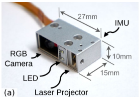
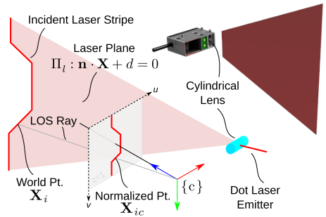
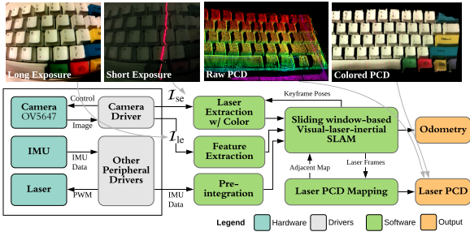
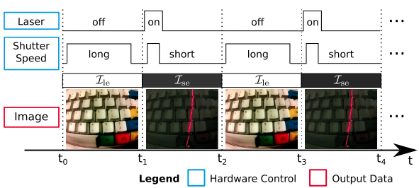
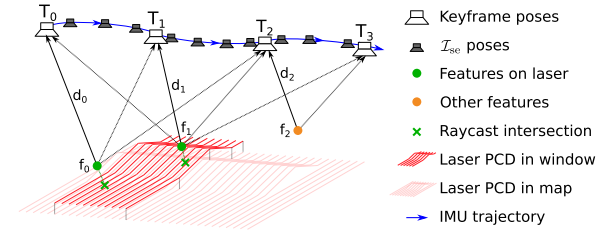
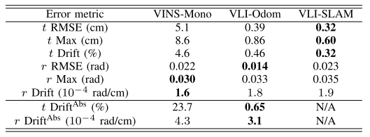
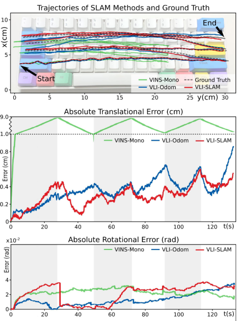
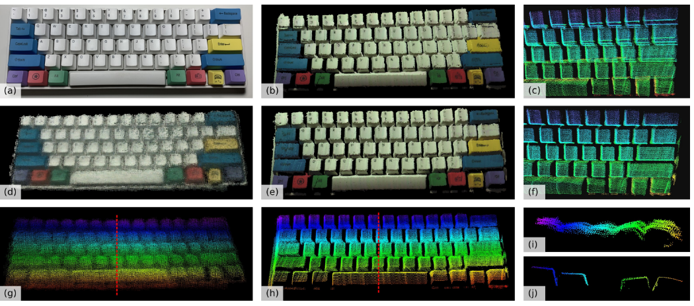

<!-- more -->

**《Visual-Laser-Inertial SLAM Using a Compact 3D Scanner for Confined Space 》(ICRA 2021)**

## Motivation

   受限空间的三维重建对于飞机机翼的制造、窄管道的检查、涡轮叶片的检查等都非常重要。由于受限空间往往缺乏定位基础设施，而且传统传感器往往无法检测到近距离内的物体，因此三维重建也具有挑战性。因此，这些任务需要一个紧凑的传感器，在短距离内工作，并能够自我定位。

## Contribution

1. 一种小型低成本三维扫描仪的设计。
2. 使用单目传感器实现彩色三维重建的交替快门方法。
3. 一种新颖的视觉激光惯性SLAM（VLI-SLAM）框架，具有1）基于激光的度量尺度估计和2）用于持续性建图的窗口到地图跟踪。

## Content 

1. 硬件和传感器模型

   需要注意的是这个传感器融合模型里使用的激光传感器是激光条纹投影仪，这个的扫描模是通过一个柱面透镜折射一个薄的激光束，并被投影到相机的fov。另外，红色激光射线可以与相机快门触发器同步打开/关闭，以启用交替快门技术。

   激光的三维点可以通过从图像上三角化恢复.

   首先将投影的激光射线建模为一个平面:

$$
\Pi_{l}:n\cdot X+d=0
$$

   最后深度三角化为:

$$
X_i=\frac{-d}{n\cdot \pi^{-1}_c(x_i)}\pi^{-1}_c(x_i)
$$

2. 算法框图

   视觉特征用来进行odom；IMU辅助修正角度，有助于处理突变运动和估计方向；激光点为视觉里程计提供深度辅助并且保持地图的一致性.

   主要分成五个部分，一是预处理进程来将原始传感器数据转换成分别的模块需要用的格式，二是初始化进程给优化结构提供初始化框架，三是里程计模块估计VO，四是建图将点云注册为全局地图，五是滑窗到地图的匹配做回环。

3. 初始化

   首先在视差足够大的滑动窗口中找到两个关键帧，使第一帧成为激光多个特征的主要观察帧; 然后通过八点法估计最大尺度下的变换; 接着通过三角化估计深度; 然后矫正的尺度可以通过特征点和激光点的匹配给出; 给定两个关键帧的初始化结构，使用透视n点算法估计滑动窗口中其他关键帧的姿态，并对滑动窗口中的其他特征点进行三角剖分; 最后通过BA给出初值
   
4. 基于滑窗的SLAM

   主要就是联合优化四种残差: 给定激光点云的视觉特征深度残差，视觉重投影残差，IMU残差，滑窗到地图的匹配残差.
   
   给定激光点云的视觉特征深度残差:($\lambda$是从先前点云获得的深度，d是从当前点云通过平面拟合获得的深度)
   
$$
r_l(X)=\sum_{f_i\in F_l}\|\frac{1}{\lambda_i}-d_i\|^2
$$

   重投影残差和IMU残差就是常规的残差，不做赘述。

   地图到滑窗的残差就是ICP残差。

5. 实验

## Conclusion

   这篇论文主要还是三维重建，激光起到了一个深度辅助的作用，不过这个三维重建的场景比较局限是受限空间。

