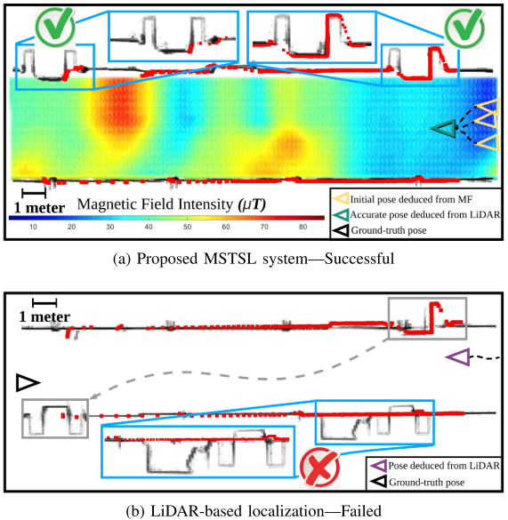
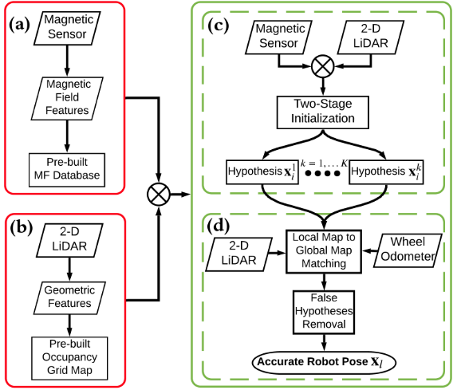
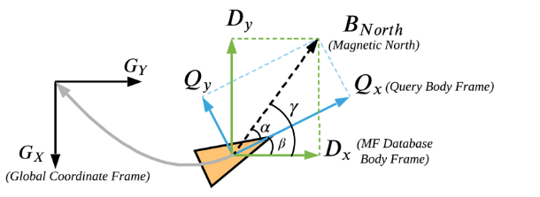
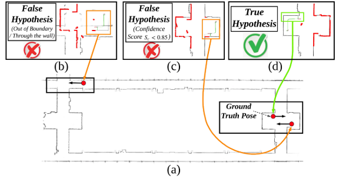
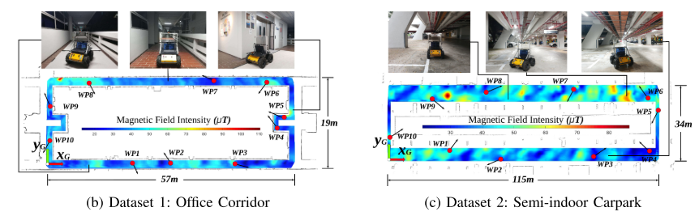
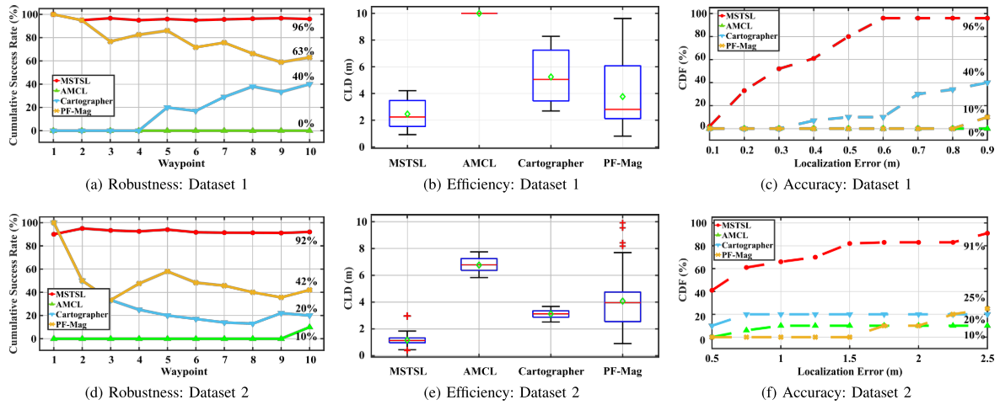

<!-- more -->

**《MSTSL: Multi-Sensor Based Two-Step Localization in Geometrically Symmetric Environments》(ICRA 2021)**

## Motivation

   对称环境对于定位的挑战比较大，因为其地理测量结构高度相似，并且特征不充分。在这篇文章里，考虑融合利用测得的磁场、二维激光雷达和轮式里程计信息来解决这个问题。主要起到一个初始化作用的是磁场，通过预建立的磁场的匹配，可以获得一个初始的定位范围，从而一定程度上缓解了这个问题。

## Contribution

1. 提出了一个新的无需地面辅助设备的在对称环境中定位的方法.
2. 对称环境下基于多传感器定位问题的数学建模及其概率推导.
3. 丰富的实验证明.

## Content 

1. 系统框图

   整个系统可以分成一个离线进程和一个在线进程，离线进程主要做两个事，一是收集磁场数据并且建立磁场地图，二是提取几何特征并且建立体素格地图；在线进程也是包括两步，一是基于磁场的初始化，二是基于雷达的定位。

2. 问题描述

   输入:  
$$
z=[z_i,z_l]^T=[z^B_i,z^L_i,z^L_l]^T(B指的是磁场信息，L是雷达信息，i是当前帧，l是上一帧)\\
u_i,人工控制的输入\\
M=[m^B,m^L]^T地图
$$

   因此，在对称空间的定位问题可以描述为一个概率分布模型:

$$
p(x_l,x_i|z_i,z_l,u_l,M)=\sum^K_{k=1}p(x^k_i|z^k_i,m^B)p(x^k_l|x^k_i,z^k_l,u^k_l,m^L)前面一个括号是初始化，后面一个是定位
$$

   将上面公式的初始化部分通过贝叶斯改写:

$$
p(x^k_i|z^k_i,m^B)=\eta_ip(x^k_i)p(z^k_l|x^k_i,m^B),\eta是正则化常数项 
$$

   对于公式的定位部分，用马尔科夫性质改写:

$$
p(x^k_l|x^k_i,z^k_l,u^k_l,m^L)=\eta_lp(x^k_l|x^k_i,u^k_l)p(z^k_l|x^k_l,m^L)
$$

3. 基于磁场的初始化

   建立磁场数据库的过程不作描述，感兴趣的可以看论文原文。下面主要讲如何在已经建好磁场地图的情况下进行初始化。
   
   主要是分成两步:一是定位确定，二是方向确定。
   
   首先是定位确定，为了确定初始的一个位置，首先描述三个坐标系如下图，全局坐标系，查询帧坐标系和数据库坐标系。鉴于附近位置的 MF 数据可能具有相似的值并考虑到不确定性，根据概率选择前 K 个假设位置，并且采用多元高斯概率分布作为模型。

   对于方向确定而言，最有可能的旋转是满足:

$$
G=^G_DR^i\cdot D^i\\
\phi=arccos((D^i\cdot G)/(\|D^i\|\|G\|))
$$

   考虑到磁力计的运动是直线配置的，最后的划分为:

$$
\theta=\left\{\begin{matrix}
0, if\ \phi_i=0 \\
-\pi, if\ \phi_i=\pi \\
 -\frac{\pi}{2}, if\ \phi_i=\frac{\pi}{2}\ upwards\\
\frac{\pi}{2}, if\ \phi_i=\frac{\pi}{2}\ downwards
\end{matrix}\right.
$$

4. 基于雷达的定位

   基于二维雷达的运动模型可以定义为($\delta$是轮速器的测量值):
$$
\left\{\begin{matrix}
 x^k_l=x^k_i+\delta d^k_l cos\theta^k_i\\
 y^k_l=y^k_i+\delta d^k_l sin\theta^k_i
 \\
\theta^k_l=\theta^k_i+\delta \theta^k_l
\end{matrix}\right.
$$

   最后的两个综合起来，可以有效的约束置信边界的范围如下图：

5. 实验结果

## Conclusion

   这篇论文主要是通过加入磁场传感器来解决室内的定位问题，看的比较快，后续如果用到磁力计的话，是需要重新仔细看的。