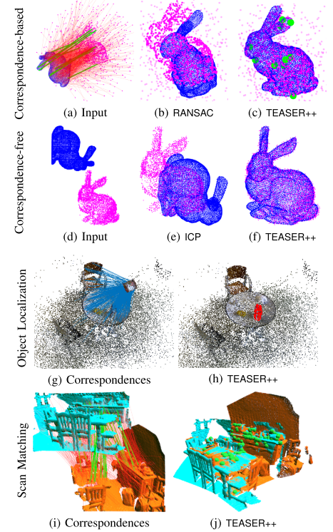
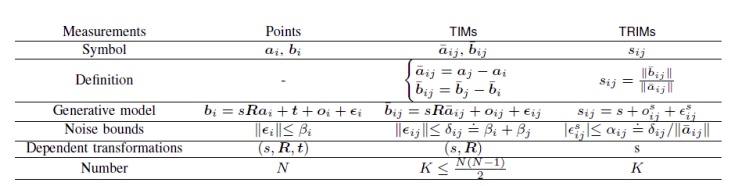
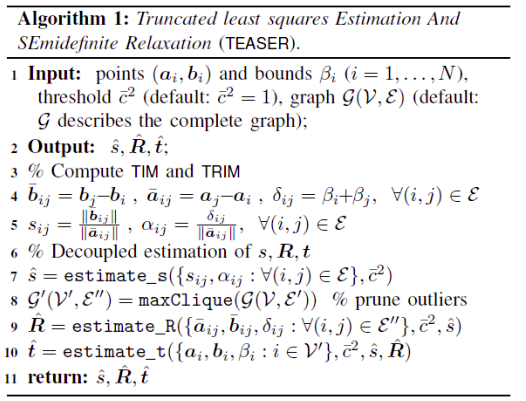
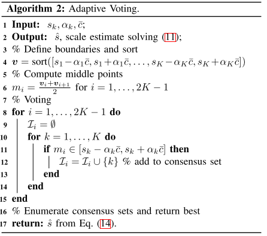
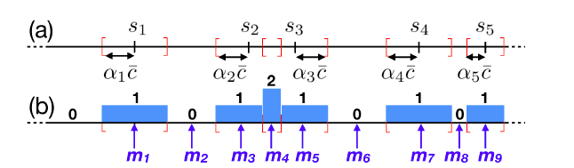
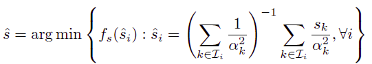
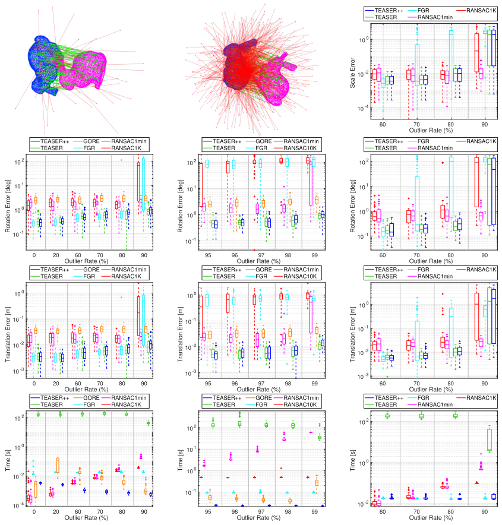
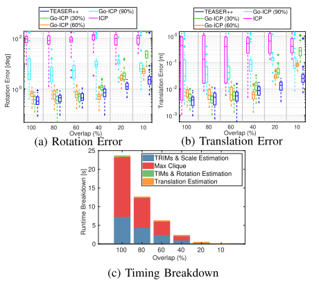

这篇博客并不是完全原创，其中部分内容参考:

https://blog.csdn.net/Yong_Qi2015/article/details/116549378

<!-- more -->

**《TEASER：Fast and Certifiable Point Cloud Registration》(TRO2020)**

## Motivation

   求解带有外点的鲁邦估计是比较困难的，只能提供相对容易的检测条件来判断检测的结果是否最优。本文为了解决带有外点的鲁邦估计问题，首先使用TLS(截断最小二乘)将配准问题重新建模，然后通过一个图理论框架将尺度旋转平移三个评价尺标解耦，最后再通过渐进非凸性求解旋转子问题。

## Contribution

1. 开发了估计尺度的不变测量量。
2. 在噪声未知但有界的假设下，将尺度位移旋转解耦形式化。
3. 提供了一个通用的图理论框架，用于推导这些不变测量量。
4. 展示这个框架通过寻找不变测量量定义的图的最大派系，允许修剪大量的外点。
5. 证明了使用adaptive voting机制能够在多项式时间内精确地求解标量例子的TLS估计问题，这就能够高效地进行尺度和分量形式平移的估计
6. 证明了能够建立一个紧的半定规划(SDP)松弛去估计旋转，同时建立一个后验条件去检测松弛的质量
7. 在无噪声例子中，提供了易于检查的条件，其中TEASER在外点存在的情况下恢复出了点云之间的变换
8. 在有噪声例子中，在TEASER估计和真值变换之间的距离上提供了界	
9. 实现TEASER的一个快速版本，称为TEASER++，使用渐进非凸(GNC)估计旋转而不需要求解大规模SDP
10. TEASER++毫秒级运行，是目前最快的鲁棒配准算法
11. TEASER++非常鲁棒使得它能够求解对应点未知的问题(如假设所有对所有的对应点情况)，并且它显著地超越ICP，比Go-ICP更精确，同时要快几个数量级
12. 当和基于深度学习的关键点检测和匹配相结合时，TEASER++能够提升配准性能
13. 当尺度已知时它们对于超过99%外点率的情况都是鲁棒的。

## Content

原论文内容很多，很多篇幅是展示的证明，下面主要讲一下算法的主要流程:

1. 使用截断最小二乘代价函数的鲁棒配准

   给定两组点云$a\_i,b\_i$, 测量噪声是$\delta\_i$,原始内参外参向量是$o\_i$, 原始问题可以描述成:
$$
b_i=s^oR^oa_i+t^o+o_i+\delta_i
$$

   可以表示成非线性最小二乘的形式:

$$
min\sum^N_{i=1}\frac{1}{\delta^2_i}\|b_i-sRa_i-t\|^2
$$

   假设噪声未知但是有界，为了对外点不敏感，可以变换成TLS:

$$
min\sum^N_{i=1}(\frac{1}{\beta^2_i}\|b_i-sRa_i-t\|^2,\hat{c}^2)
$$

2. 尺度旋转平移解耦

   首先进行平移不变测量，通过求取两个点云的相对位置进行相减来抵消平移的影响:
$$
b_j-b_i=sR(a_j-a_i)+(o_j-o_i)+(\delta_j-\delta_i)
$$

   然后进行旋转不变测量，这个需要计算出刚刚平移不变测量的范数:

$$
\|\hat{b_{i,j}}\|=\|sRa_{i,j}+o_{i,j}+\delta_{i,j}\|
$$

   因为噪声有界，所以可以转换成:

$$
\|\hat{b_{i,j}}\|=\|sRa_{i,j}\|+o_{i,j}+\delta_{i,j}
$$

   进行归一化表示为:

$$
s_{i,j}=\frac{b_{i,j}}{a_{i,j}}=s+o^s_{i,j}+\delta^s_{i,j}
$$

   总结起来，解耦的过程可以描述为下表:

3. TLS

   TRIM估计尺度，采用自适应的投票算法:
$$
\hat{s}=argmin_{s}\sum^K_{k=1}min(\frac{(s-s_k)^2}{\alpha^2_k},\hat{c}^2)
$$

   TIMS估计旋转，采用SDP半定松弛算法

$$
\hat{R}=argmin\sum^K_{k=1}min(\frac{\|\hat{b_k}-\hat{s}R\hat{a}_k\|^2}{\delta^2_k},\hat{c}^2)
$$

   最后，在已经估计出旋转和尺度的情况下，采用自适应投票算法估计平移:

$$
\hat{t}_j=argmin\sum^N_{i=1}min(\frac{(t_j-[b_i-\hat{s}\hat{R}a_i]_j)^2}{\beta^2_i},\hat{c}^2)
$$

   上述的步骤总结伪代码如下

   自适应投票算法如下：

   第4行的排序和6-12的投票算法如下:

   最后一行的公式是计算尺度估计值如下:

....中间的证明内容不作细表

5. 实验

