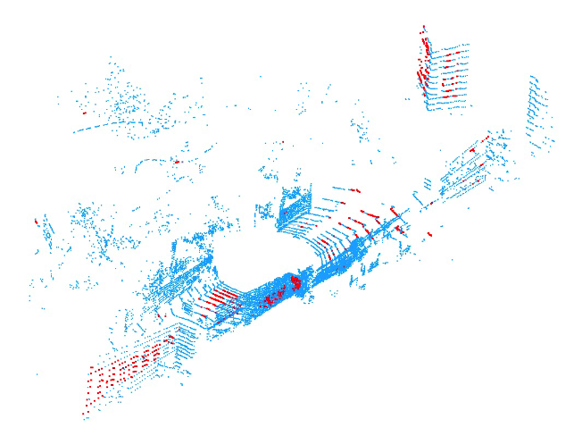
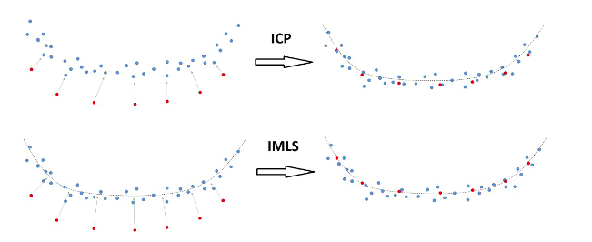

这篇论文主要是介绍的一个点云采样和点云匹配的策略

<!-- more -->

**《IMLS-SLAM:  scan-to-model  matching  based  on  3D  data》(ICRA2018)**

## Motivation

   激光SLAM的两大挑战分别是处理的数据量和点云的稀疏性，本文基于RGB-D的地图隐性的曲面表示来提出一个新的点云采样和匹配策略从而缓解这两个问题	。

   

## Contribution

1. 每次激光扫描帧的点选择策略.
2. 将模型图定义为点集平面.

## Content

1. 点云去畸变和动态物体去除

   去畸变:
   
   $$
   \hat{T}{t_k}=T(t_{k-1})*T(t_k-2)^{-1}*T(t_{k-1})
   $$
   
   动态物体去除:
   
   这个部分论文里说的很简短:
   
   > Before  matching  the  scan  to  the  model  map,  we  needto  remove  all  dynamic  objects  from  the  scan.  This  is  avery  complicated  task,  requiring  a  high  level  of  semanticinformation  about  the  scene  to  be  exact.  We  perform  asmall  object  removal  instead  of  a  dynamic  object  removaland  discard  from  the  scene  all  objects  whose  size  makes  itpossible  to  assume  that  they  could  be  dynamic  objects.  Tobegin,  we  detect  the  ground  points  in  the  scan  point  cloudusing a voxel growing similar to that in [9]. We remove theseground points and cluster the remaining points (clusters arepoints with a distance to the nearest point less than0.5minour case). We discard from the scan small group of points;they  can  represent  pedestrians,  cars,  buses,  or  trucks.  Weremove  groups  of  points  whose  bounding  box  is  less  than14minXv,  less  than14minYv,  and  less  than4minZv.  ((Xv,Yv,Zv)are  the  axes  of  a  vehicle  frame  withXvpointing  right,Yvpointing  forward,  andZvpointingupward).  Even  removing  all  these  data,  we  keep  enoughinformation about large infrastructure, such as walls, fences,facades,  and  trees  (those  with  a  height  of  more  than4m).Finally,  we  add  back  the  ground  points  to  the  scan  pointcloud.
   
   简单的说，就是先是通过平面检测去除地面点，然后再通过聚簇点云来排除表示行人交通工具等的点(那么问题来了，行人交通工具之类的点簇怎么获得呢，难道是通过点的规模？这点论文里并没有进行说明)，最后说移除长宽小于14，高小于4的bounding box，但是全文没有提到bounding box，这是从哪儿来的呢？
   
2. 扫描采样策略

   通常的ICP的点云采样是随机的，这通常会导致无法收敛，虽然有改进的根据点云的协方差矩阵进行挑选点的策略，但是这个策略在实际运行中会很慢，因为要迭代的判断大量的点。
   
   这篇文章提出的策略实际上也是基于点云的协方差矩阵，但是不同的是不再使用协方差矩阵中的点云主轴，而是保持车架的轴线，定义了具有轴（（Xv，Yv，Zv））的车架上的激光雷达扫描点云。
   
   首先计算每个点上的法线，快速的方法是使用传感器的球面范围图像来计算近似的法向量。
   
   对于每一个点，记录下一个值$a\_{2D}$:
$$
a_{2D}=(\delta_2-\delta_3)/\delta_1\\
   \delta_i=\sqrt{\lambda_i}\ \ \ \  \ \ \ \ \ \ (\lambda_i是正态计算中，主成分分析的特征值)
$$

   然后，对于每一个点，再计算出下面的九个属性:(即使$a\_{2D}$是用来表示平面的，但是即使在非平面特征的环境，这样的表示也可以提高匹配点的质量)

$$
a^2_{2D}(x_i\times\vec{n_i} )\cdot X_v\\
-a^2_{2D}(x_i\times\vec{n_i} )\cdot X_v\\
a^2_{2D}(x_i\times\vec{n_i} )\cdot Y_v\\
-a^2_{2D}(x_i\times\vec{n_i} )\cdot Y_v\\
a^2_{2D}(x_i\times\vec{n_i} )\cdot Z_v\\
-a^2_{2D}(x_i\times\vec{n_i} )\cdot Z_v\\
a^2_{2D}|\vec{n_i}\cdot X_v|\\
a^2_{2D}|\vec{n_i}\cdot Y_v|\\
a^2_{2D}|\vec{n_i}\cdot Z_v|\\
$$

   前6个值给出了扫描点对车辆不同未知角度（侧倾、俯仰、偏航）的可观测性的贡献（对远离传感器中心的点提供了更重要的贡献，最后3个值给出了扫描点对未知平移的可观测性的贡献（和距离远近无关）。

   最后可以根据这九个属性生成九个列表，每个列表的第一个点都是表示对于这个属性(row,pitch,yaw,x,y,z)置信度最高的点。

   在匹配的阶段，从每个列表的最开始采样一定的点云，找到每个点云里的距离坐标系最近的点，在各自对应的采样的点云中，只保持和距离最近的点小于一定距离阈值的点:

$$
\|x-P_c\|\le r\ \ \ \ (r是一个人工设置的排除离群点的参数)
$$

   最后，我们总共会有$9s$个采样点(9s\le N\_p)

   下图展示了$s=100$的采样点云(原始点云数量是13863)，红色的点是采样点，有一些远离传感器中心的点，可以锁定最平面区域上的旋转和点，来更好的进行点云匹配。

3. 隐式移动最小二乘（IMLS）曲面表示的SCAN-TO-MODEL匹配

   这个主要是基于KinectFusion的TSDF思想，但是TSDF的问题主要在于它是基于一个未知的体素格所以不适合室外场景，在这篇文章中的改进主要是直接在上一次定位扫描的地图点云上计算隐式移动最小二乘（IMLS）表示的平面。
   
   定义点到隐式平面的近似距离为:
$$
I^{P_k}(x)=\frac{\sum_{p_i\in P_k} W_i(x)((x-p_i)\cdot\vec{n_i})}{\sum_{p_j\in P_k} W_j(x)}\\
W_{i}(x)=e^{-\|x-p_i\|^2/h^2	}
$$

   为了进行匹配，首先要找到使IMLS距离平方和最小的Rt:

$$
\sum_{x_j\in\vec{S_k}}|I^{P_k}(Rx_j+t)|^2
$$

   因为指数权重的存在，所以进行非线性最小二乘比较难，所以将点投影到IMLS平面:

$$
y_j=x_j-I^{P_k}(x_j)\vec{n_j}
$$

   从而将原来的误差转变成求:

$$
\sum_{x_j\in\vec{S_k}}|\vec{n_j}\cdot (Rx_j+t-y_j)|^2
$$

   可以发现，ICP和IMLS方法之间对于平面的收敛有着很大的区别
   

4. 实验

## Conclusion

   这篇最有价值的地方我认为是点的挑选策略，根据不同的位姿参数来挑选合适的点，实验结构来看是很有效的，虽然时间很长，主要时间花费是在建立KD树的过程中。