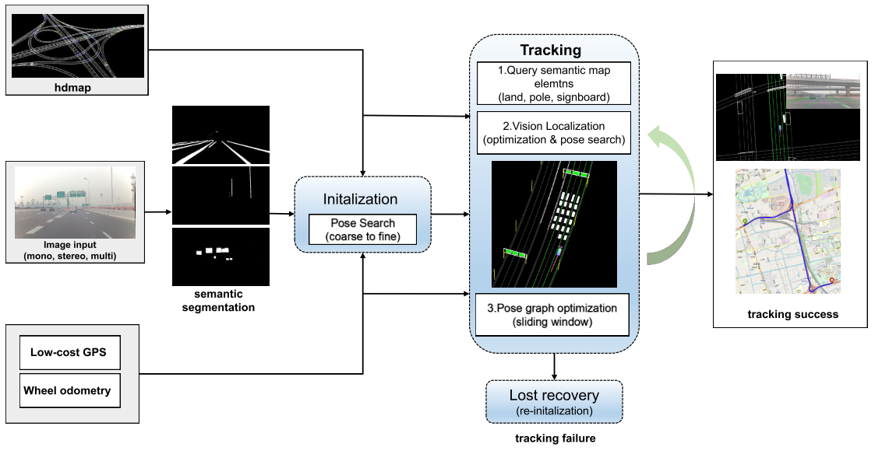
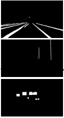
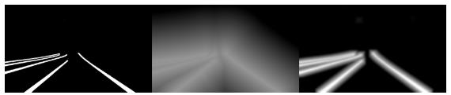
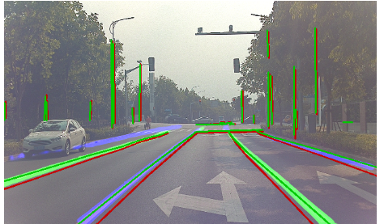
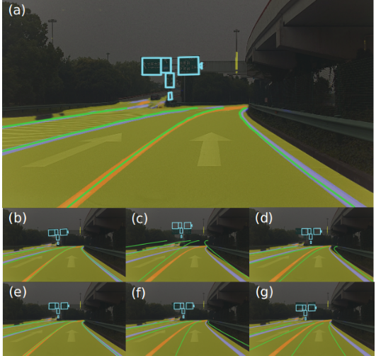
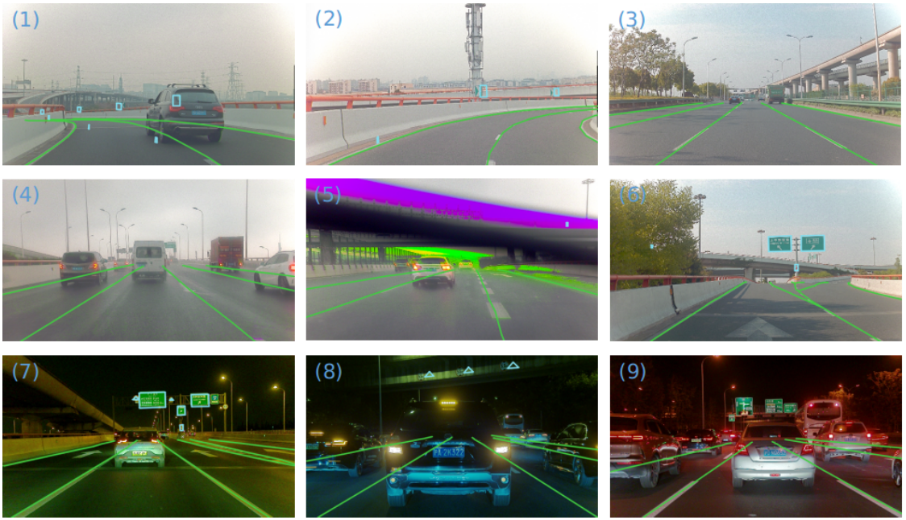
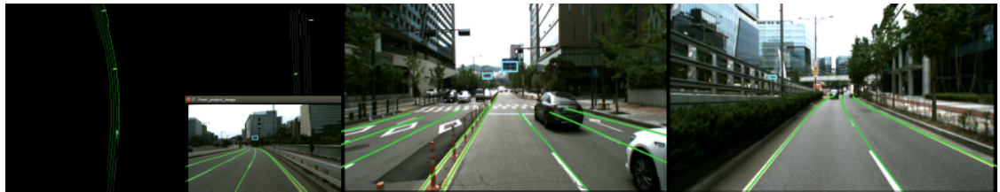
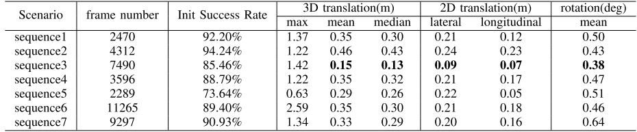

这篇论文主要是介绍的一个点云采样和点云匹配的策略

<!-- more -->

**《Coarse-to-fine Semantic Localization with HD Map for Autonomous Driving in Structural Scenes》(IROS2021)**

## Motivation

   出发点是可靠的高性价比的市内交通定位，IMU+GPS虽然很多场景效果可靠并且性价比也不错，但是GPS的精度往往没有那么可靠，基于激光点云或者视觉特征点云的定位虽然实验效果不错，但是长时间的运转会产生大量的误差，并且不适应环境的变化，另外点云存储有个问题在于内存需求过大，不易于存储(HD地图高度结构化，内存需求不大). 本文主要解决的问题就是上面说的几个问题，是HD地图和相机定位的语义结合。

## Contribution

1. 利用语义分割和高清地图，提出了一个完整的视觉定位系统，包括初始化、跟踪和丢失恢复模块
2. 提出的解决方案可以灵活地处理单目相机和多相机。
3. 优秀的实验结果

## Content

1. 系统框图

   输入分别是高清地图，图像，低精度GPS和轮式里程计，图像输入后首先进行语义分割，然后跟高清地图的语义信息进行匹配定位

2. HD地图

   主要利用了三个语义信息: 车道(LA) ,杆状物体(PO), 广告牌(SB)

3. 语义分割和后处理

   提取图像语义的网络是RES-net18. 对于广告牌语义图像(SB)，采用拉普拉斯变换进行处理, 然后再采用形态学操作进行平滑处理，经过形态学处理后的图像更容易收敛到一个正确的值.

4. 初始化

   首先通过GPS获得一个粗糙的初值, 由于车辆可以处于静止状态，因此将两个 GPS 点的距离设置为一个适中的值，从GPS中获得车辆的XY坐标，并且基于搜索的近地图地面元素获得z坐标。翻转角和俯仰角设置为0，偏航角设置为两次gps的计算值，为了获得较高的初始化成功率和更准确的初始姿态结果，通过在预定义网格中进行穷举姿态搜索来细化粗初始姿态，这个操作的代价函数可以定义为所有语义地标的光度误差，表示如下:
$$
cost=\sum^N_{i=0}\|I_s(\pi((T_{wb}\cdot T_{bc})^{-1}P_w))-1.0\|_2
$$

5. 跟踪

   主要分为三步，第一步是根据外部里程计(比如轮式里程计)获得当前帧的粗糙位姿，如果驾驶场景满足纵向约束，则执行来自全局地图步骤的裁剪局部地图。否则，首先应用纵向位置校正过程。
   
   基于全局地图的局部地图裁剪: 地图元素(LA、PO 和 SB)使用当前粗略的车辆姿态在预定义的短距离内从全局地图中查询。然后将查询到的局部地图应用于无漂移视觉定位。地图元素 E 投影回图像点 P。 为了获得准确的位姿优化，P 中的点在图像空间中均匀采样
   
   纵向位置调整: 在驾驶场景不满足纵向约束的情况下，纵向定位在很长一段时间后可能会发生显着漂移,例如，当查询的车道（1）彼此平行，（2）笔直向前，以及（3）没有标志牌或电线杆来限制车辆在环境中的纵向平移时，就会发生这种情况。在这种情况下，就需要根据GPS进行纵向的位置调整。
   
   第二步是通过与高清地图元素的图像对齐来细化 6 DoF 车辆姿态。代价函数图是基于图像语义分割和形态学操作构建。为了防止垂直地标的丢失，首先计算z轴的角度和y轴的平移，然后再计算y轴的角度和z轴的平移，x轴的角度和平移可以被忽视，因为道路场景下，翻滚角通常很小
   
   第三步通过滑窗的因子图优化来获得一个平滑的位姿，总共两个因子，第一个是根据视觉获得的先验位姿因子，第二个是通过轮式里程计建立的相邻帧因子
$$
T=argmin\sum_{i,j\in W}\|ln(T_i(T^*_i)^{-1})^{\bigvee}\|_2+\lambda\|ln(T^{-1}_jT_{i}T_{i,j})^{\bigvee}\|_{2}
$$

6. 对于多相机的考虑

   原始的误差雅克比为:

$$
\frac{\delta error}{\delta \varepsilon }=\frac{\delta I_s}{\delta u}\frac{\delta_u}{\delta p_c}\frac{\delta p_c}{\delta \varepsilon}
$$

   很明显，这个雅克比高度相关相机的参数，为了支持多相机的系统，所以要尽可能的排除不同相机的影响，那就采用车为中心进行雅克比，因此把上述的雅克比的最后一项改为:

$$
\frac{\delta p}{\delta \varepsilon}=\frac{\delta T_{cb}(T_{wb}\cdot Exp(\delta\varepsilon))^{-1}P_w}{\delta{\varepsilon}}\\
\frac{\delta p_c}{\delta \varepsilon}=-[I_3 -[p_c]_{\times}]Ad(T_{cb})
$$

   在相机坐标系的点可以表示为:

$$
p_c=R_{cb}((R_{wb})^{-1}(P_w-t_{wb}))+t_{cb}
$$

   因此最后关于平移和旋转的雅克比分别表示为:

$$
\frac{\delta p_c}{\delta t_{wb}}=-R_{cb}(R_{wb})^{-1}=-R_{cw}\\
\frac{\delta p_c}{\delta \theta_z}=R_{cb}\frac{\delta(R_{wb})^T}{\delta\theta_z}(P_w-t_{wb})
$$

7. 跟踪丢失恢复

   当检测到错误状态时，采用轮式里程计进行恢复，错误状态主要有以下三种: 一是车辆不在高清地图的操作域内，二是 姿态优化失败总数超过阈值，三是严重遮挡的连续帧数超过阈值（例如，在语义地图元素完全不可见的交通堵塞情况下）
   
8. 实验结果

(1-2) 弯路; (3) 晴天的长直路; (4) 雨天; (5) 挡风玻璃雨刮器挡住了部分图像; (6)分流匝道; (7) 低光照; (8-9) 交通拥堵

## Conclusion

   这篇文章介绍了如何将高清地图和视觉语义信息进行结合定位的方法，语义信息结合的比较简单，不过确实从实验效果来看挺有用。