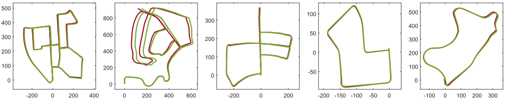

<!-- more -->

**《Intensity-SLAM: Intensity Assisted Localization and Mapping for Large Scale Environment》(ICRA2021)**

## Motivation

   强度信息是激光雷达很重要的信息，但是传统的激光里程计往往忽视了强度信息，虽然近年来的基于深度学习的端到端训练方法有的考虑到了强度信息，但是对于端到端训练方法的可靠性仍然是有很大的疑问，基于这个出发点，作者提出了一个加入强度信息的传统激光里程计。

## Contribution

1. 提出了一种新颖的 SLAM 框架，它使用强度和几何信息进行定位估计，其中涉及前端里程计估计和后端因子图优化，代码已开源
2. 建立一个强度图来揭示强度分布，并将强度成本引入现有的仅几何形状的 LiDAR SLAM 以估计机器人的位置
3. 对所提出的方法进行了彻底的评估。更具体地说，提出的方法在仓库和自动驾驶场景中进行了测试。结果表明，提出的方法在多个场景中优于现有的仅几何方法

## Content

1. 系统框图

   里程计部分联合优化强度信息和几何信息，后端部分采用基于强度的SC。

2. 强度矫正

   雷达强度的能量值可以定义为:(Pe是发射的能量值,Dr是接收器的孔径直径)

$$
P_r=\frac{P_eD^2_r\rho}{4R^2}\eta_{sys}\eta_{atm}cos\alpha\ \ \ \ \\(P_e是发射的能量值,D_r是接收器的孔径直径,\eta_{sys}是系统传输系数,\eta_{atm}是大气传输系数,\alpha是物体表面与激光束的入射角,\rho是物体的材料反射率，\\并且R和\alpha是测量的外参,\eta_{sys}和\eta_{atm}是固定的常数
)
$$

   因此，最终的强度可以定义为:

$$
I=\frac{P_r}{P_e}=\frac{D^2_r\rho}{4R^2}\eta_{sys}\eta_{atm}cos_{\alpha}\\
=\eta_{all}\frac{\rho cos\alpha}{R^2}(\eta_{all}是一个常数)
$$

   可以发现，对于同一类物体的强度，它只和入射角和距离相关:

$$
\rho\propto\frac{IR^2}{cos\alpha}
$$

   距离可以通过激光点的xyz得到，入射角可以通过分析局部法向量得到:

   对于每一个点p, 可以搜索离它最近的两个点p1和p2, 从而局部平面法向量可以定义为:

$$
n=\frac{(p-p_1)\times(p-p_2)}{|p-p_1|\cdot|p-p_2}
$$

   入射角可以定义为:

$$
cos\alpha=\frac{p^T\cdot n}{|p|}
$$

   最后，可以获得一个矫正的激光雷达强度，即将从设备中获得的强度除去角度值.(可以去掉强度比较低的点，因为这种点的信噪比低)

3. 显著点选择和特征提取

   对于激光点p和它的强度$\eta$, 计算出它的局部距离分布和局部强度分布:

$$
\sigma^G_i=\frac{1}{|N_i|}\cdot\sum_{p_j\in N_i}(|p_i-p_j|)\\
\sigma^I_i=\frac{1}{|N_i|}\cdot\sum_{p_j\in N_i}(|\eta_i-\eta_j|)\\
(|N|是点的数量)
$$

   激光点的选择依据是下面的加权和:

$$
\sigma_i=\omega^G\cdot\sigma^G_i+\omega^I\cdot\sigma^I_i
$$

   考虑到平面的平滑度比较小，角点的平滑度比较大，所以$\sigma$大的点选为角点，$\sigma$小的点选为平面点

4. 强度地图构建

   和传统的基于几何的地图一样采用体素格，区别在于强度体素格的内容是强度值$I(\eta\_i|z\_{1:t})$，对于某一个体素格$m\_i$, 在当前地图中的值可以通过上一个地图进行更新:
$$
M(m_i|z_{1:t})=M(m_i|z_{1:t-1})+\frac{\eta_{mi}-M(m_i|z_{1:t-1})}{n_{mi}}
$$

5. 扫描地图匹配

   主要就是优化两个残差: 强度残差和几何残差:
   
   几何残差直接用的loam:
$$
f_{\varepsilon}(\hat{p_i})=\frac{(\hat{p_i}-p^{\varepsilon}_1)\times(\hat{p}_i-p^{\varepsilon}_2)}{|p^{\varepsilon}_1-p^{\varepsilon}_2|}
$$

   强度残差:

   可以通过最小化强度图中当前点pi（包括边缘特征和平面特征）和变换点pi之间的强度残差来实现

$$
f_I(\hat{p}_i)=\eta_i-M(\hat{p}_i)
$$

   因为地图中的点比较稀疏，引入三线性插值:

6. 回环

   采用的是作者之前自己改进的SC-ISC.
   
7. 实验结果

## Conclusion

   这篇文章主要是引入了强度信息进行激光SLAM，在引入强度信息前，先通过矫正程序去除了角度的影响，使得强度信息的信噪比相对较高，总体上实验效果还是很好的。

