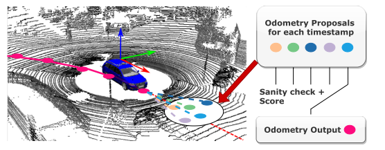
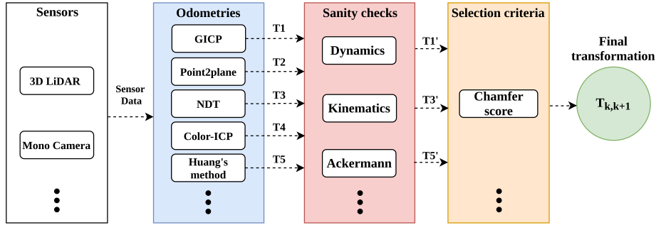
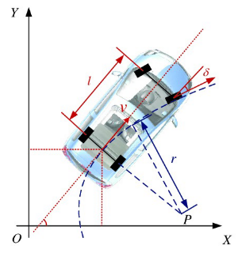
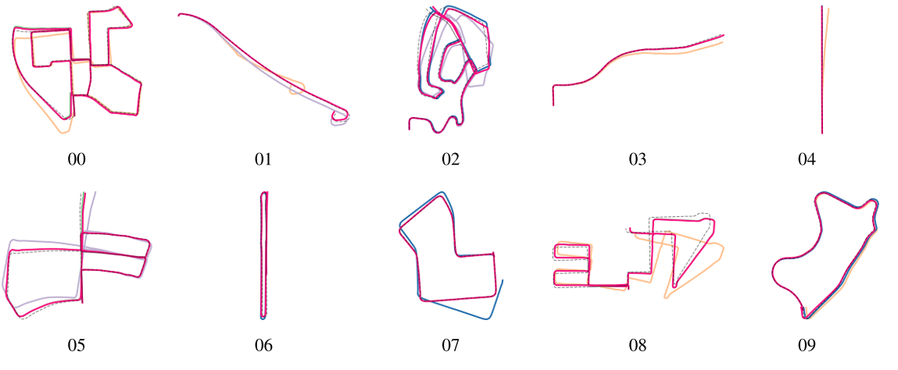
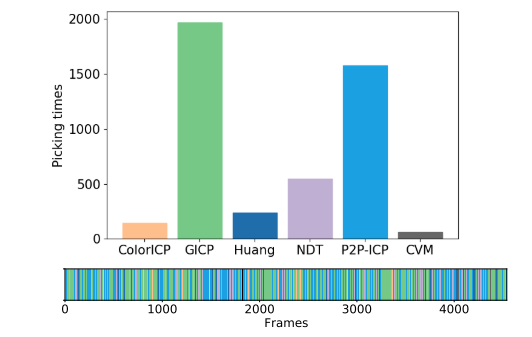
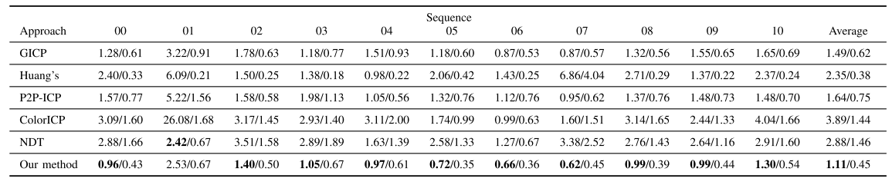
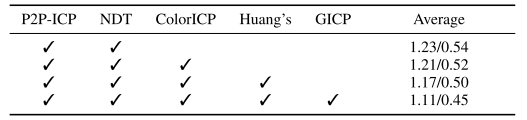
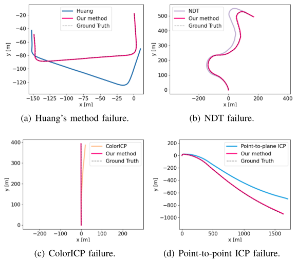
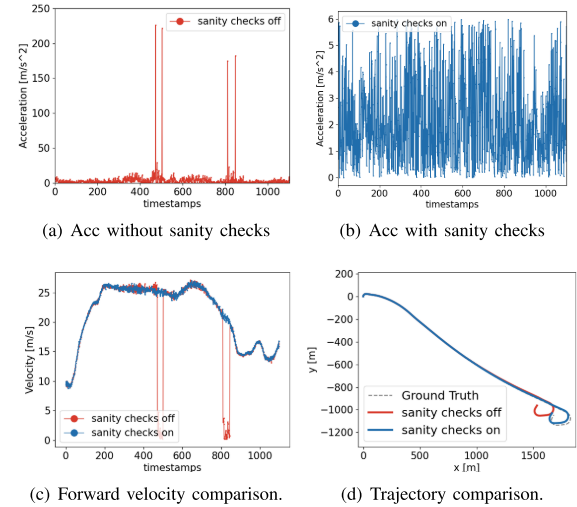

<!-- more -->

**《Simple But Effective Redundant Odometry for Autonomous Vehicles》(ICRA2021)**

## Motivation

   作者认为多传感器融合通过滤波或者优化的方式不见得十分有效，所以采取并行运行多个里程计，选择合适的里程计作为当前帧的里程计的这个思路值得一试。

## Contribution

1. 使用冗余里程计管道来提供更好的里程计结果
2. 与使用的个别方法相比，通常会产生最好的结果，
3. 避免了不同情况下的几种失败情况

## Content

1. 系统框图

   主要分成四个模块，输入预处理模块利用多种传感模式作为系统的输入，里程计候选模块采用多个不同的里程计算法来估计每个时间戳处的候选变换作为里程计建议，健全性检查模块使用车辆动力学和运动学特性检查每个里程计方案中的故障情况，计分模块利用倒角距离对里程计方案进行计分，并从最近的车辆运动中选择最终变换。

2. 并行里程计

   没有讲如何并行的操作，只是简单的介绍了用到的几个里程计:P2P-ICP,GICP,ColorIcp,NDT. 感觉这个应该是用了FPGA或者GPU了，CPU肯定不能实时运行这么多里程计了。
   
3. 健全性检查

   这个检查主要就是针对不同里程计得出的结果.
   
   I. 加速度约束，当里程计估算出的加速度大于阈值则排除
   II. 	速度约束:
   
   速度约束的模型如下图，约束公式如下:
$$
v_s(\hat{\beta},v)=f\frac{\frac{v}{f}+l(1-cos\frac{\hat{\beta}}{f})}{sin\frac{\beta}{f}}(1-cos\frac{\hat{\beta}}{f})+lsin\frac{\hat{\beta}}{f}\\
|v_s-v^*|>v_{th}
$$

4. 分数评价

   采用的标准的是基于三维点云的倒角距离度量:
$$
D_{chamfer}(M,N)=\frac{1}{M}\sum_{m\in M}d_{N}(m)
$$

   分数越低则置信度越高，最低的那个被选做当前帧的度量。

5. 实验结果

## Conclusion

   这篇文章的创新点就是并行运行多个里程计，然后每帧选取一个最合适的里程计，效果上来看，因为选取的里程计的精度都不是特别高，所以肯定结果都比他们要好点，如果中间加的是vins和loam，不清楚最后的性能是否仍然会有提升。